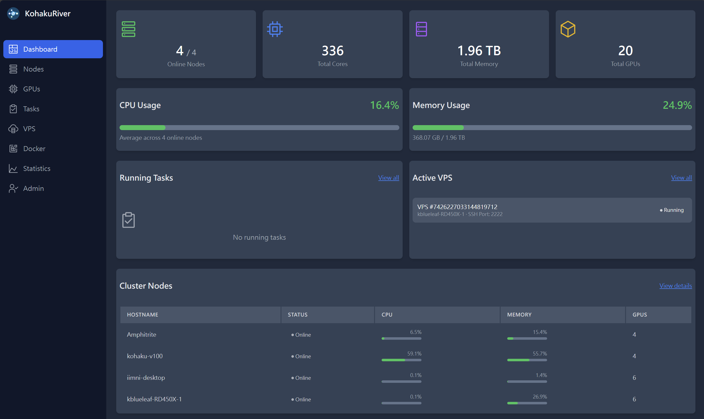
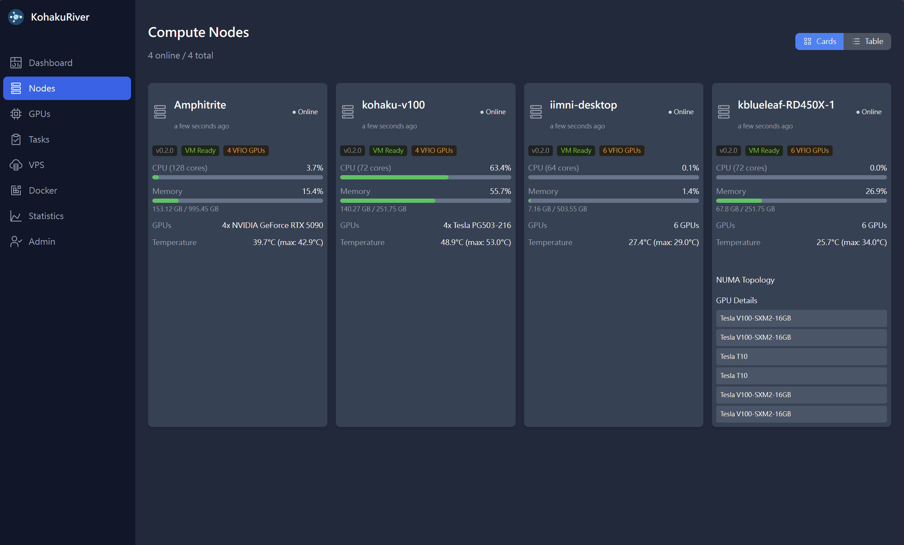
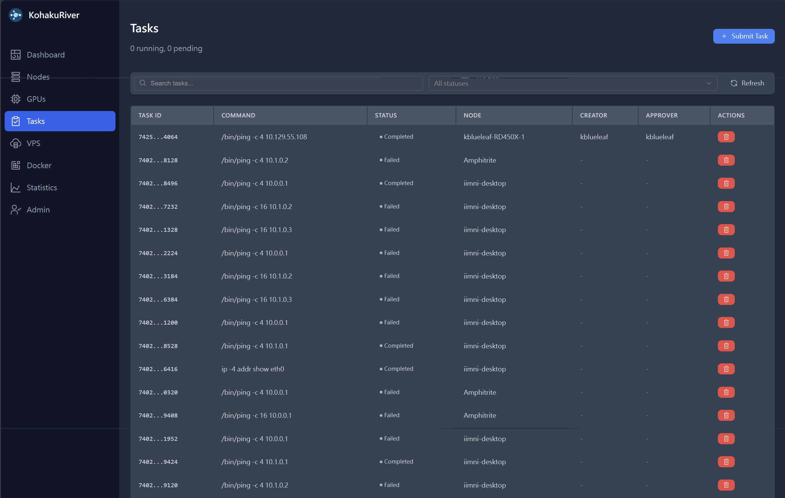
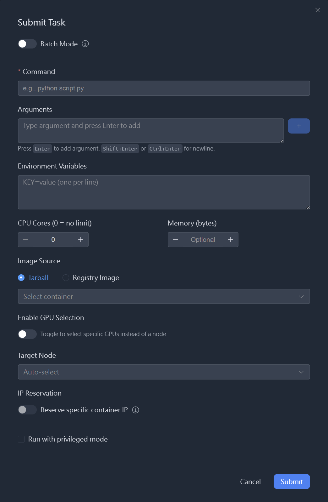
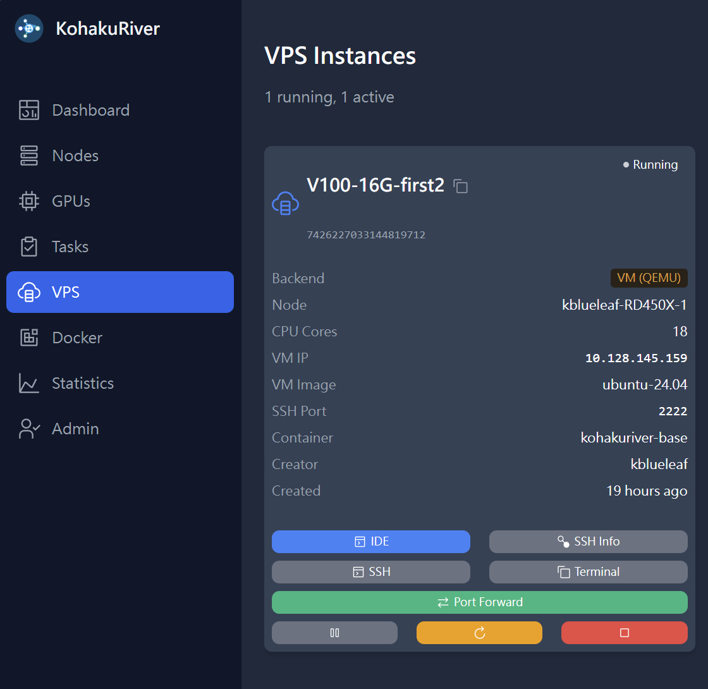
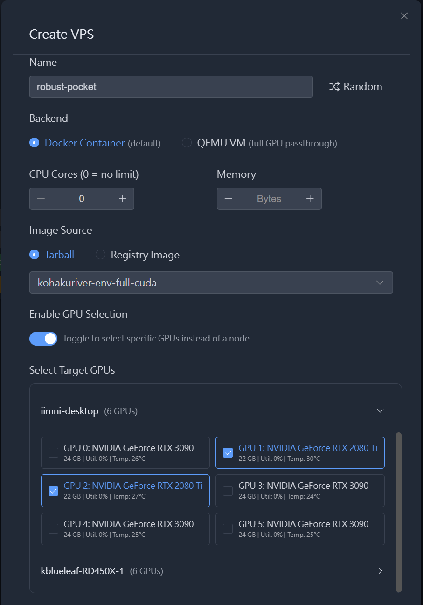
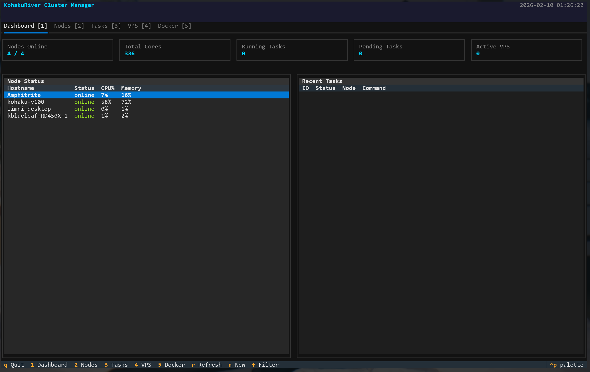
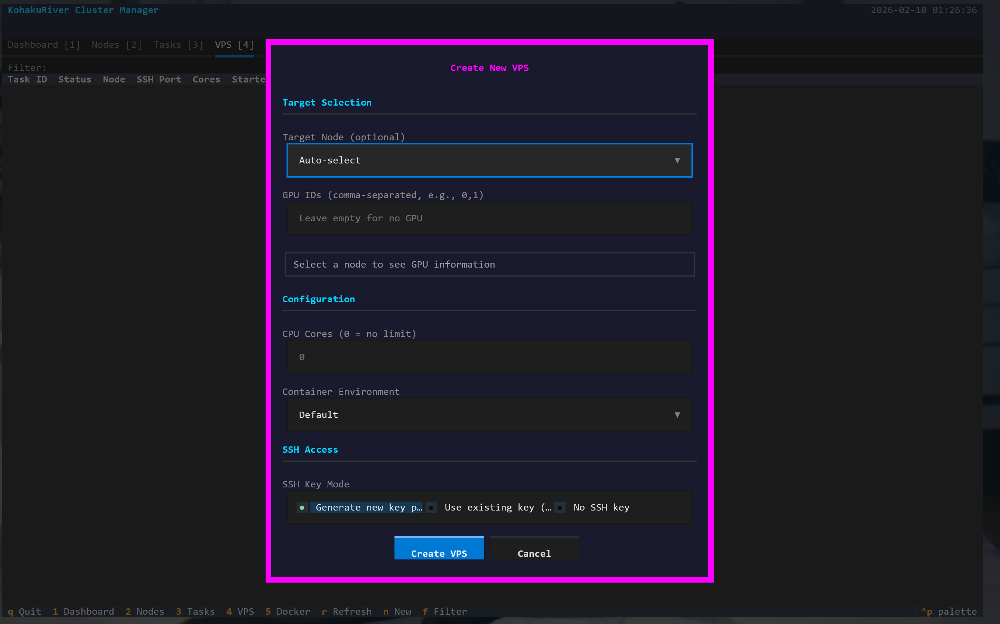
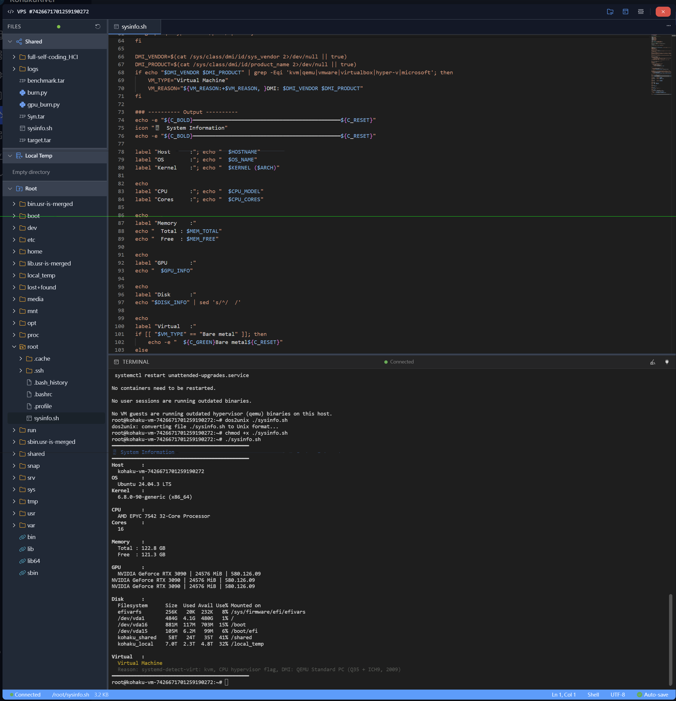

# KohakuRiver

[](https://www.gnu.org/licenses/agpl-3.0)
[](https://riverdoc.kohaku-lab.org)
[](./README.md)
[](./README.zh.md)

<p align="center">
  
</p>

<p align="center">
  <b>Self-hosted cluster manager for small teams and research labs.</b><br>
  Distribute tasks and persistent VPS sessions across compute nodes with<br>
  Docker containers, QEMU/KVM VMs, VXLAN overlay networking, and GPU passthrough.
</p>

<p align="center">
  <a href="https://riverdoc.kohaku-lab.org">Documentation</a> &middot;
  <a href="#quick-start">Quick Start</a> &middot;
  <a href="#cli-reference">CLI Reference</a>
</p>

---

## Overview

Small teams with 3-20 compute nodes face an awkward middle ground — too many machines to manage with SSH scripts, too few to justify Slurm or Kubernetes. KohakuRiver treats your cluster as one big computer: submit a command or launch a VPS, and it runs on the right node with the right resources.

> Docker in KohakuRiver functions as a portable virtual environment. Set up once, package as a tarball, and every node has the same environment automatically.

### Key Capabilities

- **Command tasks** — one-shot batch execution with stdout/stderr capture
- **VPS sessions** — persistent interactive environments with SSH, terminal, and port forwarding
- **Dual backends** — Docker containers for lightweight tasks, QEMU/KVM VMs for full hardware isolation
- **GPU support** — NVIDIA Container Toolkit for Docker, VFIO passthrough for VMs
- **Overlay networking** — VXLAN L3 hub topology, containers on different nodes communicate directly
- **Tunnel system** — WebSocket-based terminal and port forwarding without Docker port mapping
- **Web dashboard** — Vue.js UI for cluster management, monitoring, and terminal access
- **Terminal TUI** — full-screen dashboard and IDE mode with file tree and integrated terminal
- **Auth system** — roles (admin/operator/user), API tokens, invitation-based registration

---

## Screenshots

<!--
  Replace the src values with your actual screenshot paths.
  These use HTML tables so vertical/1:1 screenshots sit side-by-side nicely.
  Adjust width="50%" if you want different sizing.
-->

### Web Dashboard

<table>
<tr>
<td width="50%">

**Cluster Overview**



</td>
<td width="50%">

**Node Monitoring**



</td>
</tr>
</table>

<table>
<tr>
<td width="25%">

**Task Management**



</td>
<td width="25%">

**Task Create**



</td>
<td width="25%">

**VPS Management**



</td>
<td width="25%">

**VPS Create**



</td>
</tr>
</table>

### Terminal TUI

<table>
<tr>
<td width="50%">

**TUI Dashboard**




</td>
<td width="50%">

**IDE Mode**



</td>
</tr>
</table>

---

## Architecture

```
                  ┌──────────┐   ┌──────────────────────┐
                  │   CLI    │   │    Web Dashboard     │
                  └────┬─────┘   └──────────┬───────────┘
                       │                    │
                       ▼                    ▼
┌────────────────────────────────────────────────────────────┐
│                  Host Server (:8000)                       │
│                                                            │
│  ┌───────────┐ ┌───────────┐ ┌───────────┐ ┌───────────┐  │
│  │  FastAPI  │ │   Task    │ │  Overlay  │ │ SSH Proxy │  │
│  │   API     │ │ Scheduler │ │  Manager  │ │  (:8002)  │  │
│  └───────────┘ └───────────┘ └───────────┘ └───────────┘  │
│  ┌────────────┐ ┌────────────────────────────────────┐     │
│  │   Auth     │ │  SQLite DB (Peewee ORM)            │     │
│  │  Service   │ │  tasks, nodes, users, auth         │     │
│  └────────────┘ └────────────────────────────────────┘     │
└────────────────────────────┬───────────────────────────────┘
                             │  HTTP + VXLAN
            ┌────────────────┴────────────────┐
            │                                 │
┌───────────▼────────────────┐  ┌─────────────▼──────────────┐
│  Runner Node A (:8001)     │  │  Runner Node B (:8001)     │
│                            │  │                            │
│  ┌──────────────────────┐  │  │  ┌──────────────────────┐  │
│  │  Runner Agent        │  │  │  │  Runner Agent        │  │
│  │  (FastAPI)           │  │  │  │  (FastAPI)           │  │
│  └──────────────────────┘  │  │  └──────────────────────┘  │
│                            │  │                            │
│  ┌──────────┐ ┌──────────┐ │  │  ┌──────────┐ ┌──────────┐ │
│  │  Docker  │ │  Tunnel  │ │  │  │  Docker  │ │   QEMU   │ │
│  │  Engine  │ │  Server  │ │  │  │  Engine  │ │   /KVM   │ │
│  └──────────┘ └──────────┘ │  │  └──────────┘ └──────────┘ │
│  ┌──────────┐ ┌──────────┐ │  │  ┌──────────┐ ┌──────────┐ │
│  │   VPS    │ │  VXLAN   │ │  │  │  Tunnel  │ │  VXLAN   │ │
│  │  Manager │ │  Agent   │ │  │  │  Server  │ │  Agent   │ │
│  └──────────┘ └──────────┘ │  │  └──────────┘ └──────────┘ │
│                            │  │                            │
│  ┌──────┐ ┌──────┐        │  │  ┌──────┐ ┌──────┐        │
│  │VPS 1 │ │VPS 2 │        │  │  │VPS 3 │ │ VM 1 │        │
│  └──────┘ └──────┘        │  │  └──────┘ └──────┘        │
└────────────────────────────┘  └────────────────────────────┘
                             │
            ┌────────────────▼────────────────┐
            │   Shared Storage (optional)     │
            │   NFS / Samba / SSHFS           │
            └─────────────────────────────────┘
```

| Tier | Role |
|------|------|
| **Host** (:8000) | Central control plane. Task scheduling, node management, overlay hub, SSH/WebSocket proxy, SQLite database. |
| **Runners** (:8001) | Compute node agents. Execute tasks in Docker/QEMU, monitor resources, run tunnel server, manage overlay agent. |
| **Containers / VMs** | Workloads. Docker for lightweight tasks, QEMU/KVM for full isolation with GPU passthrough. |
| **Shared Storage** | (Optional) NFS/Samba/SSHFS. Simplifies tarball distribution. Path can differ per node. Not required with registry images or VMs. |

---

## Quick Start

### Prerequisites

- Python >= 3.10
- Docker Engine on host and runner nodes
- (Optional) Shared filesystem, NVIDIA drivers + Container Toolkit, QEMU/KVM + IOMMU

### Install

```bash
git clone https://github.com/KohakuBlueleaf/KohakuRiver.git
cd KohakuRiver
pip install .

# With GPU monitoring
pip install ".[gpu]"
```

### Configure

```bash
kohakuriver init config --generate
```

Edit `~/.kohakuriver/host_config.py`:
```python
HOST_REACHABLE_ADDRESS = "192.168.1.100"  # IP that runners can reach
SHARED_DIR = "/mnt/cluster-share"         # shared storage path (optional)
```

Edit `~/.kohakuriver/runner_config.py`:
```python
HOST_ADDRESS = "192.168.1.100"            # host IP
SHARED_DIR = "/mnt/cluster-share"         # same shared storage
```

### Start

```bash
# On the host machine
kohakuriver.host

# On each runner node
kohakuriver.runner
```

For production, use systemd:
```bash
kohakuriver init service --host     # on host
kohakuriver init service --runner   # on runners
sudo systemctl enable --now kohakuriver-host
sudo systemctl enable --now kohakuriver-runner
```

### First Task

```bash
kohakuriver task submit -t mynode -- echo "Hello from the cluster!"
kohakuriver task logs <task_id>
```

### First VPS

```bash
kohakuriver vps create -t mynode -c 4 -m 8G --ssh
kohakuriver vps connect <task_id>          # SSH
kohakuriver connect <task_id>              # WebSocket terminal
kohakuriver connect <task_id> --ide        # TUI IDE
```

---

## Features

### Container as Portable Environment

Create a Docker container on the host, customize it interactively, package it as a tarball. Every runner automatically syncs it. Or pull directly from any Docker registry.

```bash
kohakuriver docker container create python:3.12-slim my-env
kohakuriver docker container shell my-env        # customize interactively
kohakuriver docker tar create my-env             # package for distribution
```

### Resource Management

```bash
# 4 cores, 8GB memory, GPUs 0 and 1 on node "alpha"
kohakuriver task submit -t alpha::0,1 -c 4 -m 8G --container my-env -- python train.py
```

- **CPU** — core count with pinning, NUMA binding (`-t node:numa_id`)
- **Memory** — per-task limits (`-m 8G`)
- **GPU** — target by index (`-t node::0,1`), NVIDIA Container Toolkit for Docker, VFIO for VMs
- **Multi-target** — submit to multiple nodes/GPUs in one command

### QEMU/KVM Virtual Machines

Full VMs with VFIO GPU passthrough. Cloud-init provisions SSH keys, networking, and NVIDIA drivers automatically.

```bash
kohakuriver qemu check                                          # discover capabilities
kohakuriver vps create --backend qemu -t mynode::0 --vm-memory 16384 -c 8 --ssh
```

### Overlay Network

VXLAN L3 hub topology with host as central router. Set `OVERLAY_ENABLED=True` and open UDP 4789 — tunnel setup, subnet allocation, IP reservation, routing, and firewall rules are handled automatically.

```
              Host (10.128.0.1/12)
                    │
         ┌─────────┴──────────┐
    VXLAN VNI=101        VXLAN VNI=102
         │                    │
   Runner 1              Runner 2
   10.128.64.0/18        10.128.128.0/18
```

Supports up to 63 runners with ~16,380 IPs each (configurable).

### Access Without Port Mapping

A Rust tunnel client (Tokio + Tungstenite) inside containers enables access through WebSocket tunnels:

```bash
kohakuriver connect <task_id>              # full TTY terminal (vim, htop)
kohakuriver connect <task_id> --ide        # TUI IDE with file tree
kohakuriver forward <task_id> 8888         # port forwarding (Jupyter, etc.)
kohakuriver forward <task_id> 5353 --proto udp
kohakuriver vps connect <task_id>          # SSH through host proxy
```

No port conflicts. Works through firewalls. Survives container restarts.

### Snapshots

Docker VPS instances support snapshots — auto-snapshot on stop, manual creation, restore on restart, configurable retention (default: 3 per VPS).

### Authentication

Session-based and token-based auth with role hierarchy (admin, operator, user). Invitation-based registration. API tokens for CLI and automation.

---

## Web Dashboard

The Vue.js frontend provides cluster overview, task/VPS management, Docker environment management, web terminal (xterm.js), GPU monitoring (Plotly.js), and admin panel.

```bash
cd src/kohakuriver-manager
npm install
npm run dev      # port 5173
npm run build    # production build
```

---

## CLI Reference

### Tasks

```bash
kohakuriver task submit [OPTIONS] -- CMD    # submit a command task
kohakuriver task list                       # list tasks
kohakuriver task status <id>                # detailed status
kohakuriver task logs <id>                  # stdout (--stderr, --follow)
kohakuriver task kill <id>                  # kill running task
kohakuriver task pause <id>                 # pause
kohakuriver task resume <id>               # resume
kohakuriver task watch <id>                # live monitor
```

<details>
<summary>Submit options</summary>

| Flag | Description |
|------|-------------|
| `-t, --target NODE[::GPU,GPU]` | Target node, optional NUMA (`:numa`) and GPU (`::0,1`) |
| `-c, --cores N` | CPU cores (0 = no limit) |
| `-m, --memory SIZE` | Memory limit (e.g., `8G`, `512M`) |
| `--container NAME` | Container environment name |
| `--image NAME` | Docker registry image (alternative to tarball) |
| `--privileged` | Run with Docker `--privileged` |
| `--mount SRC:DST` | Additional bind mounts |
| `--wait` | Wait for task completion |

</details>

### VPS

```bash
kohakuriver vps create [OPTIONS]            # create VPS
kohakuriver vps list                        # list instances (--all for stopped)
kohakuriver vps status <id>                 # detailed status
kohakuriver vps stop <id>                   # stop (preserves state)
kohakuriver vps restart <id>                # restart
kohakuriver vps pause <id> / resume <id>    # pause / resume
kohakuriver vps connect <id>                # SSH via proxy
```

<details>
<summary>VPS options</summary>

| Flag | Description |
|------|-------------|
| `--backend docker\|qemu` | Workload backend (default: docker) |
| `--ssh` | Enable SSH access |
| `--gen-ssh-key` | Generate SSH keypair |
| `--public-key-file PATH` | SSH public key file |
| `--vm-memory MB` | VM RAM in MB (QEMU only, default: 4096) |
| `--vm-disk GB` | VM disk in GB (QEMU only, default: 20) |
| `--vm-image NAME` | Base VM image (QEMU only, default: ubuntu-22.04) |

</details>

### Access & Terminal

```bash
kohakuriver connect <id>                    # WebSocket terminal (full TTY)
kohakuriver connect <id> --ide              # TUI IDE with file tree
kohakuriver forward <id> <port>             # port forwarding
kohakuriver forward <id> <port> -l <local>  # custom local port
kohakuriver forward <id> <port> --proto udp # UDP forwarding
kohakuriver terminal                        # TUI dashboard
```

### Nodes

```bash
kohakuriver node list                       # list nodes (--status online|offline)
kohakuriver node status <hostname>          # node details
kohakuriver node health [hostname]          # health metrics
kohakuriver node summary                    # cluster summary
kohakuriver node overlay                    # overlay network status
```

### Docker

```bash
kohakuriver docker container list           # list host containers
kohakuriver docker container create IMG NAME # create from image
kohakuriver docker container shell NAME     # interactive shell
kohakuriver docker container start NAME     # start
kohakuriver docker container stop NAME      # stop
kohakuriver docker container delete NAME    # delete
kohakuriver docker tar list                 # list tarballs
kohakuriver docker tar create NAME          # create tarball
kohakuriver docker tar delete NAME          # delete tarball
kohakuriver docker images                   # list images on runners
```

<details>
<summary>QEMU/KVM, Auth, SSH, Setup</summary>

**QEMU/KVM**

```bash
kohakuriver qemu check                      # verify KVM, IOMMU, VFIO GPUs
kohakuriver qemu image create               # create base VM image
kohakuriver qemu image list                 # list base images
kohakuriver qemu instances                  # list VM instances
kohakuriver qemu cleanup <id>               # delete VM instance
kohakuriver qemu acs-override               # apply ACS override
```

**Authentication**

```bash
kohakuriver auth login                      # login
kohakuriver auth logout                     # logout (--revoke to revoke token)
kohakuriver auth status                     # current auth status
kohakuriver auth token list                 # list API tokens
kohakuriver auth token create <name>        # create token
kohakuriver auth token revoke <id>          # revoke token
```

**SSH**

```bash
kohakuriver ssh connect <id>                # SSH to VPS via proxy
kohakuriver ssh config                      # generate SSH config for all VPS
```

**Setup**

```bash
kohakuriver init config --generate          # generate config files
kohakuriver init service --host             # create host systemd service
kohakuriver init service --runner           # create runner systemd service
kohakuriver config show                     # show current config
```

</details>

---

## Configuration

Configuration files are Python modules in `~/.kohakuriver/`. Generate with `kohakuriver init config --generate`.

<details>
<summary>Host settings (<code>~/.kohakuriver/host_config.py</code>)</summary>

| Setting | Default | Description |
|---------|---------|-------------|
| `HOST_REACHABLE_ADDRESS` | `"127.0.0.1"` | IP/hostname runners and clients use to reach the host |
| `HOST_PORT` | `8000` | API server port |
| `HOST_SSH_PROXY_PORT` | `8002` | SSH proxy port |
| `SHARED_DIR` | `"/mnt/cluster-share"` | Shared storage path |
| `DB_FILE` | `"cluster_management.db"` | SQLite database path |
| `OVERLAY_ENABLED` | `False` | Enable VXLAN overlay networking |
| `DEFAULT_CONTAINER_NAME` | `"kohakuriver-base"` | Default container environment |
| `HEARTBEAT_INTERVAL_SECONDS` | `5` | Runner heartbeat interval |
| `HEARTBEAT_TIMEOUT_FACTOR` | `6` | Missed heartbeats before offline |
| `TASKS_PRIVILEGED` | `False` | Run containers with `--privileged` |

</details>

<details>
<summary>Runner settings (<code>~/.kohakuriver/runner_config.py</code>)</summary>

| Setting | Default | Description |
|---------|---------|-------------|
| `HOST_ADDRESS` | `"127.0.0.1"` | Host server address |
| `HOST_PORT` | `8000` | Host server port |
| `SHARED_DIR` | `"/mnt/cluster-share"` | Shared storage path (can differ from host) |
| `LOCAL_TEMP_DIR` | `"/tmp/kohakuriver"` | Local temporary storage |
| `OVERLAY_ENABLED` | `False` | Enable VXLAN overlay networking |
| `TUNNEL_ENABLED` | `True` | Enable tunnel server |
| `VM_IMAGES_DIR` | `"~/.kohakuriver/vm-images"` | QEMU base image directory |
| `VM_DEFAULT_MEMORY_MB` | `4096` | Default VM RAM |
| `VM_ACS_OVERRIDE` | `False` | Enable ACS override for IOMMU groups |

</details>

<details>
<summary>Environment variables</summary>

| Variable | Description |
|----------|-------------|
| `KOHAKURIVER_HOST` | Host server address (for CLI) |
| `KOHAKURIVER_PORT` | Host server port (for CLI) |
| `KOHAKURIVER_SSH_PROXY_PORT` | SSH proxy port (for CLI) |

</details>

---

## What KohakuRiver Is (and Isn't)

| KohakuRiver is for... | KohakuRiver is not for... |
|---|---|
| Small clusters (3-20 nodes) | Large-scale HPC (Slurm, PBS) |
| Command tasks and interactive VPS sessions | Multi-service orchestration (Kubernetes) |
| Docker containers as portable environments | Complex CI/CD pipelines |
| Independent tasks and batch submission | DAG workflow orchestration (Airflow, Prefect) |
| Research labs, home labs, small teams | Multi-tenant production environments |
| GPU workloads with simple allocation | Advanced GPU scheduling (MIG, time-slicing) |

---

## Project Structure

```
src/
├── kohakuriver/              # Python backend
│   ├── host/                 # Host server (FastAPI :8000)
│   ├── runner/               # Runner agent (FastAPI :8001)
│   ├── cli/                  # CLI (Typer + Rich + Textual)
│   ├── db/                   # Peewee ORM models
│   ├── docker/               # Docker client wrapper
│   ├── qemu/                 # QEMU/KVM + VFIO + cloud-init
│   ├── models/               # Pydantic request/response models
│   └── utils/                # Shared utilities, config
├── kohakuriver-manager/      # Vue.js web dashboard
├── kohakuriver-tunnel/       # Rust tunnel client
└── kohakuriver-doc/          # Documentation site
```

## Tech Stack

| Layer | Technologies |
|-------|-------------|
| **Backend** | Python 3.10+, FastAPI, Uvicorn, Peewee ORM, SQLite, pyroute2 |
| **CLI** | Typer, Rich, Textual |
| **Frontend** | Vue.js 3, Vite, Element Plus, Pinia, xterm.js, Plotly.js |
| **Tunnel** | Rust, Tokio, Tungstenite |
| **VM** | QEMU/KVM, VFIO, cloud-init, virtio-9p |
| **Auth** | bcrypt, session cookies, API tokens |

## Documentation

Full documentation: **[riverdoc.kohaku-lab.org](https://riverdoc.kohaku-lab.org)**

- **User Guide** — Installation, setup, tasks, VPS, CLI reference, administration
- **Developer Guide** — Architecture internals, code structure, conventions
- **Technical Report** — Deep-dive analyses of overlay networking, QEMU virtualization, tunnel protocol, authentication

---

## License

This project is licensed under the **GNU Affero General Public License v3.0 (AGPL-3.0)**.

For commercial or proprietary license exemptions, contact: **kohaku@kblueleaf.net**
