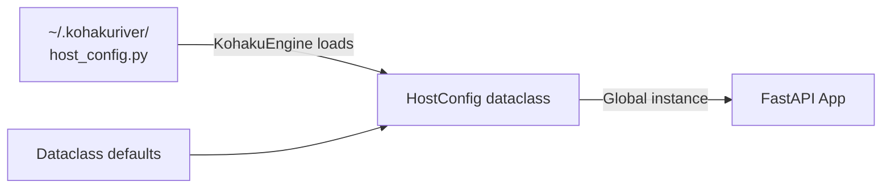

# Config System

KohakuRiver uses Python `@dataclass` classes for configuration, with a global singleton pattern that allows runtime modification before server startup.

## Pattern Overview



Each component (host, runner) defines:

1. A `@dataclass` with typed, documented fields and sensible defaults.
2. A module-level global instance (`config = HostConfig()`).
3. Configuration loaded at startup by overwriting the global instance's attributes.

## HostConfig (`host/config.py`)

```python
@dataclass
class HostConfig:
    # Network
    HOST_BIND_IP: str = "0.0.0.0"
    HOST_PORT: int = 8000
    HOST_SSH_PROXY_PORT: int = 8002
    HOST_REACHABLE_ADDRESS: str = "127.0.0.1"

    # Paths
    SHARED_DIR: str = "/mnt/cluster-share"  # Optional: only needed for tarball-based image distribution
    DB_FILE: str = "/var/lib/kohakuriver/kohakuriver.db"
    CONTAINER_DIR: str = ""

    # Timing
    HEARTBEAT_INTERVAL_SECONDS: int = 5
    HEARTBEAT_TIMEOUT_FACTOR: int = 6
    CLEANUP_CHECK_INTERVAL_SECONDS: int = 10

    # Docker
    DEFAULT_CONTAINER_NAME: str = "kohakuriver-base"
    INITIAL_BASE_IMAGE: str = "python:3.12-alpine"
    TASKS_PRIVILEGED: bool = False
    ADDITIONAL_MOUNTS: list[str] = field(default_factory=list)

    # Overlay Network
    OVERLAY_ENABLED: bool = False
    OVERLAY_SUBNET: str = "10.128.0.0/12/6/14"
    OVERLAY_VXLAN_ID: int = 100
    OVERLAY_VXLAN_PORT: int = 4789
    OVERLAY_MTU: int = 1450

    # Authentication
    AUTH_ENABLED: bool = False
    ADMIN_SECRET: str = ""
    SESSION_EXPIRE_HOURS: int = 720  # 30 days

    # Logging
    LOG_LEVEL: LogLevel = LogLevel.INFO

    # Helper methods
    def get_container_dir(self) -> str: ...
    def get_host_url(self) -> str: ...
    def get_heartbeat_timeout(self) -> int: ...

config = HostConfig()  # Global instance
```

### Key Settings

- **`HOST_REACHABLE_ADDRESS`**: The address runners use to reach the host. Must be set correctly for cluster communication.
- **`OVERLAY_SUBNET`**: Format `BASE_IP/NETWORK_PREFIX/NODE_BITS/SUBNET_BITS`. See [Networking Internals](./networking-internals.md).
- **`HEARTBEAT_TIMEOUT_FACTOR`**: A node is considered dead after `interval * factor` seconds without a heartbeat.

## RunnerConfig (`runner/config.py`)

```python
@dataclass
class RunnerConfig:
    # Network
    RUNNER_BIND_IP: str = "0.0.0.0"
    RUNNER_PORT: int = 8001
    HOST_ADDRESS: str = "127.0.0.1"
    HOST_PORT: int = 8000

    # Paths
    SHARED_DIR: str = "/mnt/cluster-share"  # Optional: used for tarball image sync and cross-node shared data
    LOCAL_TEMP_DIR: str = "/tmp/kohakuriver"

    # Docker
    DOCKER_NETWORK_NAME: str = "kohakuriver-net"
    DOCKER_NETWORK_SUBNET: str = "172.30.0.0/16"
    DOCKER_NETWORK_GATEWAY: str = "172.30.0.1"

    # Snapshots
    AUTO_SNAPSHOT_ON_STOP: bool = True
    MAX_SNAPSHOTS_PER_VPS: int = 3
    AUTO_RESTORE_ON_CREATE: bool = True

    # Tunnel
    TUNNEL_ENABLED: bool = True
    TUNNEL_CLIENT_PATH: str = ""

    # QEMU/KVM
    VM_IMAGES_DIR: str = "/var/lib/kohakuriver/vm-images"
    VM_INSTANCES_DIR: str = "/var/lib/kohakuriver/vm-instances"
    VM_DEFAULT_MEMORY_MB: int = 4096
    VM_DEFAULT_DISK_SIZE: str = "500G"
    VM_ACS_OVERRIDE: bool = True

    # Overlay (must match Host)
    OVERLAY_ENABLED: bool = False
    OVERLAY_SUBNET: str = "10.128.0.0/12/6/14"

    # Helper methods
    def get_hostname(self) -> str: ...
    def get_host_url(self) -> str: ...
    def get_container_tar_dir(self) -> str: ...
    def get_tunnel_client_path(self) -> str | None: ...
    def get_container_network(self) -> str: ...
    def get_container_gateway(self) -> str: ...
    def set_overlay_configured(self, gateway: str) -> None: ...

config = RunnerConfig()  # Global instance
```

### Dynamic Network Selection

The runner dynamically selects the container network based on overlay state:

```python
def get_container_network(self) -> str:
    if self.OVERLAY_ENABLED and self._overlay_configured:
        return self.OVERLAY_NETWORK_NAME  # "kohakuriver-overlay"
    return self.DOCKER_NETWORK_NAME       # "kohakuriver-net"
```

### Tunnel Client Auto-Detection

`get_tunnel_client_path()` searches these locations in order:

1. Explicit `TUNNEL_CLIENT_PATH` setting
2. `./tunnel-client` (CWD)
3. `~/.kohakuriver/tunnel-client`
4. `/usr/local/bin/tunnel-client`
5. Shared storage `bin/tunnel-client`
6. Development build path

## Configuration Files

User configuration lives in `~/.kohakuriver/`:

```python
# ~/.kohakuriver/host_config.py
HOST_REACHABLE_ADDRESS = "192.168.1.100"
HOST_PORT = 8000
SHARED_DIR = "/mnt/cluster-share"  # Optional: omit if using registry_image exclusively
OVERLAY_ENABLED = True
AUTH_ENABLED = True
ADMIN_SECRET = "my-admin-secret"
```

The KohakuEngine library reads the Python file and applies the values to the dataclass.

## Enum Types

Configuration uses custom enums from `models/enums.py`:

```python
class LogLevel(str, Enum):
    FULL = "full"       # Complete trace
    DEBUG = "debug"
    INFO = "info"
    WARNING = "warning"
```

## Default Config File

A TOML defaults file exists at `src/kohakuriver/utils/default_config.toml`, which is bundled with the package via `setuptools.package-data`.
