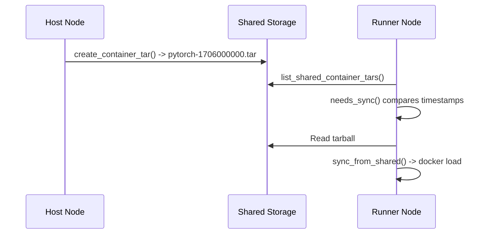

# Docker Integration

KohakuRiver uses the Docker SDK for Python to manage containers and images. The Docker-related code is split across `src/kohakuriver/docker/` (utilities) and `src/kohakuriver/runner/services/` (execution logic).

## Container Naming (`docker/naming.py`)

All KohakuRiver-managed Docker resources follow strict naming conventions:

### Container Names

| Type              | Pattern                      | Example                                |
| ----------------- | ---------------------------- | -------------------------------------- |
| Command task      | `kohakuriver-task-{task_id}` | `kohakuriver-task-7199539478398935040` |
| VPS session       | `kohakuriver-vps-{task_id}`  | `kohakuriver-vps-7199539478398935041`  |
| Environment build | `kohakuriver-env-{name}`     | `kohakuriver-env-pytorch`              |

### Image Tags

| Type        | Pattern                              | Example                                   |
| ----------- | ------------------------------------ | ----------------------------------------- |
| Environment | `kohakuriver/{name}:{tag}`           | `kohakuriver/pytorch:base`                |
| Snapshot    | `kohakuriver-snapshot/vps-{id}:{ts}` | `kohakuriver-snapshot/vps-123:1706000000` |

### Docker Labels

Every managed container gets labels for filtering:

```python
labels = {
    "kohakuriver.managed": "true",
    "kohakuriver.task_id": "12345",
    "kohakuriver.task_type": "command",  # or "vps"
    "kohakuriver.node": "worker-01",
}
```

`is_kohakuriver_container()` and `extract_task_id_from_name()` parse these conventions.

## Image Distribution (`docker/utils.py`)

KohakuRiver supports two image distribution methods: **tarballs on shared storage** (NFS/CIFS) and **Docker registry pulls** via the `registry_image` field. Tarball distribution through shared storage is the recommended default -- it keeps all runners on identical images without requiring a private registry. When shared storage is unavailable, or when using public/third-party images, tasks can specify `registry_image` (e.g., `ubuntu:22.04`) and Docker pulls the image directly.

### Distribution Flow



### Tarball Functions

- `list_shared_container_tars(dir, name)` -- Lists files matching `{name}-{timestamp}.tar`, sorted newest-first.
- `get_local_image_timestamp(name)` -- Gets the Docker image creation time for comparison.
- `needs_sync(name, dir)` -- Returns `(True, path)` if shared tarball is newer than local image.
- `sync_from_shared(name, path)` -- Loads tarball via `docker.images.load()` and ensures correct tag.
- `create_container_tar(source, name, dir)` -- Commits a container to an image, saves as tarball, cleans old tarballs.

### Sync Timeout

Image sync has a configurable timeout (`DOCKER_IMAGE_SYNC_TIMEOUT`, default 600 seconds) for large images (10-30 GB).

## Exception Hierarchy (`docker/exceptions.py`)

```
DockerError (base)
  DockerConnectionError      # Daemon not running, permission denied
  ContainerNotFoundError     # Container does not exist
  ContainerCreationError     # Failed to create container
  ContainerExecutionError    # Command execution failed
  ImageNotFoundError         # Image not in local Docker or registry
  ImageBuildError            # Image build/commit failed
  ImageExportError           # Image save to tarball failed
  ImageImportError           # Image load from tarball failed
  ResourceAllocationError    # CPU/memory/GPU allocation failed
```

## Task Container Configuration

When the runner creates a task container, it configures:

```python
container = client.containers.create(
    image=image_tag,
    command=[command] + arguments,
    environment=env_vars,
    cpuset_cpus=cpuset_string,        # NUMA-aware CPU pinning
    mem_limit=memory_bytes,
    network=config.get_container_network(),  # kohakuriver-net or overlay
    volumes={shared_dir: {"bind": "/shared", "mode": "rw"}},
    labels=make_labels(task_id, "command", hostname),
    privileged=config.TASKS_PRIVILEGED,
    device_requests=[docker.types.DeviceRequest(
        device_ids=[str(g) for g in gpus],
        capabilities=[["gpu"]],
    )] if gpus else None,
)
```

### VPS Container Configuration

VPS containers additionally get:

- SSH server installation and key configuration
- Tunnel client binary injected at `/usr/local/bin/tunnel-client`
- Startup script that launches both SSH and the tunnel client
- Auto-snapshot on stop (if `AUTO_SNAPSHOT_ON_STOP=True`)
- Auto-restore from latest snapshot on create (if `AUTO_RESTORE_ON_CREATE=True`)

### Network Configuration

Containers connect to one of two networks:

1. **`kohakuriver-net`** (default) -- isolated bridge network per runner (`172.30.0.0/16`).
2. **`kohakuriver-overlay`** -- VXLAN-backed overlay for cross-node communication. Each runner gets a `/16` (or configurable) subnet. See [Networking Internals](./networking-internals.md).

## Registry Images

In addition to tarball-based images, tasks can specify a `registry_image` (e.g., `ubuntu:22.04`) which Docker pulls directly. This overrides the tarball-based `container_name`.
