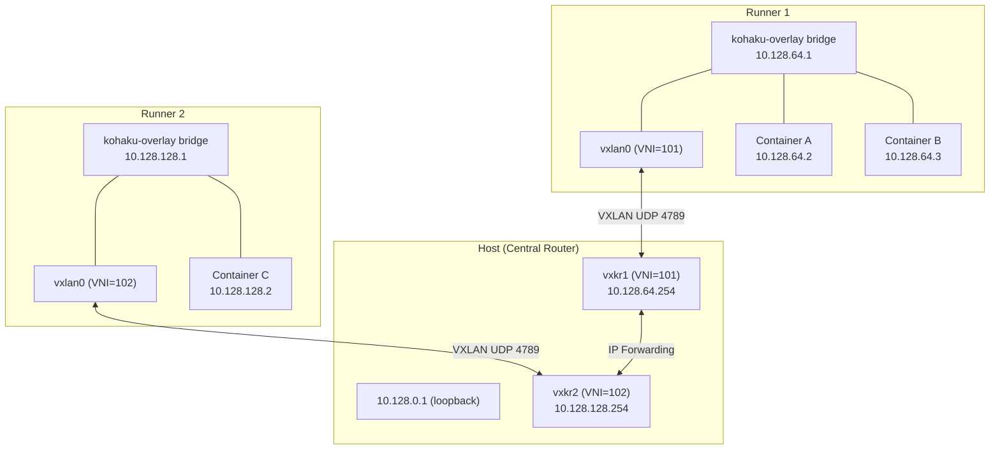

# Networking Internals

KohakuRiver provides an optional VXLAN L3 overlay network that enables cross-node communication between containers and VMs. The Host acts as the central router.

## Architecture



## Subnet Configuration

The overlay subnet is configured as a four-part string: `BASE_IP/NETWORK_PREFIX/NODE_BITS/SUBNET_BITS`.

The three parts must sum to 32: `NETWORK_PREFIX + NODE_BITS + SUBNET_BITS = 32`.

### Default: `10.128.0.0/12/6/14`

| Parameter       | Value            | Meaning                                        |
| --------------- | ---------------- | ---------------------------------------------- |
| Network         | `10.128.0.0/12`  | Range `10.128.0.0` - `10.143.255.255`          |
| Node bits       | 6                | Up to 63 runners                               |
| Subnet bits     | 14               | ~16,380 container IPs per runner               |
| Runner 1 subnet | `10.128.64.0/18` | Gateway `10.128.64.1`, Host IP `10.128.64.254` |
| Host IP         | `10.128.0.1`     | On loopback                                    |

### Alternative: `10.0.0.0/8/8/16`

| Parameter       | Value         | Meaning                                  |
| --------------- | ------------- | ---------------------------------------- |
| Network         | `10.0.0.0/8`  | Full `10.x.x.x` range                    |
| Node bits       | 8             | Up to 255 runners                        |
| Subnet bits     | 16            | ~65,532 container IPs per runner         |
| Runner 1 subnet | `10.1.0.0/16` | Gateway `10.1.0.1`, Host IP `10.1.0.254` |

### OverlaySubnetConfig API

Defined in `models/overlay_subnet.py`:

```python
config = OverlaySubnetConfig.parse("10.128.0.0/12/6/14")
config.max_runners        # 63
config.ips_per_runner     # 16380
config.get_host_ip()      # "10.128.0.1"
config.get_runner_subnet(1)   # "10.128.64.0/18"
config.get_runner_gateway(1)  # "10.128.64.1"
config.get_host_ip_on_runner_subnet(1)  # "10.128.64.254"
config.get_container_ip_range(1)  # ("10.128.64.2", "10.128.127.253")
```

## Host-Side Overlay (`host/services/overlay/`)

The `OverlayNetworkManager` on the Host:

1. **Allocates** subnets when runners register (`allocate_for_runner`)
2. **Creates** per-runner VXLAN interfaces named `vxkr{base36_id}`
3. **Assigns** an IP from the runner's subnet (`.254`) to each VXLAN interface
4. **Enables** IP forwarding (`sysctl net.ipv4.ip_forward=1`)
5. **Adds** routes for each runner subnet via the corresponding VXLAN interface

Each runner gets a unique VNI: `base_vxlan_id + runner_id` (e.g., 101, 102, ...).

### Recovery on Restart

On Host startup, the manager scans existing `vxkr*` interfaces:

- **Valid** (correct naming + expected VNI): recover as placeholder allocation
- **Invalid** (wrong naming or VNI): delete and recreate on runner registration

When a runner re-registers, it matches by `physical_ip` and reclaims its allocation.

## Runner-Side Overlay (`runner/services/overlay_manager.py`)

The `RunnerOverlayManager` receives an `OverlayConfig` from the Host during registration:

```python
@dataclass
class OverlayConfig:
    runner_id: int
    subnet: str               # "10.128.64.0/18"
    gateway: str              # "10.128.64.1"
    host_overlay_ip: str      # "10.128.0.1"
    host_physical_ip: str     # Physical IP for VXLAN tunnel
    runner_physical_ip: str   # This runner's physical IP
    overlay_network_cidr: str # "10.128.0.0/12"
    host_ip_on_runner_subnet: str  # "10.128.64.254"
```

Setup steps:

1. Create VXLAN device (`vxlan0`) with VNI pointing to Host's physical IP
2. Create bridge (`kohaku-overlay`) with gateway IP
3. Attach VXLAN to bridge
4. Add route for overlay network via Host gateway
5. Set up iptables FORWARD rules and NAT masquerade
6. Create Docker network (`kohakuriver-overlay`) using the bridge

### Firewall Rules

```bash
# Allow overlay traffic forwarding
iptables -I FORWARD 1 -s 10.128.0.0/12 -j ACCEPT
iptables -I FORWARD 2 -d 10.128.0.0/12 -j ACCEPT

# NAT for external access (masquerade non-overlay destinations)
iptables -t nat -A POSTROUTING -s 10.128.0.0/12 ! -d 10.128.0.0/12 -j MASQUERADE
```

## Cross-Node Traffic Flow

Container A (`10.128.64.2` on Runner 1) to Container C (`10.128.128.2` on Runner 2):

1. A sends packet to `10.128.128.2`
2. Runner 1 routes via gateway `10.128.64.1` -> VXLAN (VNI=101) -> Host
3. Host receives on `vxkr1` (IP `10.128.64.254`)
4. Host kernel routes: `10.128.128.0/18` is via `vxkr2`
5. Host sends via `vxkr2` (VNI=102) -> Runner 2
6. Runner 2 delivers to Container C via bridge

## IP Reservation System

The `IPReservationManager` (`host/services/ip_reservation.py`) enables pre-reserving container IPs for distributed training scenarios where the master address must be known before launching workers.

### Workflow

1. User requests IP reservation: `POST /api/overlay/reserve-ip`
2. Manager picks available IP, generates HMAC-signed token
3. User includes token in task submission: `ip_reservation_token`
4. During task dispatch, Host validates token and passes reserved IP to runner
5. Runner creates container with the exact IP on the overlay network

Tokens are self-contained: `base64(json{ip, runner, exp}.sha256_signature)`. They expire after `DEFAULT_RESERVATION_TTL` (300 seconds) and are cleaned up periodically.

## VM Networking

QEMU VMs use a different network path depending on overlay status:

- **Overlay enabled**: TAP device attached to `kohaku-overlay` bridge (same subnet as Docker containers)
- **Overlay disabled**: TAP device on NAT bridge `kohaku-br0` (`10.200.0.0/24`)

See the `vm_network_manager.py` in runner services for TAP creation and bridge attachment.
