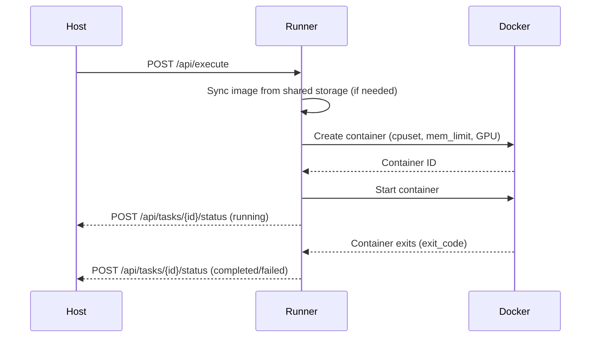

# Runner Architecture

The Runner is the compute-node agent that executes tasks and manages container/VM lifecycles. It runs a FastAPI server on port 8001 and communicates with the Host via HTTP.

## High-Level Architecture

```
                 ┌─────────────────────────────────────────┐
                 │        Host  :8000                      │
                 └──────────────┬──────────────────────────┘
                                │ HTTP
                 ┌──────────────▼─────────────────────────┐
                 │          Runner API  :8001              │
                 │                                        │
                 │  ┌──────────────────────────────────┐  │
                 │  │          Service Layer            │  │
                 │  │                                   │  │
                 │  │  TaskExecutor    VPSManager       │  │
                 │  │  VMVPSManager    TunnelServer     │  │
                 │  │  ResourceMonitor OverlayManager   │  │
                 │  └──┬──────┬──────────┬─────────┬───┘  │
                 │     │      │          │         │      │
                 │  ┌──▼──┐ ┌▼────┐  ┌──▼───┐ ┌──▼────┐  │
                 │  │Docker│ │QEMU │  │Tunnel│ │psutil │  │
                 │  │Daemon│ │/KVM │  │Client│ │nvidia │  │
                 │  └──┬──┘ └──┬──┘  └──┬───┘ └───────┘  │
                 └─────┼───────┼────────┼─────────────────┘
                       │       │        │
                 ┌─────▼───────▼────────▼─────────────────┐
                 │  Containers and VMs                     │
                 │  ┌──────────┐ ┌──────────┐ ┌─────────┐ │
                 │  │ Task     │ │ VPS      │ │ VM      │ │
                 │  │ Container│ │ Container│ │ (QEMU)  │ │
                 │  └──────────┘ └──────────┘ └─────────┘ │
                 └─────────────────────────────────────────┘
```

## Application Lifecycle

On startup, the runner:

1. Loads configuration from `~/.kohakuriver/runner_config.py`.
2. Detects hardware: CPU cores, NUMA topology, GPU info, VM capability.
3. Registers with the host (`POST /api/nodes/register`).
4. Starts the heartbeat background task.
5. Sets up overlay network (if enabled).
6. Recovers any surviving containers/VMs from a previous run (via KohakuVault state DB).

## Endpoint Groups

| Router     | Path Prefix                       | Source File                 | Purpose                              |
| ---------- | --------------------------------- | --------------------------- | ------------------------------------ |
| Tasks      | `/api/execute`, `/api/kill`, etc. | `endpoints/tasks.py`        | Task execution and control           |
| VPS        | `/api/vps/`                       | `endpoints/vps.py`          | VPS create, stop, restart, snapshots |
| Terminal   | `/ws/terminal/`                   | `endpoints/terminal.py`     | WebSocket TTY access                 |
| Tunnel     | `/ws/tunnel/`                     | `services/tunnel_server.py` | WebSocket port forwarding            |
| Docker     | `/api/docker/`                    | `endpoints/docker.py`       | Docker image operations              |
| Filesystem | `/api/fs/`                        | `endpoints/filesystem*.py`  | File operations, watching            |

## Task Execution Flow



### Task Executor (`services/task_executor.py`)

Handles command-type tasks:

1. Syncs the container image from shared storage if needed (tarball-based distribution).
2. Creates a Docker container with resource constraints (CPU, memory, GPU).
3. Mounts shared directories and configures networking.
4. Starts the container and monitors for exit.
5. Reports status back to the host.

Container naming follows `kohakuriver-task-{task_id}`.

### Resource Constraints

```
Constraint   Docker Parameter          Source
──────────   ──────────────────────    ─────────────────────────────
CPU          cpuset_cpus               NUMA-aware core list
Memory       mem_limit                 required_memory_bytes
GPU          --gpus device=...         GPU ID list (NVIDIA Container Toolkit)
Network      network                   kohakuriver-net or overlay
Privileged   privileged                TASKS_PRIVILEGED config
Working Dir  working_dir               DEFAULT_WORKING_DIR config
```

## VPS Management

### Docker VPS (`services/vps_manager.py`, `services/vps_creation.py`)

Long-running interactive containers with:

- SSH server setup (multiple key modes: `none`, `upload`, `generate`)
- Persistent container lifecycle (stop/restart preserves state)
- Snapshot support (commit container to image, auto-restore on create)
- Tunnel client injection for port forwarding

Container naming: `kohakuriver-vps-{task_id}`.

### QEMU VM VPS (`services/vm_vps_manager.py`)

Full virtual machines with:

- QEMU/KVM with UEFI boot (OVMF)
- GPU passthrough via VFIO (IOMMU-group-aware)
- Cloud-init provisioning (user, SSH keys, packages, NVIDIA driver)
- 9p filesystem sharing (`/shared`, `/local_temp`)
- VM agent for heartbeat and GPU monitoring inside the VM
- Network via overlay TAP or NAT bridge (`kohaku-br0`)

The VPS dispatch logic checks the `vps_backend` field ("docker" or "qemu") and routes to the appropriate manager.

## Heartbeat

The runner sends periodic heartbeats to `POST /api/nodes/{hostname}/heartbeat`:

```python
class HeartbeatRequest:
    running_tasks: list[int]          # Currently running task IDs
    killed_tasks: list[KilledInfo]    # Tasks killed since last heartbeat
    cpu_percent: float
    memory_percent: float
    memory_used_bytes: int
    gpu_info: list[dict]              # Per-GPU utilization
    vm_capable: bool
    vfio_gpus: list[dict]
    runner_version: str
```

The host uses this to:

1. Update node metrics in the database.
2. Detect orphaned tasks (in DB but not in `running_tasks`).
3. Process `killed_tasks` (e.g., OOM kills reported with `KILLED_OOM` reason).

Heartbeat interval is `HEARTBEAT_INTERVAL_SECONDS` (default 5 seconds). The host considers a runner dead after `HEARTBEAT_TIMEOUT_FACTOR * HEARTBEAT_INTERVAL_SECONDS` (default 30 seconds) without a heartbeat.

## Resource Monitor (`services/resource_monitor.py`)

Periodically collects system metrics at `RESOURCE_CHECK_INTERVAL_SECONDS` (default 1 second):

- CPU utilization via `psutil`
- Memory usage
- Temperature sensors
- GPU stats via `nvidia-ml-py` (if installed with `pip install ".[gpu]"`)

## Tunnel Server (`services/tunnel_server.py`)

WebSocket endpoint that accepts connections from tunnel clients inside containers. Multiplexes TCP/UDP port forwarding over a single WebSocket using the binary tunnel protocol. See [Protocol Spec](../tunnel/protocol-spec.md).

The tunnel client binary is injected into VPS containers at startup. The runner locates the binary via `RunnerConfig.get_tunnel_client_path()`.

## Overlay Network (`services/overlay_manager.py`)

Runner-side overlay setup:

1. Creates VXLAN tunnel to host (`vxlan0` with VNI pointing to host's physical IP)
2. Creates `kohaku-overlay` bridge with gateway IP
3. Attaches VXLAN to bridge
4. Adds route for overlay network via host gateway
5. Sets up iptables rules for forwarding and NAT masquerade
6. Creates Docker network `kohakuriver-overlay` using the bridge

See [Networking Internals](./networking-internals.md).

## State Persistence

The runner uses KohakuVault (SQLite-based) at `LOCAL_TEMP_DIR/.kohakuriver/runner-state.db` to persist running task state. On restart, it reads this to recover surviving containers/VMs via `background/startup_check.py`.
