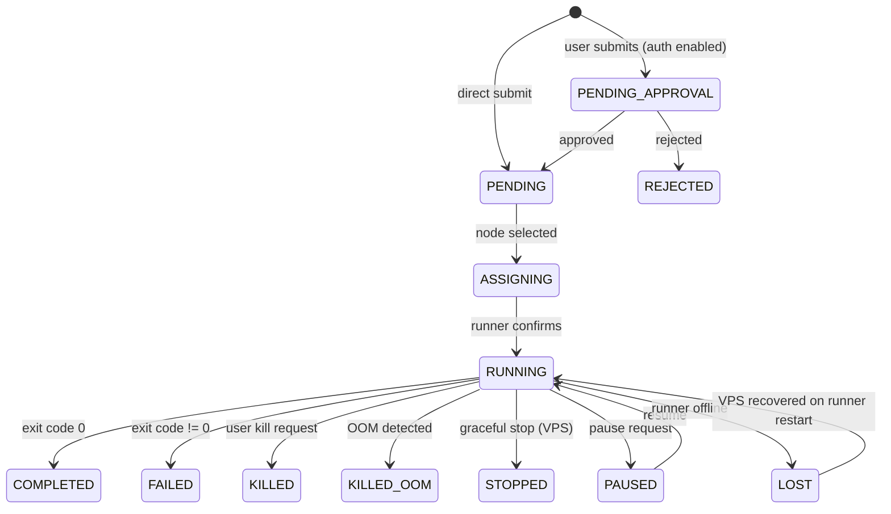

# Code Conventions

This document describes the patterns and conventions used throughout the KohakuRiver codebase.

## Python Backend

### Module Organization

Each module follows a consistent structure with section headers:

```python
# =============================================================================
# Section Name
# =============================================================================
```

Subsections use:

```python
# -------------------------------------------------------------------------
# Subsection Name
# -------------------------------------------------------------------------
```

This makes large files navigable by search and provides visual separation in editors.

### Configuration Pattern

Both host and runner use Python `@dataclass` configurations with a global singleton:

```python
@dataclass
class HostConfig:
    HOST_PORT: int = 8000
    # ...

config = HostConfig()  # Global instance
```

Configuration is modified at runtime before server startup. See [Config System](./backend/config-system.md) for details.

### JSON Field Pattern (Peewee)

Complex data stored in SQLite `TextField` columns as JSON. Every JSON field gets a matching accessor pair:

```python
class Task(BaseModel):
    required_gpus = peewee.TextField(default="[]")

    def get_required_gpus(self) -> list[int]:
        try:
            return json.loads(self.required_gpus)
        except json.JSONDecodeError:
            return []

    def set_required_gpus(self, gpus: list[int] | None) -> None:
        self.required_gpus = json.dumps(gpus or [])
```

The pattern summary:

```
Field              get_X()          set_X()           Stored as
─────────────────  ───────────────  ────────────────  ──────────
arguments          -> list[str]     (list[str])       '["a","b"]'
env_vars           -> dict          (dict)            '{"K":"V"}'
required_gpus      -> list[int]     (list[int])       '[0,1]'
docker_mount_dirs  -> list[str]     (list[str])       '["/data"]'
numa_topology      -> dict          (dict)            '{"0":[0,1]}'
gpu_info           -> list[dict]    (list[dict])      '[{...}]'
vfio_gpus          -> list[dict]    (list[dict])      '[{...}]'
limits_json        -> dict          (dict)            '{...}'
```

See [Database Models](./backend/database-models.md) for the full pattern.

### Pydantic Models

All API request/response types are Pydantic `BaseModel` subclasses in `models/requests.py`. Snowflake IDs use a custom `SnowflakeID` type that serializes 64-bit ints as strings for JavaScript compatibility:

```python
SnowflakeID = Annotated[int, PlainSerializer(lambda x: str(x), return_type=str)]
```

This avoids JavaScript's `Number.MAX_SAFE_INTEGER` (2^53) precision loss for 64-bit snowflake IDs.

### Async Database Access

Peewee is synchronous. In async contexts (FastAPI handlers), use `run_in_executor`:

```python
from kohakuriver.db.base import run_in_executor

task = await run_in_executor(Task.get_or_none, Task.task_id == task_id)
```

This runs the blocking Peewee call in the default thread pool executor.

### Logging

All modules use Loguru via a shared helper:

```python
from kohakuriver.utils.logger import get_logger
logger = get_logger(__name__)
```

Log levels are controlled by the `LOG_LEVEL` config field (an `LogLevel` enum with values: `full`, `debug`, `info`, `warning`).

### Naming Conventions

```
Resource Type        Pattern                              Example
──────────────────   ──────────────────────────────────   ─────────────────────────
Docker task          kohakuriver-task-{task_id}           kohakuriver-task-7199539478398935040
Docker VPS           kohakuriver-vps-{task_id}            kohakuriver-vps-7199539478398935041
Docker env build     kohakuriver-env-{name}               kohakuriver-env-pytorch
Docker image         kohakuriver/{name}:{tag}             kohakuriver/pytorch:base
Snapshot image       kohakuriver-snapshot/vps-{id}:{ts}   kohakuriver-snapshot/vps-123:1706000000
VM name              kohaku-vm-{task_id}                  kohaku-vm-12345
VXLAN devices        vxkr{base36_runner_id} (host)        vxkr1
                     vxlan0 (runner)
Docker networks      kohakuriver-net (default)
                     kohakuriver-overlay (overlay)
Bridges              kohaku-overlay (runner overlay)
                     kohaku-br0 (VM NAT)
```

### Docker Labels

Every managed container gets labels for filtering and identification:

```python
labels = {
    "kohakuriver.managed": "true",
    "kohakuriver.task_id": "12345",
    "kohakuriver.task_type": "command",   # or "vps"
    "kohakuriver.node": "worker-01",
}
```

### Error Handling

Each subsystem defines its own exception hierarchy:

```
docker/exceptions.py                  qemu/exceptions.py
─────────────────────                 ─────────────────────
DockerError (base)                    QEMUError (base)
├── DockerConnectionError             ├── QEMUConnectionError
├── ContainerNotFoundError            ├── VMNotFoundError
├── ContainerCreationError            ├── VMCreationError
├── ContainerExecutionError           ├── VFIOBindError
├── ImageNotFoundError                ├── CloudInitError
├── ImageBuildError                   └── VMCapabilityError
├── ImageExportError
├── ImageImportError
└── ResourceAllocationError
```

### Status Transitions

Task status follows a finite state machine. Valid transitions are enforced in `task_scheduler.py`:



## Frontend (JavaScript/Vue)

### No TypeScript

The project uses **JavaScript only**. Type hints are provided via JSDoc annotations where needed.

### Vue 3 Composition API

All components use `<script setup>` with the Composition API. No Options API.

### Element Plus

UI components come from Element Plus. Import is handled automatically via `unplugin-vue-components`.

### Pinia Stores

State management uses Pinia with the `defineStore` setup syntax:

```javascript
export const useVpsStore = defineStore('vps', () => {
  const vpsList = ref([])
  const activeVps = computed(() => vpsList.value.filter((v) => ['running', 'paused'].includes(v.status)))
  async function fetchVpsList() {
    /* ... */
  }
  return { vpsList, activeVps, fetchVpsList }
})
```

### API Client

All API calls go through `utils/api/client.js` which provides an Axios instance. Domain-specific API modules (tasks, vps, nodes, docker, auth, overlay, filesystem) export functions that return Axios promises.

### File-Based Routing

Both the manager and doc site use `unplugin-vue-router` for file-based routing. Pages live in `src/pages/` and routes are auto-generated from the directory structure.

## Rust (Tunnel Client)

- Uses Tokio async runtime.
- `clap` for argument parsing with environment variable fallbacks.
- `tracing` for structured logging.
- All types are in dedicated modules (`protocol.rs`, `connection.rs`, `tunnel.rs`).
- Error handling uses `anyhow` + `thiserror`.

See [Rust Client](./tunnel/rust-client.md) and [Protocol Spec](./tunnel/protocol-spec.md) for details.
