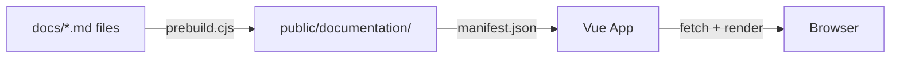

# Doc Site Architecture

This document describes the architecture of the KohakuRiver documentation site itself (`src/kohakuriver-doc/`). It is a custom Vue.js static site that renders markdown files with YAML frontmatter.

## Tech Stack

| Layer               | Technology                             |
| ------------------- | -------------------------------------- |
| Framework           | Vue.js 3 (Composition API)             |
| Routing             | vue-router with file-based auto-routes |
| Markdown            | markdown-it                            |
| Syntax Highlighting | highlight.js                           |
| Diagrams            | Mermaid.js                             |
| CSS                 | UnoCSS (with Attributify preset)       |
| Icons               | @iconify-json/carbon                   |
| Build               | Vite (rolldown-vite)                   |

## How It Works

### Content Pipeline



1. **Prebuild** (`scripts/prebuild.cjs`): Copies all `.md` files from `docs/` to `public/documentation/`, generating `.manifest.json` files in each directory listing files and subdirectories.

2. **Runtime**: The Vue app fetches the manifest to build navigation, then fetches individual markdown files on demand and renders them with markdown-it.

### Manifest Format

Each directory gets a `.manifest.json`:

```json
{
  "files": ["contributing.md", "development-setup.md"],
  "dirs": ["backend", "frontend", "tunnel"]
}
```

### YAML Frontmatter

Every markdown file starts with frontmatter:

```yaml
---
title: The Page Title
description: A brief description for navigation
icon: i-carbon-some-icon
---
```

The `icon` field uses Carbon icon names from `@iconify-json/carbon`.

## Project Structure

```
src/kohakuriver-doc/
  docs/                       # Markdown source files
    dev/                      # Developer docs (this section)
      backend/
      frontend/
      tunnel/
    guide/                    # User guide
    tech-report/              # Technical reports

  src/
    main.js                   # App bootstrap with Pinia + Router
    App.vue                   # Root layout (header, main, footer)
    pages/                    # File-based routes
    components/
      layout/
        TheHeader.vue         # Top navigation
        TheFooter.vue         # Footer
    styles/
      main.css               # Global styles

  scripts/
    prebuild.cjs              # Docs -> public copy script

  public/
    documentation/            # Generated (from prebuild)

  site.config.js              # Site configuration
  vite.config.js              # Build configuration
  uno.config.js               # UnoCSS configuration
  package.json
```

## Site Configuration

`site.config.js` defines the site metadata and sections:

```javascript
export default {
  name: 'KohakuRiver',
  tagline: 'Cluster Manager Documentation',
  sections: [
    { key: 'guide', title: 'User Guide', icon: 'i-carbon-book' },
    { key: 'dev', title: 'Developer Guide', icon: 'i-carbon-code' },
    { key: 'tech-report', title: 'Technical Report', icon: 'i-carbon-report' },
  ],
  links: {
    github: 'https://github.com/KohakuBlueleaf/KohakuRiver',
  },
}
```

Each section key maps to a directory under `docs/`.

## Vite Configuration

Key plugins:

- **VueRouter**: File-based routing from `src/pages/`
- **AutoImport**: Auto-imports Vue, Pinia, and vue-router APIs
- **Components**: Auto-registers components from `src/components/` and `src/framework/components/`
- **UnoCSS**: Utility-first CSS with `@iconify-json/carbon` icons

Build optimization splits chunks for `highlight.js`, `element-plus`, `mermaid`, and core vendor libs.

## Adding Documentation

To add a new doc page:

1. Create a `.md` file under the appropriate `docs/` subdirectory.
2. Add YAML frontmatter with `title`, `description`, and `icon`.
3. Write content using standard Markdown with optional Mermaid diagrams.
4. Run `npm run dev` -- the prebuild script copies files automatically.
5. The page appears in navigation based on the manifest.

## Development

```bash
cd src/kohakuriver-doc
npm install
npm run dev       # Starts dev server on port 5174
npm run build     # Production build
npm run format    # Prettier formatting
```

The dev server runs the prebuild script before starting Vite.
