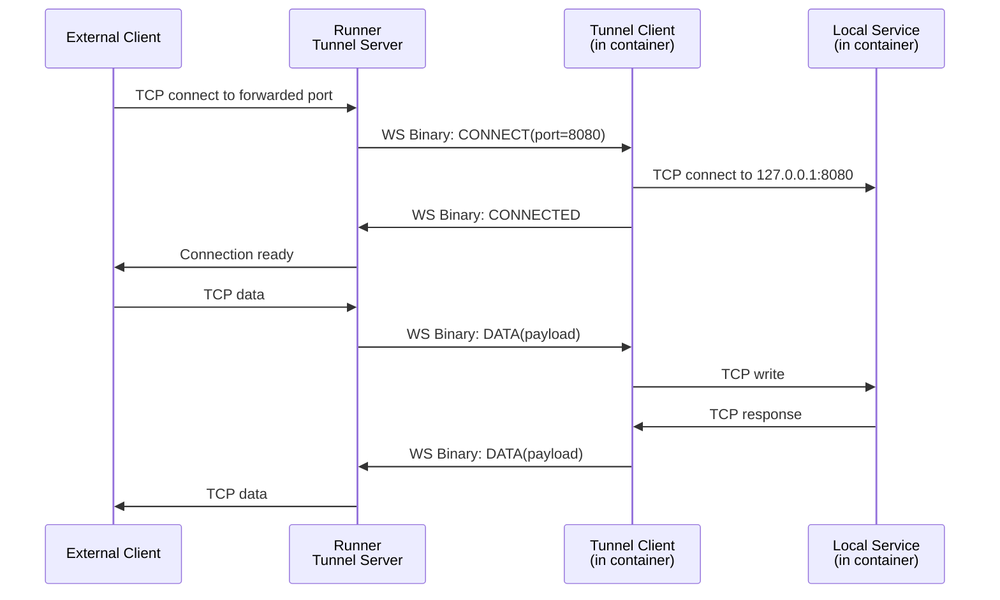

# Tunnel Protocol Specification

The KohakuRiver tunnel protocol enables TCP/UDP port forwarding between external clients and services running inside containers. It uses binary WebSocket messages with an 8-byte header.

## Overview



## Wire Format

All messages are binary WebSocket frames. Every message starts with an 8-byte header, followed by an optional variable-length payload.

```
 0                   1                   2                   3
 0 1 2 3 4 5 6 7 8 9 0 1 2 3 4 5 6 7 8 9 0 1 2 3 4 5 6 7 8 9 0 1
+-+-+-+-+-+-+-+-+-+-+-+-+-+-+-+-+-+-+-+-+-+-+-+-+-+-+-+-+-+-+-+-+
|     Type      |    Proto      |           Client ID           |
+-+-+-+-+-+-+-+-+-+-+-+-+-+-+-+-+-+-+-+-+-+-+-+-+-+-+-+-+-+-+-+-+
|   Client ID (cont.)          |             Port              |
+-+-+-+-+-+-+-+-+-+-+-+-+-+-+-+-+-+-+-+-+-+-+-+-+-+-+-+-+-+-+-+-+
|                     Payload (variable)                        |
+-+-+-+-+-+-+-+-+-+-+-+-+-+-+-+-+-+-+-+-+-+-+-+-+-+-+-+-+-+-+-+-+
```

### Header Fields

| Offset | Size    | Field     | Description                                      |
| ------ | ------- | --------- | ------------------------------------------------ |
| 0      | 1 byte  | Type      | Message type (see below)                         |
| 1      | 1 byte  | Proto     | Protocol: `0x00` = TCP, `0x01` = UDP             |
| 2      | 4 bytes | Client ID | Connection identifier (big-endian uint32)        |
| 6      | 2 bytes | Port      | Target port (big-endian uint16, used in CONNECT) |

Total header: **8 bytes**.

### Python struct format: `>BBIH` (big-endian: byte, byte, uint32, uint16)

## Message Types

| Value  | Name      | Direction        | Description                                         |
| ------ | --------- | ---------------- | --------------------------------------------------- |
| `0x01` | CONNECT   | Server -> Client | Open connection to specified port                   |
| `0x02` | CONNECTED | Client -> Server | Connection successfully established                 |
| `0x03` | DATA      | Bidirectional    | Relay data payload                                  |
| `0x04` | CLOSE     | Bidirectional    | Close connection                                    |
| `0x05` | ERROR     | Client -> Server | Connection attempt failed (payload = error message) |
| `0x06` | PING      | Server -> Client | Keepalive ping                                      |
| `0x07` | PONG      | Client -> Server | Keepalive pong                                      |

## Connection Lifecycle

### Opening a Connection

1. External client connects to a forwarded port on the runner.
2. Runner generates a unique `client_id` and sends `CONNECT(proto, client_id, port)` to the tunnel client.
3. Tunnel client opens a local TCP/UDP connection to `127.0.0.1:port`.
4. On success: tunnel client responds with `CONNECTED(proto, client_id)`.
5. On failure: tunnel client responds with `ERROR(proto, client_id, error_message)`.

### Data Transfer

Both sides send `DATA(proto, client_id, payload)` messages. The `client_id` demultiplexes concurrent connections over the single WebSocket.

### Closing a Connection

Either side sends `CLOSE(proto, client_id)`. The receiving side tears down its local connection.

### Keepalive

The runner periodically sends `PING(client_id=0)`. The tunnel client responds with `PONG(client_id=0)`.

## Python Implementation

The Python side (`src/kohakuriver/tunnel/protocol.py`) provides:

```python
HEADER_FORMAT = ">BBIH"  # 8 bytes
HEADER_SIZE = 8

def build_message(msg_type, proto, client_id, port=0, payload=b"") -> bytes:
    header = struct.pack(HEADER_FORMAT, msg_type, proto, client_id, port)
    return header + payload

def parse_header(data: bytes) -> TunnelHeader | None:
    if len(data) < HEADER_SIZE:
        return None
    msg_type, proto, client_id, port = struct.unpack(HEADER_FORMAT, data[:HEADER_SIZE])
    return TunnelHeader(msg_type, proto, client_id, port)

def get_payload(data: bytes) -> bytes:
    return data[HEADER_SIZE:]
```

## Rust Implementation

The Rust side (`src/kohakuriver-tunnel/src/protocol.rs`) provides equivalent types:

```rust
pub const HEADER_SIZE: usize = 8;

pub struct Header {
    pub msg_type: MsgType,
    pub proto: Proto,
    pub client_id: u32,
    pub port: u16,
}

pub fn build_message(msg_type, proto, client_id, port, payload) -> Bytes;
pub fn build_connected(proto, client_id) -> Bytes;
pub fn build_data(proto, client_id, data) -> Bytes;
pub fn build_close(proto, client_id) -> Bytes;
pub fn build_error(proto, client_id, msg) -> Bytes;
pub fn build_pong(client_id) -> Bytes;
```

## WebSocket Endpoint

The tunnel client connects to:

```
ws://{runner_gateway}:{runner_port}/ws/tunnel/{container_id}
```

Where `runner_gateway` is the Docker network gateway IP (the runner's IP as seen from inside the container).

## Multiplexing

Multiple concurrent connections are multiplexed over the single WebSocket using `client_id`. Each connection gets a unique `client_id` assigned by the runner's tunnel server. The tunnel client maintains a `HashMap<u32, ActiveConnection>` to route data to the correct local TCP/UDP socket.
