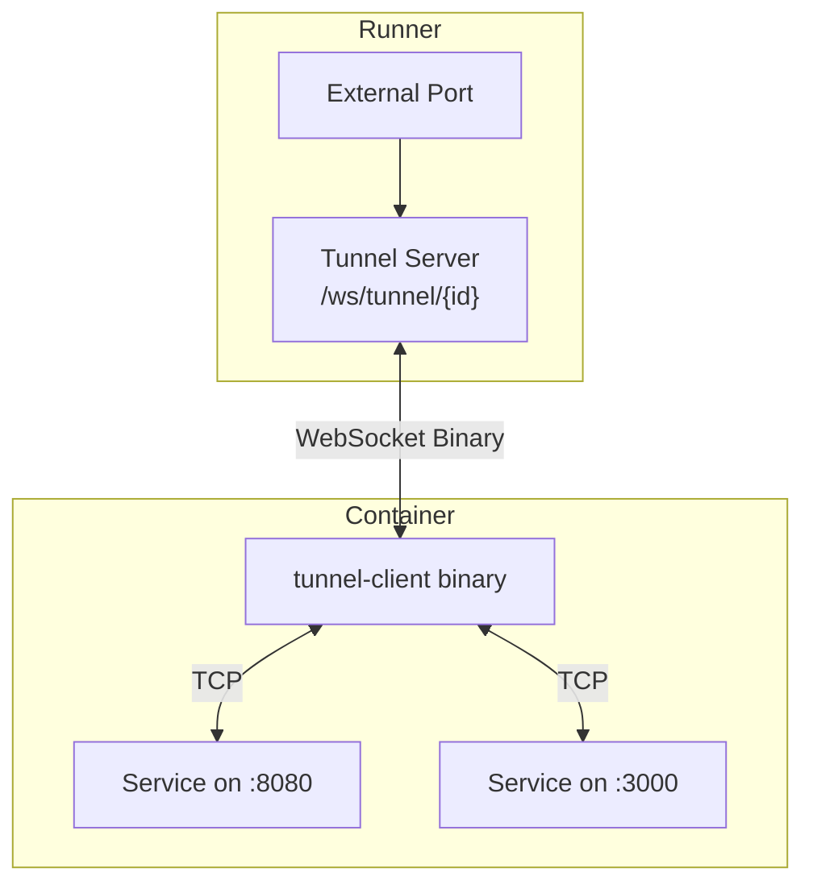

# Rust Tunnel Client

The tunnel client (`src/kohakuriver-tunnel/`) is a lightweight Rust binary that runs inside Docker containers. It connects to the runner's WebSocket endpoint and forwards TCP/UDP connections to local services inside the container.

## Architecture



## Module Structure

```
src/kohakuriver-tunnel/src/
  main.rs          # Entry point, CLI args, logging setup
  tunnel.rs        # TunnelClient, TunnelConfig, main event loop
  connection.rs    # ConnectionManager, TCP/UDP handlers
  protocol.rs      # Wire format types and builders
```

### Dependencies

| Crate                            | Purpose                |
| -------------------------------- | ---------------------- |
| `tokio`                          | Async runtime          |
| `tokio-tungstenite`              | WebSocket client       |
| `futures-util`                   | Stream/Sink utilities  |
| `clap`                           | CLI argument parsing   |
| `tracing` + `tracing-subscriber` | Structured logging     |
| `bytes`                          | Zero-copy byte buffers |
| `anyhow` + `thiserror`           | Error handling         |
| `url`                            | URL parsing            |

## Entry Point (`main.rs`)

```rust
#[derive(Parser)]
struct Args {
    #[arg(short, long, env = "RUNNER_URL")]
    runner_url: String,
    #[arg(short, long, env = "CONTAINER_ID")]
    container_id: String,
    #[arg(long, default_value = "5", env = "RECONNECT_DELAY")]
    reconnect_delay: u64,
    #[arg(long, default_value = "0", env = "MAX_RECONNECT")]
    max_reconnect: u32,
    #[arg(long, default_value = "info", env = "LOG_LEVEL")]
    log_level: String,
}
```

All arguments support environment variable fallback, enabling configuration via Docker environment variables without command-line args.

## TunnelClient (`tunnel.rs`)

### Configuration

```rust
pub struct TunnelConfig {
    pub runner_url: String,
    pub container_id: String,
    pub reconnect_delay: Duration,
    pub max_reconnect_attempts: u32,  // 0 = infinite
}
```

### Connection URL

The WebSocket URL is constructed as:

```
{runner_url}/ws/tunnel/{container_id}
```

### Reconnection Loop

`run()` implements infinite reconnection:

```rust
pub async fn run(&self) -> Result<()> {
    let mut attempt = 0u32;
    loop {
        attempt += 1;
        if max > 0 && attempt > max { return Err(...) }

        match self.connect_and_run().await {
            Ok(()) => { attempt = 0; }  // Reset on success
            Err(e) => { error!(...); }
        }
        sleep(self.config.reconnect_delay).await;
    }
}
```

On successful connection, the attempt counter resets. This ensures transient failures do not exhaust the retry limit.

### Message Loop

`connect_and_run()` establishes the WebSocket and processes messages:

1. Connect via `tokio_tungstenite::connect_async`.
2. Split the stream into sender and receiver.
3. Create a `ConnectionManager` with the sender.
4. Loop over incoming messages, dispatching by type:
   - `Binary` -> parse tunnel protocol header, dispatch to handler
   - `Ping` -> respond with `Pong`
   - `Close` -> break loop
5. On exit, call `conn_manager.shutdown()`.

## ConnectionManager (`connection.rs`)

Manages all active forwarded connections.

### Data Structures

```rust
struct ActiveConnection {
    data_tx: mpsc::Sender<Bytes>,     // Channel to TCP/UDP writer
    _handle: tokio::task::JoinHandle<()>,  // Spawned task
}

pub struct ConnectionManager {
    connections: HashMap<u32, ActiveConnection>,
    ws_sender: WsSender,  // Arc<Mutex<SplitSink<...>>>
}
```

### Connection Handling

**CONNECT**: When the server requests a new connection:

1. Create an `mpsc::channel` for data forwarding (buffer size 256).
2. Spawn a task for TCP or UDP connection handling.
3. Store the `ActiveConnection` in the `HashMap`.

**DATA**: Forward payload bytes through the channel to the appropriate connection's write task.

**CLOSE**: Remove the connection from the map. Dropping the `ActiveConnection` closes the channel, which signals the writer task to stop.

**PING**: Respond with a PONG message.

### TCP Connection Handler

Each TCP connection spawns two sub-tasks:

1. **Read task**: Reads from the TCP socket and sends `DATA` messages through the WebSocket.
2. **Write task**: Receives data from the `mpsc::channel` and writes to the TCP socket.

Uses `tokio::select!` to wait for either task to complete, then cleans up.

```rust
async fn handle_tcp_connection(
    client_id: u32,
    port: u16,
    ws_sender: WsSender,
    data_rx: mpsc::Receiver<Bytes>,
) -> Result<()> {
    let stream = TcpStream::connect(("127.0.0.1", port)).await?;
    // Send CONNECTED message
    let (reader, writer) = stream.into_split();
    // Spawn read_task (TCP -> WS) and write_task (channel -> TCP)
    tokio::select! { /* wait for either */ }
}
```

### UDP Connection Handler

Similar to TCP but uses `UdpSocket::bind("127.0.0.1:0")` and `connect(target)` for connected UDP semantics.

## Building

```bash
cd src/kohakuriver-tunnel
cargo build --release
# Binary: target/release/tunnel-client
```

## Deployment

The runner injects the tunnel client binary into containers at startup. The binary path is auto-detected by `RunnerConfig.get_tunnel_client_path()` from several search locations:

1. `TUNNEL_CLIENT_PATH` config setting
2. `./tunnel-client` (working directory)
3. `~/.kohakuriver/tunnel-client`
4. `/usr/local/bin/tunnel-client`
5. Shared storage `bin/tunnel-client`
6. Development build path (`../kohakuriver-tunnel/target/release/tunnel-client`)

## Environment Variables

| Variable          | Required | Default | Description                             |
| ----------------- | -------- | ------- | --------------------------------------- |
| `RUNNER_URL`      | Yes      | --      | Runner WebSocket URL                    |
| `CONTAINER_ID`    | Yes      | --      | Container identifier                    |
| `RECONNECT_DELAY` | No       | `5`     | Seconds between reconnection attempts   |
| `MAX_RECONNECT`   | No       | `0`     | Max retries (0 = infinite)              |
| `LOG_LEVEL`       | No       | `info`  | Log level (trace/debug/info/warn/error) |
