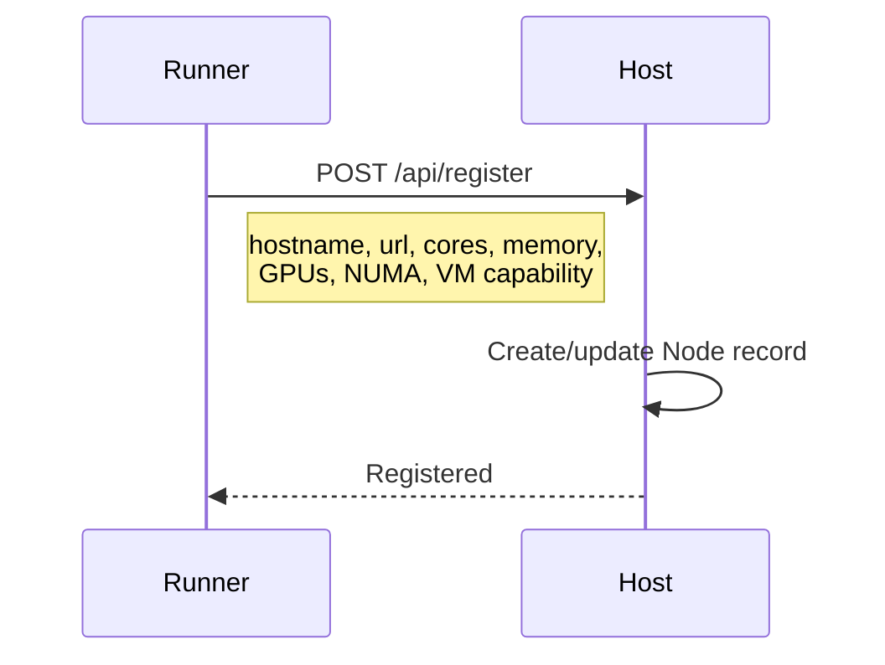

# Node Management

Cluster nodes are managed through automatic registration, heartbeat monitoring, and manual administration.

## Node Registration

Nodes register automatically when the runner starts:



The registration includes:

- **hostname**: Unique identifier for the node
- **url**: Runner's reachable URL (e.g., `http://192.168.1.10:8001`)
- **total_cores**: Number of CPU cores
- **memory_total_bytes**: Total RAM
- **numa_topology**: NUMA nodes with CPU and memory per node
- **gpu_info**: Per-GPU name, memory, and initial utilization
- **vm_capable**: Whether QEMU/KVM is available
- **vfio_gpus**: VFIO-capable GPUs for VM passthrough
- **runner_version**: Runner software version

## Heartbeat Monitoring

After registration, runners send periodic heartbeats:

```bash
PUT /api/heartbeat/<hostname>
```

Each heartbeat contains:

- CPU utilization percentage
- Memory usage (used bytes, total bytes, percent)
- Temperature (average and maximum)
- Per-GPU metrics (utilization, memory used/total, temperature)
- List of running task IDs
- List of killed task IDs (OOM, etc.)

### Heartbeat Timing

| Setting              | Location      | Default | Description                    |
| -------------------- | ------------- | ------- | ------------------------------ |
| `HEARTBEAT_INTERVAL` | Runner config | `5`     | Seconds between heartbeats     |
| `HEARTBEAT_TIMEOUT`  | Host config   | `30`    | Seconds before node is offline |

If a node misses heartbeats for `HEARTBEAT_TIMEOUT` seconds, the host marks it as `offline`. Running tasks on that node are marked as `lost`.

## Node Status

### CLI

```bash
# List all nodes
kohakuriver node list

# Detailed node status
kohakuriver node status <hostname>

# Health metrics
kohakuriver node health <hostname>

# Watch in real-time
kohakuriver node watch <hostname>

# Cluster summary
kohakuriver node summary
```

### API

```bash
# All nodes
curl http://host:8000/api/nodes

# Single node
curl http://host:8000/api/nodes/<hostname>
```

## Resource Tracking

The host tracks resource availability per node:

| Resource  | Tracked By             | Updated When          |
| --------- | ---------------------- | --------------------- |
| CPU cores | Allocated cores count  | Task starts/completes |
| Memory    | Allocated memory bytes | Task starts/completes |
| GPUs      | Allocated GPU indices  | Task starts/completes |

When a task is submitted, the host validates that the target node has sufficient available resources before dispatching.

## Handling Node Failures

When a node goes offline:

1. Heartbeat timeout expires
2. Host marks node status as `offline`
3. All `running` tasks on the node are marked as `lost`
4. GPU and resource allocations are released

When the node comes back online:

1. Runner re-registers with the host
2. Runner reports any still-running tasks in heartbeats
3. Host reconciles task states

## Removing Nodes

There is no explicit "remove node" command. Nodes that stop sending heartbeats are automatically marked offline. To permanently remove a node:

1. Stop the runner on the node
2. Wait for heartbeat timeout
3. Clean up overlay resources: `kohakuriver node overlay-release <hostname>`
4. The node record remains in the database but is marked offline

## Node Database Model

The Node model in `src/kohakuriver/db/node.py` stores:

| Field                | Type        | Description              |
| -------------------- | ----------- | ------------------------ |
| `hostname`           | Primary Key | Unique node identifier   |
| `url`                | String      | Runner URL               |
| `total_cores`        | Integer     | CPU core count           |
| `memory_total_bytes` | Integer     | Total RAM                |
| `status`             | Enum        | `online` or `offline`    |
| `last_heartbeat`     | DateTime    | Last heartbeat timestamp |
| `cpu_percent`        | Float       | Current CPU usage        |
| `memory_percent`     | Float       | Current memory usage     |
| `numa_topology`      | JSON        | NUMA node structure      |
| `gpu_info`           | JSON        | Per-GPU metrics          |
| `vm_capable`         | Boolean     | QEMU/KVM support         |
| `vfio_gpus`          | JSON        | VFIO-capable GPU list    |
| `runner_version`     | String      | Software version         |

## Related Topics

- [Monitoring](../tasks/monitoring.md) -- Task and node monitoring
- [Overlay Management](overlay-management.md) -- Network management
- [Node CLI](../cli/node.md) -- CLI commands
- [Troubleshooting](troubleshooting.md) -- Common issues
