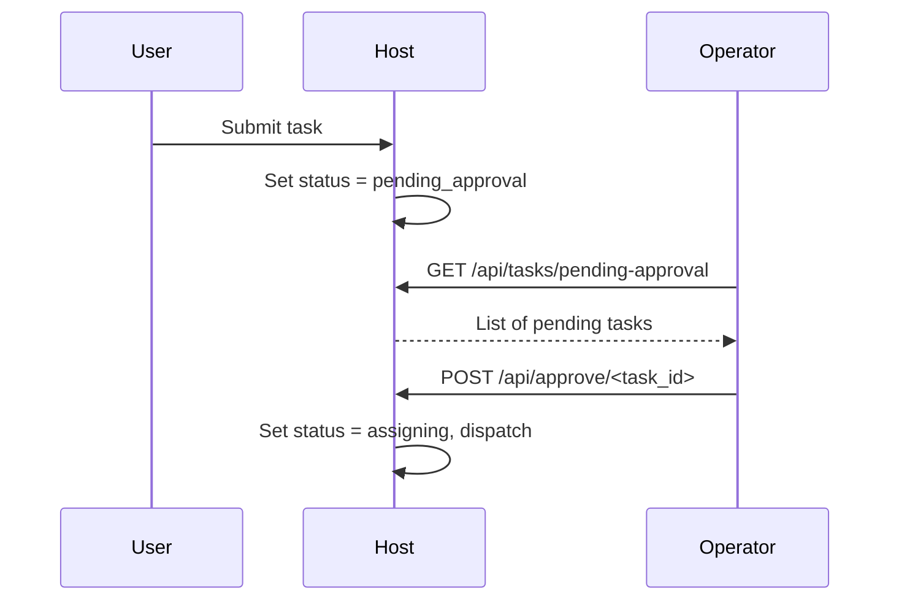

# User Management

KohakuRiver supports role-based access control when `AUTH_ENABLED = True` in the host configuration. Users are managed through the CLI, web dashboard, or API.

## User Roles

| Role       | Level | Permissions                                                |
| ---------- | ----- | ---------------------------------------------------------- |
| `anony`    | 0     | No access (authentication required)                        |
| `viewer`   | 1     | Read-only: view nodes, tasks, VPS status                   |
| `user`     | 2     | Submit tasks (require approval), view own tasks            |
| `operator` | 3     | Full task/VPS management, approve user tasks, manage nodes |
| `admin`    | 4     | Everything + user management + system configuration        |

Roles are hierarchical -- each role includes all permissions of lower roles.

## Initial Setup

### First Admin Account

When authentication is first enabled, create the admin account using the `ADMIN_REGISTER_SECRET`:

```bash
curl -X POST http://host:8000/api/auth/register \
    -H "Content-Type: application/json" \
    -d '{
        "username": "admin",
        "password": "secure_password",
        "register_secret": "YOUR_ADMIN_REGISTER_SECRET"
    }'
```

Then log in:

```bash
kohakuriver auth login --username admin --password secure_password
```

### Creating Additional Users

Admins can create users through the web dashboard admin panel or the API:

```bash
curl -X POST http://host:8000/api/auth/register \
    -H "Authorization: Bearer <admin_token>" \
    -H "Content-Type: application/json" \
    -d '{"username": "newuser", "password": "password", "role": "user"}'
```

### Invitation System

For controlled user onboarding, admins can create invitation codes:

1. Create an invitation via the admin panel or API
2. Share the invitation code with the new user
3. The user registers using the invitation code
4. Their role is set according to the invitation

## Managing Roles

### View Users

Through the web dashboard admin panel, view all users with their roles, groups, and activity.

### Change User Role

Via the API:

```bash
curl -X PUT http://host:8000/api/auth/users/<user_id>/role \
    -H "Authorization: Bearer <admin_token>" \
    -H "Content-Type: application/json" \
    -d '{"role": "operator"}'
```

### Delete User

```bash
curl -X DELETE http://host:8000/api/auth/users/<user_id> \
    -H "Authorization: Bearer <admin_token>"
```

Deleting a user revokes all their sessions and tokens but does not delete their submitted tasks.

## Groups

Groups provide organizational structure:

- Users can belong to multiple groups
- VPS instances can be assigned to specific groups
- Groups enable team-based resource sharing

### VPS Assignment

VPS instances can be restricted to specific users or groups through the `VpsAssignment` model. This allows shared access to VPS instances within a team.

## Sessions and Tokens

### Sessions

Each login creates a session with an expiry time (`SESSION_EXPIRE_HOURS`, default: 24 hours). Sessions are stored server-side and associated with the user.

### API Tokens

API tokens provide persistent authentication for scripts and automation:

```bash
# Create a token
kohakuriver auth token create my-script-token

# List tokens
kohakuriver auth token list

# Revoke a token
kohakuriver auth token revoke my-script-token
```

Tokens do not expire unless explicitly revoked or a custom expiry is set.

## Task Approval Workflow

When a `user` role submits a task:



Operators and admins see pending tasks in the web dashboard with a notification badge.

## Admin Secret

The `ADMIN_SECRET` in the host configuration provides a master key for administrative operations. It can be passed as a header:

```bash
curl -H "X-Admin-Secret: YOUR_ADMIN_SECRET" http://host:8000/api/admin/...
```

This bypasses normal authentication for emergency access. Keep this secret secure.

## Related Topics

- [Authentication Setup](../setup/authentication.md) -- Enabling auth
- [Auth CLI](../cli/auth.md) -- CLI auth commands
- [Admin Panel](../web-dashboard/admin-panel.md) -- Web-based management
- [Security Hardening](../setup/security-hardening.md) -- Security practices
