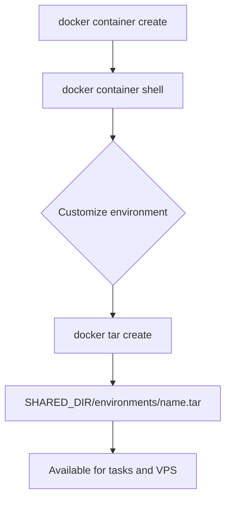

# kohakuriver docker

The `kohakuriver docker` command group manages Docker images, containers, and environment tarballs.

## Commands

### docker images

List Docker images on the local machine.

```bash
kohakuriver docker images
```

Displays image name, tag, size, and creation date.

### docker delete

Delete a Docker image.

```bash
kohakuriver docker delete <image_name>
```

### docker container

Container management subcommands:

#### container list

```bash
kohakuriver docker container list
```

Lists all KohakuRiver-managed containers with their status.

#### container create

```bash
kohakuriver docker container create <name> --image <registry_image>
```

Creates a new container from a registry image for environment customization.

#### container delete

```bash
kohakuriver docker container delete <name>
```

#### container start

```bash
kohakuriver docker container start <name>
```

#### container stop

```bash
kohakuriver docker container stop <name>
```

#### container shell

```bash
kohakuriver docker container shell <name>
```

Opens an interactive shell inside the container for package installation and configuration.

#### container migrate

```bash
kohakuriver docker container migrate <name>
```

Commits the current container state and exports it as a tarball to shared storage.

### docker tar

Tarball management subcommands for the shared-storage-based environment workflow. These commands require `SHARED_DIR` to be configured. Alternatively, you can skip tarballs entirely and use `--image` to pull environments directly from a Docker registry when creating tasks or VPS instances.

#### tar list

```bash
kohakuriver docker tar list
```

Lists all environment tarballs in `SHARED_DIR/environments/`.

#### tar create

```bash
kohakuriver docker tar create <name>
```

Exports a container as a tarball to shared storage. The tarball is saved as `SHARED_DIR/environments/<name>.tar`.

#### tar delete

```bash
kohakuriver docker tar delete <name>
```

Deletes a tarball from shared storage.

## Environment Workflow



## Example: Create ML Environment

```bash
# Create container from PyTorch base
kohakuriver docker container create ml-env \
    --image pytorch/pytorch:2.1.0-cuda12.1-cudnn8-runtime

# Enter and customize
kohakuriver docker container shell ml-env
# Inside: apt install openssh-server, pip install packages, etc.
# Exit the shell

# Export to shared storage
kohakuriver docker tar create ml-env

# Use in tasks
kohakuriver task submit -t node1 --container ml-env -- python train.py
```

## Related Topics

- [Docker Environment](../setup/docker-environment.md) -- Docker setup
- [Container Preparation](../vps/container-preparation.md) -- Building custom environments
- [Command Tasks](../tasks/command-tasks.md) -- Using environments in tasks
