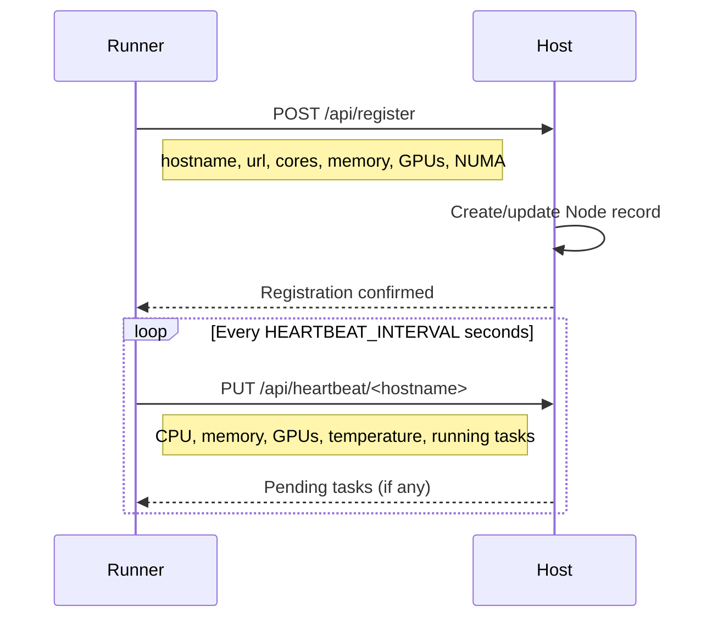

# kohakuriver runner

The `kohakuriver runner` command starts the runner agent on a compute node.

## Usage

```bash
kohakuriver runner [options]
```

## Options

| Flag       | Default                           | Description                       |
| ---------- | --------------------------------- | --------------------------------- |
| `--config` | `~/.kohakuriver/runner_config.py` | Path to runner configuration file |
| `--bind`   | From config (`0.0.0.0`)           | IP address to bind to             |
| `--port`   | From config (`8001`)              | Port to listen on                 |

## What It Starts

The runner starts as a FastAPI application under Uvicorn with these components:

1. **REST API** on port 8001 -- Receives task execution requests from the host
2. **Heartbeat Client** -- Sends periodic heartbeats with metrics to the host
3. **Task Executor** -- Runs command tasks in Docker containers
4. **VPS Manager** -- Manages long-running VPS instances (Docker and QEMU)
5. **Tunnel Server** -- Port forwarding via WebSocket (if `TUNNEL_ENABLED`)
6. **Overlay Agent** -- VXLAN network management (if `OVERLAY_ENABLED`)
7. **Resource Monitor** -- Collects CPU, memory, GPU, and temperature metrics
8. **Filesystem API** -- Shared storage file operations

## Registration

On startup, the runner registers with the host:



The runner reports:

- Hostname and reachable URL
- Total CPU cores and memory
- NUMA topology
- GPU information (if `nvidia-ml-py` is installed)
- VM capability and VFIO GPU list

## Configuration

The runner reads its config from a Python file (`runner_config.py`). Generate a template:

```bash
kohakuriver init config --runner
```

Key configuration options are documented in [Runner Configuration](../setup/runner-configuration.md).

## Example

```bash
# Start with default config
kohakuriver runner

# Start with custom config
kohakuriver runner --config /etc/kohakuriver/runner.py
```

## Systemd Service

For production deployments, run the runner as a systemd service:

```bash
kohakuriver init service --runner
sudo systemctl enable kohakuriver-runner
sudo systemctl start kohakuriver-runner
```

See [Systemd Services](../setup/systemd-services.md) for details.

## Direct Entry Point

The runner can also be started directly:

```bash
kohakuriver.runner
```

This uses the `kohakuriver.cli.runner:main` entry point.

## GPU Monitoring

For GPU monitoring, install the GPU extra:

```bash
pip install "kohakuriver[gpu]"
```

This installs `nvidia-ml-py`, enabling the runner to report per-GPU utilization, memory, and temperature in heartbeats.

## Related Topics

- [Runner Configuration](../setup/runner-configuration.md) -- Full configuration reference
- [Host](host.md) -- Starting the host server
- [First Cluster](../getting-started/first-cluster.md) -- Setting up a cluster
