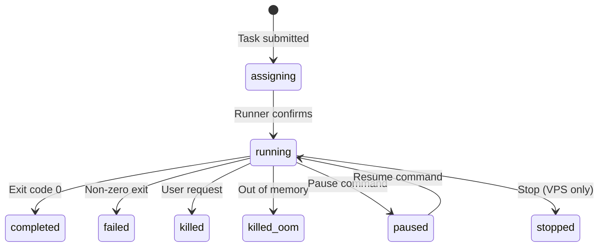

# First Task

With your cluster running (see [First Cluster](./first-cluster.md)), you can submit your first task.

## Set Up CLI Environment

Make sure the CLI knows where your host is:

```bash
export HAKURIVER_HOST=192.168.1.100
export HAKURIVER_PORT=8000
```

## Submit a Simple Task

Submit a command that runs in a container:

```bash
kohakuriver task submit -t mynode -- echo "Hello from KohakuRiver!"
```

Breaking down the command:

- `task submit` -- The subcommand for task submission
- `-t mynode` -- Target node hostname (replace with your runner's hostname)
- `--` -- Separator between options and the command
- `echo "Hello from KohakuRiver!"` -- The command to execute

You will see output like:

```
Task(s) submitted: 1234567890123456
```

## Check Task Status

```bash
kohakuriver task status 1234567890123456
```

This shows detailed task information including status, assigned node, timestamps, and resource allocation.

## View Task Output

```bash
# View stdout
kohakuriver task logs 1234567890123456

# View stderr
kohakuriver task logs 1234567890123456 --stderr
```

## Submit with Options

### Specify CPU and Memory

```bash
kohakuriver task submit -t mynode -c 4 -m 8G -- python3 -c "print('Using 4 cores and 8GB')"
```

- `-c 4` -- Request 4 CPU cores
- `-m 8G` -- Request 8 GB memory limit

### Target Specific GPUs

```bash
kohakuriver task submit -t mynode::0,1 -- python3 train.py
```

The target format is `hostname[:numa_id][::gpu_ids]`:

- `mynode` -- Just the hostname
- `mynode:0` -- Hostname with NUMA node 0
- `mynode::0,1` -- Hostname with GPU 0 and GPU 1

### Use a Custom Container

```bash
kohakuriver task submit -t mynode --container my-pytorch-env -- python3 /shared/train.py
```

### Use a Docker Registry Image

```bash
kohakuriver task submit -t mynode --image ubuntu:22.04 -- apt list --installed
```

### Wait for Completion

```bash
kohakuriver task submit -t mynode -w -- sleep 5 && echo "Done"
```

The `-w` flag blocks until the task completes.

### Follow Logs in Real-time

```bash
kohakuriver task logs 1234567890123456 -f
```

The `-f` flag follows log output similar to `tail -f`.

## List Tasks

```bash
# List recent tasks
kohakuriver task list

# Filter by status
kohakuriver task list --status running

# Filter by node
kohakuriver task list --node mynode

# Compact output
kohakuriver task list --compact
```

## Manage Running Tasks

```bash
# Kill a task
kohakuriver task kill 1234567890123456

# Pause a task
kohakuriver task pause 1234567890123456

# Resume a paused task
kohakuriver task resume 1234567890123456

# Live-watch task status
kohakuriver task watch 1234567890123456
```

## Understanding Task States

Tasks progress through these states:



When authentication is enabled, user-role tasks go through an additional `pending_approval` state before `assigning`.

## Next Steps

- [Task Overview](../tasks/overview.md) -- Detailed task documentation
- [VPS Overview](../vps/overview.md) -- Create interactive VPS sessions
- [CLI Task Reference](../cli/task.md) -- Full CLI reference for task commands
