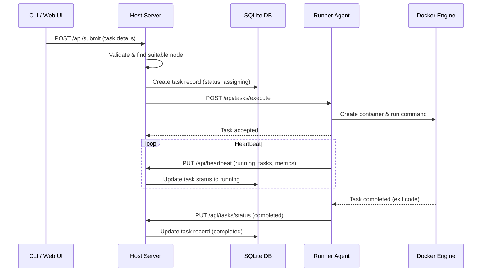

# Architecture

KohakuRiver uses a three-tier architecture: **Host** (central orchestrator), **Runners** (task executors on compute nodes), and **Containers/VMs** (Docker-based or QEMU-based workloads).

## System Overview

```
                  ┌──────────┐   ┌──────────────────────┐
                  │   CLI    │   │    Web Dashboard     │
                  └────┬─────┘   └──────────┬───────────┘
                       │                    │
                       ▼                    ▼
┌────────────────────────────────────────────────────────────┐
│                  Host Server (:8000)                       │
│                                                            │
│  ┌───────────┐ ┌───────────┐ ┌───────────┐ ┌───────────┐   │
│  │  FastAPI  │ │   Task    │ │  Overlay  │ │ SSH Proxy │   │
│  │   API     │ │ Scheduler │ │  Manager  │ │  (:8002)  │   │
│  └───────────┘ └───────────┘ └───────────┘ └───────────┘   │
│  ┌────────────┐ ┌────────────────────────────────────┐     │
│  │   Auth     │ │  SQLite DB (Peewee ORM)            │     │
│  │  Service   │ │  tasks, nodes, users, auth         │     │
│  └────────────┘ └────────────────────────────────────┘     │
└────────────────────────────┬───────────────────────────────┘
                             │  HTTP + VXLAN
            ┌────────────────┴────────────────┐
            │                                 │
┌───────────▼────────────────┐  ┌─────────────▼──────────────┐
│  Runner Node A (:8001)     │  │  Runner Node B (:8001)     │
│                            │  │                            │
│  ┌──────────────────────┐  │  │  ┌──────────────────────┐  │
│  │  Runner Agent        │  │  │  │  Runner Agent        │  │
│  │  (FastAPI)           │  │  │  │  (FastAPI)           │  │
│  └──────────────────────┘  │  │  └──────────────────────┘  │
│                            │  │                            │
│  ┌──────────┐ ┌──────────┐ │  │  ┌──────────┐ ┌──────────┐ │
│  │  Docker  │ │  Tunnel  │ │  │  │  Docker  │ │   QEMU   │ │
│  │  Engine  │ │  Server  │ │  │  │  Engine  │ │   /KVM   │ │
│  └──────────┘ └──────────┘ │  │  └──────────┘ └──────────┘ │
│  ┌──────────┐ ┌──────────┐ │  │  ┌──────────┐ ┌──────────┐ │
│  │   VPS    │ │  VXLAN   │ │  │  │  Tunnel  │ │  VXLAN   │ │
│  │  Manager │ │  Agent   │ │  │  │  Server  │ │  Agent   │ │
│  └──────────┘ └──────────┘ │  │  └──────────┘ └──────────┘ │
│                            │  │                            │
│  ┌──────┐ ┌──────┐         │  │  ┌──────┐ ┌──────┐         │
│  │VPS 1 │ │VPS 2 │         │  │  │VPS 3 │ │ VM 1 │         │
│  └──────┘ └──────┘         │  │  └──────┘ └──────┘         │
└────────────────────────────┘  └────────────────────────────┘
                             │
            ┌────────────────▼────────────────┐
            │   Shared Storage (optional)     │
            │   NFS / Samba / SSHFS           │
            └─────────────────────────────────┘
```

## Component Details

### Host Server (Port 8000)

The host is the central control plane. It runs a FastAPI server providing:

- **Task scheduling** -- Assigns tasks to runners based on resource availability, node targeting, GPU requirements, and NUMA constraints.
- **Node management** -- Handles runner registration, heartbeat processing, and health monitoring.
- **Overlay network management** -- Manages VXLAN tunnel setup, subnet allocation, and IP reservation for cross-node communication.
- **SSH proxy** (Port 8002) -- Proxies SSH connections to VPS containers running on any runner node.
- **WebSocket proxying** -- Proxies terminal sessions and port forwarding tunnels from clients to runners.
- **Authentication** -- Session-based and token-based auth with role hierarchy.
- **Database** -- SQLite via Peewee ORM storing tasks, nodes, users, and auth data.

### Runner Agent (Port 8001)

Each compute node runs a runner agent that:

- **Registers** with the host on startup and sends periodic heartbeats with resource metrics (CPU, memory, GPU, temperature).
- **Executes tasks** in Docker containers with resource constraints (CPU pinning, memory limits, GPU allocation via NVIDIA Container Toolkit (`--gpus` flag)).
- **Manages VPS instances** -- Creates, stops, restarts, snapshots Docker containers or QEMU VMs.
- **Runs tunnel server** -- Provides WebSocket-based port forwarding for accessing services inside containers.
- **Manages VXLAN agent** -- Configures overlay network interfaces when overlay is enabled.
- **Monitors resources** -- Tracks GPU utilization, CPU/memory usage, and container health.

### Containers and VMs

Workloads run in two possible backends:

- **Docker containers** -- Lightweight, fast startup. The shared directory is mounted at `/shared`. Container environments can be prepared as tarballs and distributed via shared storage, or pulled directly from Docker registries using the `registry_image` field.
- **QEMU/KVM VMs** -- Full virtual machines with VFIO GPU passthrough. Cloud-init provides automatic provisioning. Supports NVIDIA driver installation inside VMs.

## Data Flow

### Task Submission Flow



### Heartbeat and Health Monitoring

Runners send heartbeats to the host at a configurable interval (default: 5 seconds). Each heartbeat carries:

- List of currently running task IDs
- List of tasks killed since last heartbeat (with reason, e.g., OOM)
- CPU and memory utilization percentages
- GPU information (utilization, memory, temperature)
- VM capability status and VFIO GPU list
- Runner version string

The host uses heartbeats to:

- Confirm task state transitions (assigning -> running)
- Detect failed task assignments
- Mark nodes as offline after missed heartbeats (configurable timeout factor, default: 6x interval = 30 seconds)

### Network Architecture

```
                  VXLAN Overlay Network
                  ─────────────────────

  ┌──────────────────────────────────────────────────┐
  │              Host (Central Router)               │
  │                                                  │
  │   kohaku-overlay bridge ── 10.128.0.1            │
  │        │                         │               │
  │   ┌────┴────┐              ┌─────┴────┐          │
  │   │ VXLAN   │              │  VXLAN   │          │
  │   │ ID 101  │              │  ID 102  │          │
  │   └────┬────┘              └─────┬────┘          │
  └────────┼─────────────────────────┼───────────────┘
           │ UDP :4789               │ UDP :4789
           │ (encapsulated)          │ (encapsulated)
  ┌────────▼──────────────┐  ┌───────▼───────────────┐
  │  Runner 1             │  │  Runner 2             │
  │  Subnet: 10.128.0.0/14│  │  Subnet: 10.132.0.0/14│
  │                       │  │                       │
  │  ┌─────────────────┐  │  │  ┌──────────────────┐ │
  │  │  Docker Bridge   │  │  │  │  Docker Bridge    │  │
  │  │  (kohaku-overlay)│  │  │  │  (kohaku-overlay) │  │
  │  └──┬───────────┬──┘  │  │  └──┬────────────┬──┘ │
  │     │           │      │  │     │            │   │
  │  ┌──▼──┐    ┌──▼──┐   │  │  ┌──▼──┐     ┌──▼──┐  │
  │  │ C1  │    │ C2  │   │  │  │ C3  │     │ VM1 │  │
  │  │.0.2 │    │.0.3 │   │  │  │.0.2 │     │.0.10│  │
  │  └─────┘    └─────┘   │  │  └─────┘     └─────┘  │
  └───────────────────────┘  └───────────────────────┘
```

When overlay is enabled, containers and VMs on different nodes can communicate directly via their overlay IP addresses. The host acts as a central L3 router, and each runner gets a dedicated subnet.

## Key Design Decisions

1. **Shared storage is recommended** -- For the best experience, all nodes should have access to the same shared filesystem (the mount path can differ per node via the `SHARED_DIR` setting). This simplifies container distribution (via tarballs), enables log access from any node, and provides a common workspace. However, shared storage is not strictly required -- containers can alternatively be pulled from Docker registries using the `registry_image` field, and VMs use local disk images.

2. **Snowflake IDs** -- Tasks use 64-bit snowflake IDs for globally unique, time-ordered identification without coordination.

3. **SQLite for simplicity** -- A single SQLite database on the host stores all state. This avoids the operational complexity of distributed databases for small-to-medium clusters.

4. **Two container distribution methods** -- Container environments can be exported as tarballs to shared storage, which runners import locally (the default and simplest approach when shared storage is available). Alternatively, containers can be pulled from any Docker registry by specifying `registry_image` in the task or VPS configuration, which does not require shared storage.
