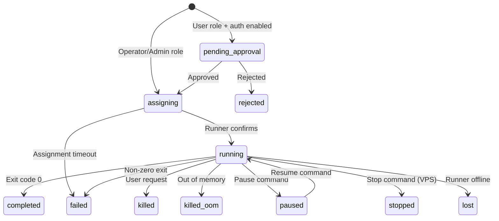

# Task Overview

Tasks are the fundamental unit of work in KohakuRiver. Every workload -- whether a one-shot command or a long-running VPS session -- is represented as a task.

## Task Types

### COMMAND Tasks

One-shot command execution in a Docker container. The command runs, stdout/stderr are captured to log files, and an exit code is returned.

```bash
kohakuriver task submit -t mynode -- python train.py --epochs 100
```

### VPS Tasks

Long-running interactive sessions with SSH access or terminal attach. VPS tasks stay running until explicitly stopped. See [VPS Overview](../vps/overview.md).

```bash
kohakuriver vps create -t mynode --ssh
```

## Task Lifecycle



## Task States

| State              | Description                                                   |
| ------------------ | ------------------------------------------------------------- |
| `pending_approval` | User-submitted task awaiting operator approval (auth enabled) |
| `rejected`         | Task rejected by operator                                     |
| `pending`          | Approved but not yet dispatched                               |
| `assigning`        | Dispatched to runner, awaiting confirmation                   |
| `running`          | Actively executing on a runner                                |
| `paused`           | Execution paused (Docker pause)                               |
| `completed`        | Finished successfully (exit code 0)                           |
| `failed`           | Finished with error (non-zero exit or assignment failure)     |
| `killed`           | Terminated by user request                                    |
| `killed_oom`       | Killed due to out-of-memory                                   |
| `stopped`          | Gracefully stopped (VPS)                                      |
| `lost`             | Runner went offline while task was running                    |

## Task Identification

Each task receives a globally unique **snowflake ID** -- a 64-bit integer that encodes the creation timestamp. Snowflake IDs are:

- Unique across the cluster without coordination
- Time-ordered (newer tasks have larger IDs)
- Serialized as strings in API responses (JavaScript `Number.MAX_SAFE_INTEGER` is 2^53-1)

Tasks can also have an optional user-friendly `name` field.

## Batch Submissions

Tasks submitted together share a `batch_id`. This happens when submitting to multiple targets:

```bash
# Submit to two nodes -- creates two tasks with the same batch_id
kohakuriver task submit -t node1 -t node2 -- python distributed_train.py
```

## Resource Requirements

Each task can specify:

- **CPU cores** (`required_cores`) -- Number of CPU cores to allocate (0 = no limit, uses all available cores)
- **Memory** (`required_memory_bytes`) -- Memory limit in bytes
- **GPUs** (`required_gpus`) -- List of GPU indices to allocate
- **NUMA node** (`target_numa_node_id`) -- Pin to a specific NUMA node

## Task Ownership

When authentication is enabled, tasks track:

- `owner_id` -- User who submitted the task
- `approval_status` -- Whether the task was approved (null, pending, approved, rejected)
- `approved_by_id` -- User who approved the task

## Output and Logs

Command tasks capture output to log files:

- `stdout_path` -- Path to stdout log file
- `stderr_path` -- Path to stderr log file

When shared storage is configured, logs are stored under `SHARED_DIR/logs/<task_id>/` and are accessible from any node. Without shared storage, logs are stored locally on the runner and retrieved via the API.
