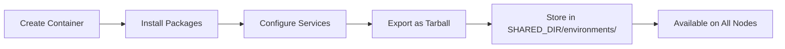

# Container Preparation

KohakuRiver uses Docker container environments as portable execution contexts. The recommended approach is to package environments as Docker image tarballs distributed via shared storage, ensuring consistent execution across all nodes. Alternatively, containers can be created directly from Docker registry images using the `registry_image` field (or `--image` CLI flag), which does not require shared storage.

## Environment Workflow



## Creating an Environment

### Step 1: Create a Base Container

```bash
# From a registry image
kohakuriver docker container create my-pytorch --image pytorch/pytorch:2.1.0-cuda12.1-cudnn8-runtime

# List containers
kohakuriver docker container list
```

### Step 2: Enter the Container

```bash
kohakuriver docker container shell my-pytorch
```

This opens an interactive shell inside the container where you can install packages and configure services.

### Step 3: Install Required Software

Inside the container shell:

```bash
# Update package lists
apt-get update

# Install SSH server (required for VPS with SSH)
apt-get install -y openssh-server
mkdir -p /run/sshd

# Install development tools
apt-get install -y git vim wget curl

# Install Python packages
pip install jupyter tensorboard

# Install any other dependencies
pip install transformers datasets accelerate
```

### Step 4: Configure SSH (for VPS)

For VPS instances with SSH access, configure the SSH server:

```bash
# Allow root login
sed -i 's/#PermitRootLogin.*/PermitRootLogin yes/' /etc/ssh/sshd_config
sed -i 's/#PubkeyAuthentication.*/PubkeyAuthentication yes/' /etc/ssh/sshd_config

# Create SSH directory
mkdir -p /root/.ssh
chmod 700 /root/.ssh

# Create a startup script that starts SSH on container boot
cat > /start.sh << 'EOF'
#!/bin/bash
service ssh start
exec "$@"
EOF
chmod +x /start.sh
```

### Step 5: Export as Tarball

Exit the container shell and export:

```bash
# Export to shared storage
kohakuriver docker tar create my-pytorch

# Verify
kohakuriver docker tar list
```

The tarball is saved to `SHARED_DIR/environments/my-pytorch.tar` and is immediately available on all nodes that mount the shared storage.

## Using Environments

### In Command Tasks

```bash
kohakuriver task submit -t mynode --container my-pytorch -- python train.py
```

### In VPS Tasks

```bash
kohakuriver vps create -t mynode --container my-pytorch --ssh
```

### Using Registry Images Directly

If you do not need a custom environment, use a registry image:

```bash
kohakuriver task submit -t mynode --image pytorch/pytorch:latest -- python train.py
kohakuriver vps create -t mynode --image ubuntu:22.04 --ssh
```

Registry images are pulled by Docker on the runner node.

## Managing Environments

### List Available Images

```bash
# List Docker images on the local machine
kohakuriver docker images

# List exported tarballs in shared storage
kohakuriver docker tar list
```

### Delete an Image or Tarball

```bash
# Delete a local Docker image
kohakuriver docker delete my-pytorch

# Delete a tarball from shared storage
kohakuriver docker tar delete my-pytorch
```

### Container Operations

```bash
# List containers
kohakuriver docker container list

# Start a stopped container
kohakuriver docker container start my-pytorch

# Stop a running container
kohakuriver docker container stop my-pytorch

# Delete a container
kohakuriver docker container delete my-pytorch

# Migrate (export running container to tarball)
kohakuriver docker container migrate my-pytorch
```

## SSH-Ready Environment Checklist

For a VPS environment with SSH access, ensure:

- [ ] `openssh-server` is installed
- [ ] `/run/sshd` directory exists
- [ ] `sshd_config` allows root login and pubkey authentication
- [ ] A startup mechanism starts the SSH daemon on container boot
- [ ] `/root/.ssh` directory exists with correct permissions (700)

## GPU-Ready Environment Checklist

For GPU workloads:

- [ ] NVIDIA CUDA toolkit is installed (or use an NVIDIA base image)
- [ ] `nvidia-smi` is accessible (verified at runtime via NVIDIA Container Toolkit)
- [ ] Required ML frameworks are installed (PyTorch, TensorFlow, etc.)
- [ ] cuDNN is installed if needed by the framework

## Example: ML Training Environment

```bash
# Create from NVIDIA CUDA base
kohakuriver docker container create ml-train \
    --image nvidia/cuda:12.1.0-cudnn8-devel-ubuntu22.04

# Enter and configure
kohakuriver docker container shell ml-train

# Inside the container:
apt-get update
apt-get install -y openssh-server python3-pip git vim
mkdir -p /run/sshd /root/.ssh
pip install torch torchvision transformers datasets accelerate
pip install jupyter tensorboard wandb

# Configure SSH
sed -i 's/#PermitRootLogin.*/PermitRootLogin yes/' /etc/ssh/sshd_config

# Exit and export
exit
kohakuriver docker tar create ml-train
```

## Resource Limits During Build

When building environments, the container runs on your local machine with resource limits defined by the host configuration:

| Setting                   | Default | Description                             |
| ------------------------- | ------- | --------------------------------------- |
| `ENV_CONTAINER_CPU_LIMIT` | `4`     | CPU cores for environment containers    |
| `ENV_CONTAINER_MEM_LIMIT` | `"8G"`  | Memory limit for environment containers |

These limits only apply during the build process, not during task execution.

## Related Topics

- [Docker Environment](../setup/docker-environment.md) -- Docker setup and network configuration
- [Docker VPS](docker-vps.md) -- Using environments in Docker VPS
- [Command Tasks](../tasks/command-tasks.md) -- Using environments in command tasks
