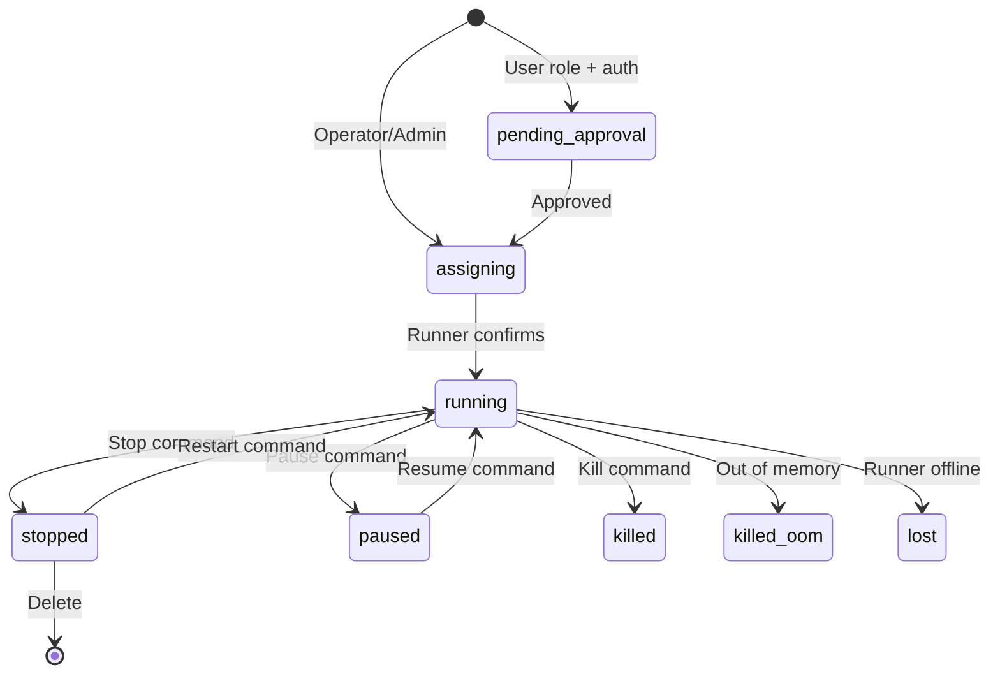

# VPS Overview

VPS (Virtual Private Server) tasks provide long-running interactive sessions with SSH access, terminal attach, and optional GPU allocation. Unlike command tasks that run a single command and exit, VPS tasks remain running until explicitly stopped.

## VPS Backends

KohakuRiver supports two VPS backends:

```
  Docker Backend                     QEMU/KVM Backend
  ──────────────                     ────────────────

  ┌─────────────────────┐           ┌─────────────────────┐
  │     Runner Node     │           │     Runner Node     │
  │                     │           │                     │
  │  ┌───────────────┐  │           │  ┌───────────────┐  │
  │  │ Docker Engine │  │           │  │   QEMU/KVM    │  │
  │  │               │  │           │  │               │  │
  │  │ ┌───────────┐ │  │           │  │ ┌───────────┐ │  │
  │  │ │ Container │ │  │           │  │ │  Full VM  │ │  │
  │  │ │           │ │  │           │  │ │           │ │  │
  │  │ │  SSH :22  │ │  │           │  │ │  SSH :22  │ │  │
  │  │ │  App :8080│ │  │           │  │ │  App :8080│ │  │
  │  │ │           │ │  │           │  │ │  own      │ │  │
  │  │ │  Shared   │ │  │           │  │ │  kernel   │ │  │
  │  │ │  kernel   │ │  │           │  │ │  NVIDIA   │ │  │
  │  │ │  NVIDIA   │ │  │           │  │ │  driver   │ │  │
  │  │ │  runtime  │ │  │           │  │ │  (VFIO)   │ │  │
  │  │ └───────────┘ │  │           │  │ └───────────┘ │  │
  │  └───────────────┘  │           │  └───────────────┘  │
  └─────────────────────┘           └─────────────────────┘

  Fast startup, shared kernel        Full isolation, own kernel
  Container-level isolation          VFIO GPU passthrough
  NVIDIA Container Toolkit           Cloud-init provisioning
  Snapshots supported                Disk persists across restarts
  Pause/resume supported             No pause/resume
```

| Backend  | Isolation       | GPU Access                                          | Use Case                                      |
| -------- | --------------- | --------------------------------------------------- | --------------------------------------------- |
| `docker` | Container-level | NVIDIA Container Toolkit (`--gpus` flag) | Development, training, shared GPU             |
| `qemu`   | Full VM         | VFIO passthrough (dedicated hardware)               | Full isolation, custom kernel, bare-metal GPU |

## Creating a VPS

### Docker VPS (Default)

```bash
kohakuriver vps create -t mynode --ssh -c 4 -m 8G
```

### QEMU VM VPS

```bash
kohakuriver vps create --backend qemu -t mynode::0 \
    --vm-memory 16384 -c 8 --ssh
```

## VPS Lifecycle



Key differences from command tasks:

- VPS tasks do not complete on their own -- they run until stopped or killed
- VPS tasks support **stop** and **restart** operations
- Docker VPS supports **pause** and **resume** (QEMU VMs do not)
- Docker VPS supports **snapshots** for saving container state

## Access Methods

### SSH Access

The most common access method. When `--ssh` is specified during creation:

1. The host allocates an SSH port (starting from 9000)
2. An SSH server runs inside the container or VM
3. Connect via the host's SSH proxy on port 8002

```bash
kohakuriver ssh <task_id>
```

See [SSH Access](ssh-access.md) for details.

### Terminal Attach

For quick debugging, attach directly to the container:

```bash
# WebSocket terminal (recommended)
kohakuriver connect <task_id>

# Direct Docker exec
kohakuriver terminal attach <task_id>

# Run a single command
kohakuriver terminal exec <task_id> -- ps aux
```

### Port Forwarding

Forward local ports to services running inside the VPS:

```bash
kohakuriver forward <task_id> 8080 --local-port 8080
```

See [Port Forwarding](port-forwarding.md) for details.

## VPS Management

```bash
# List all VPS instances
kohakuriver vps list

# Check status
kohakuriver vps status <task_id>

# Stop a running VPS
kohakuriver vps stop <task_id>

# Restart a stopped VPS
kohakuriver vps restart <task_id>

# Pause/resume (Docker only)
kohakuriver vps pause <task_id>
kohakuriver vps resume <task_id>
```

## Resource Allocation

VPS tasks support the same resource constraints as command tasks:

| Flag           | Description                                                |
| -------------- | ---------------------------------------------------------- |
| `-c, --cores`  | CPU cores (0 = no limit; VPS prompt defaults to 0)         |
| `-m, --memory` | Memory limit (e.g., `8G`)                                  |
| `-t, --target` | Target node with optional NUMA and GPU (`node:numa::gpus`) |
| `--container`  | Container environment name (Docker backend)                |
| `--image`      | Docker registry image (Docker backend)                     |
| `--vm-image`   | Base VM image name (QEMU backend)                          |
| `--vm-disk`    | VM disk size in GB (QEMU backend)                          |
| `--vm-memory`  | VM memory in MB (QEMU backend)                             |

## Authentication and Approval

When authentication is enabled, VPS creation requires **operator** or **admin** role. Users with the `user` role must submit VPS requests that go through the approval workflow:

1. User submits VPS creation request
2. Task enters `pending_approval` state
3. Operator or admin approves or rejects the request
4. On approval, the VPS is dispatched to the runner

## Related Topics

- [Docker VPS](docker-vps.md) -- Docker-based VPS details
- [VM VPS](vm-vps.md) -- QEMU/KVM VM-based VPS details
- [SSH Access](ssh-access.md) -- Connecting via SSH
- [Snapshots](snapshots.md) -- Saving and restoring VPS state
- [Port Forwarding](port-forwarding.md) -- Accessing services inside VPS
- [Container Preparation](container-preparation.md) -- Building custom environments
