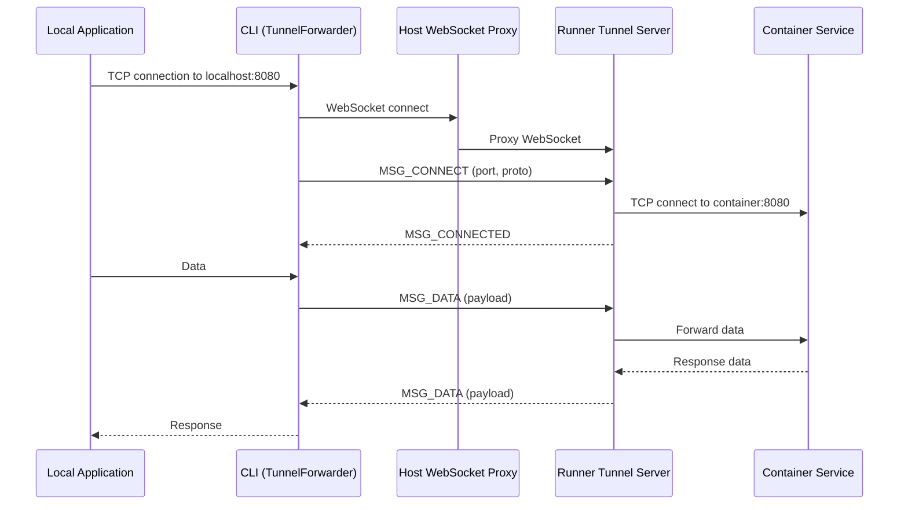

# Port Forwarding

KohakuRiver's tunnel system allows you to forward local ports to services running inside VPS containers or VMs. This is useful for accessing web servers, Jupyter notebooks, databases, or any TCP/UDP service.

## Quick Start

```bash
# Forward local port 8080 to container port 8080
kohakuriver forward <task_id> 8080

# Forward with a different local port
kohakuriver forward <task_id> 8888 --local-port 9999

# Forward UDP traffic
kohakuriver forward <task_id> 5060 --proto udp
```

## How It Works

Port forwarding uses a WebSocket-based tunnel protocol between the CLI client and a tunnel server running on the runner node. The host proxies WebSocket connections to the correct runner.

```
  Tunnel Data Path
  ────────────────

  Local Machine                Host                    Runner Node
  ┌──────────────┐    ┌──────────────────┐    ┌─────────────────────────┐
  │              │    │                  │    │                         │
  │  ┌────────┐  │    │  ┌────────────┐  │    │  ┌──────────┐           │
  │  │  App   │──┼TCP─┼──│  WebSocket │──┼WS──┼──│  Tunnel  │           │
  │  │(browser│  │    │  │   Proxy    │  │    │  │  Server  │           │
  │  │ etc.)  │  │    │  └────────────┘  │    │  └────┬─────┘           │
  │  └────────┘  │    │                  │    │       │                 │
  │              │    │                  │    │  ┌────▼─────┐           │
  │  ┌────────┐  │    │                  │    │  │Container │           │
  │  │  CLI   │  │    │                  │    │  │ Service  │           │
  │  │Forwarder──┼WS──┼──│  WebSocket │──┼WS──┼──│ :8080    │           │
  │  │        │  │    │  │   Proxy    │  │    │  └──────────┘           │
  │  └────────┘  │    │  └────────────┘  │    │                         │
  │              │    │                  │    │                         │
  │ localhost    │    │   :8000          │    │   :8001                 │
  │   :8080      │    │                  │    │                         │
  └──────────────┘    └──────────────────┘    └─────────────────────────┘
```

### Connection Sequence



## Command Reference

```bash
kohakuriver forward <task_id> <remote_port> [options]
```

| Argument/Flag  | Default        | Description                  |
| -------------- | -------------- | ---------------------------- |
| `task_id`      | Required       | Task ID of the VPS           |
| `remote_port`  | Required       | Port inside the container/VM |
| `--local-port` | Same as remote | Local port to listen on      |
| `--local-host` | `127.0.0.1`    | Local address to bind        |
| `--proto`      | `tcp`          | Protocol: `tcp` or `udp`     |

## Tunnel Protocol

The tunnel uses a binary WebSocket protocol with an 8-byte header:

```
  Tunnel Binary Header (8 bytes, big-endian)
  ──────────────────────────────────────────

  Byte:   0        1        2  3  4  5     6  7
        ┌────────┬────────┬──────────────┬─────────┐
        │  Type  │ Proto  │  Client ID   │  Port   │
        │  (1B)  │  (1B)  │    (4B)      │  (2B)   │
        └────────┴────────┴──────────────┴─────────┘

  Type:      Message type (0x01-0x07)
  Proto:     0x00 = TCP, 0x01 = UDP
  Client ID: 32-bit connection identifier
  Port:      16-bit target port number

  Followed by variable-length payload (for MSG_DATA).
```

### Message Types

| Type   | Name          | Direction        | Description            |
| ------ | ------------- | ---------------- | ---------------------- |
| `0x01` | MSG_CONNECT   | Client -> Server | Open a new connection  |
| `0x02` | MSG_CONNECTED | Server -> Client | Connection established |
| `0x03` | MSG_DATA      | Bidirectional    | Data payload           |
| `0x04` | MSG_CLOSE     | Bidirectional    | Close connection       |
| `0x05` | MSG_ERROR     | Server -> Client | Error message          |
| `0x06` | MSG_PING      | Bidirectional    | Keepalive ping         |
| `0x07` | MSG_PONG      | Bidirectional    | Keepalive pong         |

## Tunnel Server Configuration

The tunnel server runs on each runner node when `TUNNEL_ENABLED = True` in the runner configuration. It is started automatically alongside the runner's FastAPI server.

### Runner Settings

| Setting          | Default | Description              |
| ---------------- | ------- | ------------------------ |
| `TUNNEL_ENABLED` | `True`  | Enable the tunnel server |

## Rust Tunnel Client

For performance-critical use cases, KohakuRiver includes a Rust-based tunnel client at `src/kohakuriver-tunnel/`:

```bash
# Build
cd src/kohakuriver-tunnel
cargo build --release

# Run
./target/release/kohakuriver-tunnel \
    --host ws://host:8000/api/tunnel/<task_id> \
    --local-port 8080 \
    --remote-port 8080
```

The Rust client uses Tokio for async I/O and Tungstenite for WebSocket, providing lower latency and higher throughput than the Python CLI.

## Use Cases

### Jupyter Notebook

```bash
# Inside the VPS, start Jupyter
jupyter notebook --ip=0.0.0.0 --port=8888 --no-browser

# On your local machine
kohakuriver forward <task_id> 8888
# Open http://localhost:8888
```

### TensorBoard

```bash
# Inside the VPS
tensorboard --logdir=/shared/logs --port=6006

# On your local machine
kohakuriver forward <task_id> 6006
# Open http://localhost:6006
```

### Database

```bash
# Forward PostgreSQL
kohakuriver forward <task_id> 5432

# Connect with psql
psql -h localhost -p 5432 -U myuser mydb
```

### Web Server

```bash
# Forward a development web server
kohakuriver forward <task_id> 3000 --local-port 3000
# Open http://localhost:3000
```

## Multiple Forwards

Run multiple `kohakuriver forward` commands in parallel to forward multiple ports:

```bash
kohakuriver forward <task_id> 8888 &
kohakuriver forward <task_id> 6006 &
kohakuriver forward <task_id> 3000 &
```

Each forward creates an independent WebSocket tunnel.

## Troubleshooting

### Connection Refused

- Verify the service is running inside the VPS: `kohakuriver terminal exec <task_id> -- ss -tlnp`
- Check the service is binding to `0.0.0.0`, not `127.0.0.1`
- Ensure the VPS is in `running` state

### Tunnel Disconnects

- Check network stability between your machine and the host
- Verify the tunnel server is enabled on the runner (`TUNNEL_ENABLED = True`)
- Check host and runner logs for WebSocket errors

## Related Topics

- [SSH Access](ssh-access.md) -- SSH-based access to VPS
- [Docker VPS](docker-vps.md) -- Docker VPS details
- [VM VPS](vm-vps.md) -- QEMU VM VPS details
