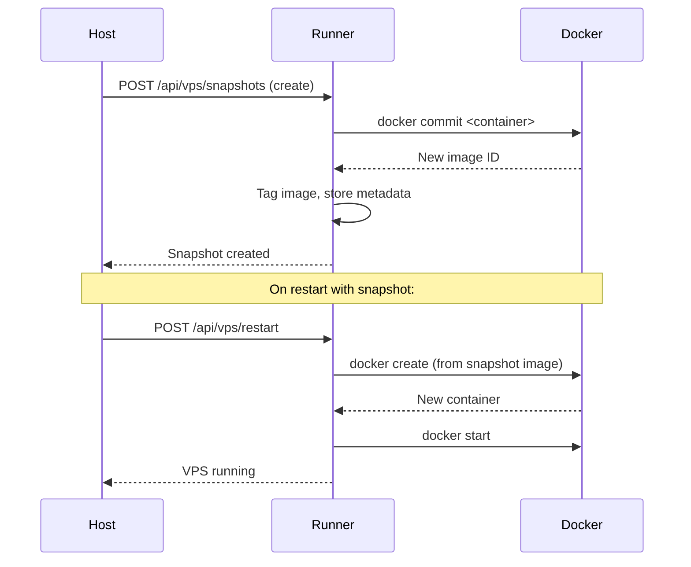

# Snapshots

Snapshots capture the filesystem state of a Docker VPS container, allowing you to save work and restore to a known good state. Snapshots are only available for Docker-backed VPS instances.

## Creating Snapshots

### Manual Snapshot

```bash
# Create a snapshot of a running or stopped VPS
curl -X POST http://host:8000/api/vps/snapshots/<task_id>
```

Through the web dashboard, click the snapshot button on the VPS card.

### Automatic Snapshots

When `AUTO_SNAPSHOT_ON_STOP` is enabled in the runner configuration, a snapshot is automatically taken each time a VPS is stopped:

```python
# runner_config.py
AUTO_SNAPSHOT_ON_STOP = True
MAX_SNAPSHOTS_PER_VPS = 5
```

When the maximum snapshot count is reached, the oldest snapshot is deleted to make room for the new one.

## Listing Snapshots

### All Snapshots for a VPS

```bash
curl http://host:8000/api/vps/snapshots/<task_id>
```

Returns a list of snapshots with:

- Snapshot ID
- Creation timestamp
- Size information

### Latest Snapshot

```bash
curl http://host:8000/api/vps/snapshots/<task_id>/latest
```

Returns only the most recent snapshot.

## Restoring from Snapshots

When restarting a stopped VPS, the runner can restore from the latest snapshot. The restart flow:

1. Host sends restart request to the runner
2. Runner checks for available snapshots
3. If a snapshot exists, the container is recreated from the snapshot image
4. The VPS boots with the saved filesystem state

This is handled automatically during the restart process. The container's filesystem state at the time of the snapshot is restored, including:

- Installed packages and libraries
- User files and configurations
- Running service configurations (though processes must restart)

## Deleting Snapshots

```bash
# Delete a specific snapshot
curl -X DELETE http://host:8000/api/vps/snapshots/<task_id>/<snapshot_id>
```

## How Snapshots Work

Docker VPS snapshots use Docker's `commit` command internally:



The snapshot captures the entire container filesystem at that moment. It does not capture:

- Running processes (they must be restarted)
- In-memory state
- Network connections

## Runner Configuration

| Setting                 | Default | Description                               |
| ----------------------- | ------- | ----------------------------------------- |
| `AUTO_SNAPSHOT_ON_STOP` | `True`  | Automatically snapshot on VPS stop        |
| `MAX_SNAPSHOTS_PER_VPS` | `5`     | Maximum snapshots per VPS before rotation |

## Best Practices

- **Snapshot before major changes**: Take a manual snapshot before installing new packages or modifying system configuration
- **Monitor disk usage**: Snapshots consume disk space on the runner. Use `MAX_SNAPSHOTS_PER_VPS` to limit accumulation
- **Save important work to shared storage**: Snapshots are local to the runner node. For critical data, save to `/shared` which is backed by network storage
- **Snapshot before GPU driver updates**: If updating NVIDIA drivers inside a VPS, snapshot first in case the update fails

## Limitations

- Snapshots are only available for **Docker** VPS (not QEMU VM VPS)
- Snapshots capture filesystem state only, not process state
- Snapshots are stored on the runner's local Docker storage
- Large containers (many GB of installed packages or data) produce large snapshots

## Related Topics

- [Docker VPS](docker-vps.md) -- Docker VPS lifecycle and configuration
- [Container Preparation](container-preparation.md) -- Building base environments
