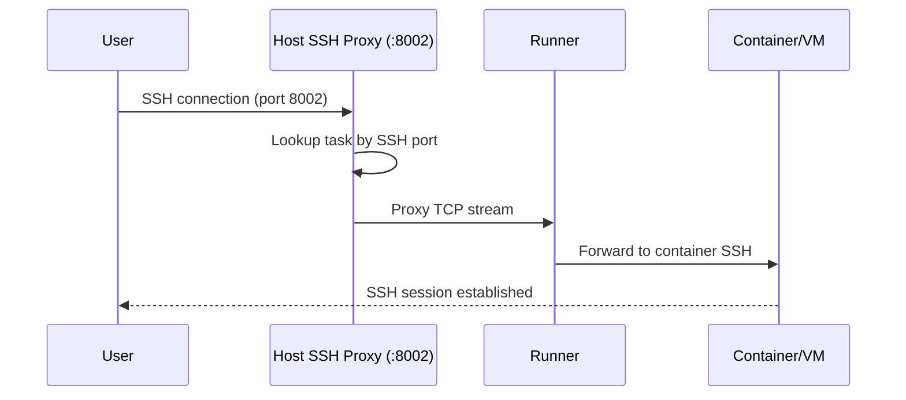

# SSH Access

KohakuRiver provides SSH access to VPS instances through a centralized SSH proxy running on the host. This allows users to SSH into any VPS on any node through a single entry point.

## How SSH Proxy Works

The host runs an SSH proxy on port 8002 (configurable via `HOST_SSH_PROXY_PORT`). When a VPS is created with `--ssh`, the host allocates a unique SSH port (starting from 9000) and the proxy routes connections based on this port.

```
  SSH Proxy Path
  ──────────────

  ┌────────────┐        ┌───────────────────────────┐        ┌──────────────────┐
  │            │        │       Host Server          │        │   Runner Node    │
  │   User     │        │                           │        │                  │
  │            │  SSH   │  ┌─────────────────────┐  │  TCP   │  ┌────────────┐  │
  │  ssh -p    │───────>│  │   SSH Proxy         │──┼───────>│  │  Runner    │  │
  │  8002      │  :8002 │  │                     │  │        │  │  Agent     │  │
  │  host      │        │  │  Looks up task by   │  │        │  └─────┬──────┘  │
  │            │        │  │  allocated SSH port  │  │        │        │        │
  │            │<───────│  │  and routes to the   │──┼────────│──┐     │        │
  │            │        │  │  correct runner      │  │        │  │     │        │
  │            │        │  └─────────────────────┘  │        │  │  ┌──▼──────┐ │
  └────────────┘        │                           │        │  └──│Container│ │
                        │  DB: task_id -> runner    │        │     │  SSH    │ │
                        │        + ssh_port         │        │     │  :22   │ │
                        └───────────────────────────┘        │     └────────┘ │
                                                            └─────────────────┘
```

### Connection Flow



## Quick Connect

The simplest way to connect:

```bash
kohakuriver ssh <task_id>
```

This command:

1. Looks up the task's SSH port and assigned node
2. Determines the appropriate SSH key
3. Opens an SSH session through the host proxy

### Options

```bash
kohakuriver ssh <task_id> \
    --key ~/.ssh/mykey \
    --user root \
    --proxy-port 8002 \
    --local-port 2222
```

| Flag           | Default       | Description                                      |
| -------------- | ------------- | ------------------------------------------------ |
| `--key`        | Auto-detected | Path to SSH private key                          |
| `--user`       | `root`        | Remote username                                  |
| `--proxy-port` | `8002`        | Host SSH proxy port                              |
| `--local-port` | None          | Use a local port forward instead of direct proxy |

## SSH Config Generation

Generate an SSH config file for use with standard SSH clients or IDEs:

```bash
# Print config to stdout
kohakuriver ssh config

# Write to a file
kohakuriver ssh config --output ~/.ssh/kohakuriver_config
```

The generated config creates entries like:

```
Host kohakuriver-<task_id>
    HostName <host_address>
    Port 8002
    User root
    IdentityFile ~/.ssh/kohakuriver_<task_id>
    StrictHostKeyChecking no
    UserKnownHostsFile /dev/null
    ProxyCommand none
```

You can include this in your main SSH config:

```
# ~/.ssh/config
Include ~/.ssh/kohakuriver_config
```

Then connect with:

```bash
ssh kohakuriver-<task_id>
```

## SSH Key Modes

When creating a VPS, choose how SSH keys are handled:

### Default (Upload Existing)

```bash
kohakuriver vps create -t mynode --ssh
```

Automatically finds and uploads `~/.ssh/id_*.pub` keys from your local machine. The public keys are injected into the container's `~/.ssh/authorized_keys`.

### Generate New Key Pair

```bash
kohakuriver vps create -t mynode --ssh --gen-ssh-key
```

Generates a fresh ED25519 key pair. The private key is saved locally (default: `~/.ssh/kohakuriver_<task_id>`), and the public key is injected into the container.

```bash
# Specify where to save the private key
kohakuriver vps create -t mynode --ssh --gen-ssh-key \
    --key-out-file ~/.ssh/my_vps_key
```

### Specific Public Key

```bash
# From a file
kohakuriver vps create -t mynode --ssh \
    --public-key-file ~/.ssh/custom_key.pub

# As a string
kohakuriver vps create -t mynode --ssh \
    --public-key-string "ssh-ed25519 AAAA... user@host"
```

### No SSH Key

```bash
kohakuriver vps create -t mynode --ssh --no-ssh-key
```

Creates the VPS with SSH enabled but no key injected. Useful when the container image has a pre-configured password or other authentication mechanism.

## SSH Inside Containers

For SSH to work inside a Docker VPS container, the container environment must have:

1. An SSH server installed (e.g., `openssh-server`)
2. The SSH server configured to start automatically
3. Port 22 accessible within the container

See [Container Preparation](container-preparation.md) for building SSH-ready environments.

For QEMU VM VPS, cloud-init automatically installs and configures the SSH server.

## Troubleshooting

### Connection Refused

- Verify the VPS is in `running` state: `kohakuriver vps status <task_id>`
- Check that SSH is enabled on the VPS (the task should have an `ssh_port` assigned)
- Ensure the host SSH proxy is running on port 8002
- Verify the container has an SSH server running

### Authentication Failed

- Check the correct key is being used: `kohakuriver ssh <task_id> --key ~/.ssh/correct_key`
- If using generated keys, the private key is at the path shown during VPS creation
- Verify the public key was injected: `kohakuriver terminal exec <task_id> -- cat /root/.ssh/authorized_keys`

### Connection Timeout

- Ensure the runner node is online: `kohakuriver node status <hostname>`
- Check network connectivity between your machine and the host
- Verify the host SSH proxy port (8002) is not blocked by a firewall

## Related Topics

- [Docker VPS](docker-vps.md) -- Creating Docker-based VPS
- [VM VPS](vm-vps.md) -- Creating VM-based VPS
- [Port Forwarding](port-forwarding.md) -- Forwarding additional ports
- [Container Preparation](container-preparation.md) -- Building SSH-ready environments
