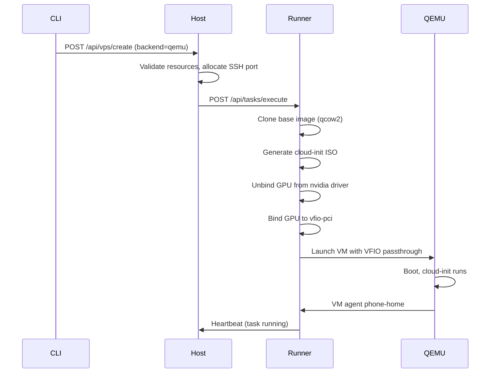

# VM VPS

VM VPS instances run as full QEMU/KVM virtual machines with VFIO GPU passthrough, cloud-init provisioning, and SSH access. This backend provides complete hardware isolation.

## Prerequisites

Before creating VM VPS instances, ensure:

1. **QEMU/KVM** is installed on the runner node
2. **IOMMU** is enabled in BIOS and kernel
3. **VFIO modules** are loaded
4. **Base VM images** are created

See [QEMU/KVM Setup](../setup/qemu-kvm.md) and [GPU Passthrough](../setup/gpu-passthrough.md) for setup instructions.

## Verify Readiness

```bash
# Check QEMU capabilities on the runner
kohakuriver qemu check
```

This reports:

- QEMU and KVM availability
- Discoverable VFIO GPUs with PCI addresses and IOMMU groups
- Whether ACS override is active

## Creating a VM VPS

### Basic Creation

```bash
kohakuriver vps create --backend qemu -t mynode --ssh
```

### With GPU Passthrough

```bash
kohakuriver vps create --backend qemu -t mynode::0 \
    --vm-memory 16384 \
    -c 8 \
    --ssh
```

### Full Options

```bash
kohakuriver vps create --backend qemu -t mynode::0,1 \
    -c 16 \
    --vm-memory 32768 \
    --vm-disk 100 \
    --vm-image ubuntu-22.04 \
    --ssh --gen-ssh-key
```

| Flag             | Default                       | Description                |
| ---------------- | ----------------------------- | -------------------------- |
| `--backend qemu` | `docker`                      | Select the QEMU VM backend |
| `--vm-memory`    | `VM_DEFAULT_MEMORY_MB` (4096) | VM RAM in megabytes        |
| `--vm-disk`      | 20                            | Disk size in GB            |
| `--vm-image`     | `ubuntu-22.04`                | Base image name            |
| `-c, --cores`    | 1                             | Number of vCPUs            |

## How It Works

### VM Creation Flow



### Cloud-Init Provisioning

Each VM is provisioned with cloud-init, which:

1. Sets the hostname
2. Creates the default user with SSH keys
3. Installs the NVIDIA driver matching the host GPU
4. Configures the network interface
5. Starts the **VM agent** -- a lightweight Python script that:
   - Sends a phone-home signal to the runner on boot
   - Sends periodic heartbeats with the VM's IP address
   - Listens for shutdown commands from the runner

### GPU Passthrough Process

When a VM VPS requests GPUs:

1. The runner identifies the GPU's PCI address and IOMMU group
2. All devices in the same IOMMU group are unbound from their host drivers
3. Devices are bound to `vfio-pci`
4. QEMU is launched with `-device vfio-pci,host=<pci_address>` for each GPU
5. Companion audio devices (if any) are also passed through

On VM shutdown, devices are unbound from `vfio-pci` and rebound to the host driver.

```
  GPU Passthrough Lifecycle
  ─────────────────────────

  Host GPU State              VM Lifecycle
  ──────────────              ────────────

  nvidia driver bound         VM not running
       │
       ▼
  Unbind from nvidia    ───>  VM starting
       │
       ▼
  Bind to vfio-pci      ───>  QEMU launches with
       │                       -device vfio-pci
       ▼
  GPU passed to VM      ───>  VM running
       │                       (nvidia driver
       │                        inside VM)
       ▼
  Unbind from vfio-pci  ───>  VM stopping
       │
       ▼
  Rebind to nvidia      ───>  VM stopped
       │
       ▼
  nvidia driver bound         GPU available
  (host can use GPU)          for other tasks
```

### VM Networking

VM networking supports two modes:

```
  Overlay Mode (OVERLAY_ENABLED=True)
  ────────────────────────────────────
  ┌──────────────────────────────┐
  │         Runner Node          │
  │                              │
  │  ┌──────────────────────┐    │
  │  │   kohaku-overlay     │    │
  │  │   (VXLAN bridge)     │    │
  │  └───────────┬──────────┘    │
  │              │               │
  │         ┌────▼────┐          │
  │         │  TAP    │          │         Reachable from
  │         │ device  │          │  ─────> other nodes via
  │         └────┬────┘          │         overlay IPs
  │              │               │
  │         ┌────▼────┐          │
  │         │   VM    │          │
  │         │10.X.Y.Z │          │
  │         └─────────┘          │
  └──────────────────────────────┘

  NAT Mode (OVERLAY_ENABLED=False)
  ────────────────────────────────
  ┌──────────────────────────────┐
  │         Runner Node          │
  │                              │
  │  ┌──────────────────────┐    │
  │  │   kohaku-br0         │    │
  │  │   (NAT bridge)       │    │
  │  │   192.168.100.1      │    │
  │  └───────────┬──────────┘    │
  │              │               │
  │         ┌────▼────┐          │         Local only,
  │         │  TAP    │          │  ─────> NAT for external
  │         │ device  │          │         access
  │         └────┬────┘          │
  │              │               │
  │         ┌────▼────┐          │
  │         │   VM    │          │
  │         │.100.10  │          │
  │         └─────────┘          │
  └──────────────────────────────┘
```

| Mode    | Bridge                      | Subnet             | When Used              |
| ------- | --------------------------- | ------------------ | ---------------------- |
| Overlay | `kohaku-overlay` TAP device | Overlay subnet     | `OVERLAY_ENABLED=True` |
| NAT     | `kohaku-br0` bridge         | `VM_BRIDGE_SUBNET` | Overlay disabled       |

In overlay mode, the VM receives an IP on the cluster overlay network and is reachable from other nodes. In NAT mode, the VM uses a local bridge with NAT for external connectivity.

## Stop and Restart

### Stopping

```bash
kohakuriver vps stop <task_id>
```

When a VM VPS is stopped:

1. The runner sends an ACPI shutdown signal to the VM
2. The VM agent inside the guest initiates a clean shutdown
3. GPUs are unbound from `vfio-pci` and returned to the host driver
4. The qcow2 disk image is preserved for restart

### Restarting

```bash
kohakuriver vps restart <task_id>
```

When a VM VPS is restarted:

1. GPUs are again unbound from the host driver and bound to `vfio-pci`
2. QEMU is relaunched with the existing disk image
3. The VM boots with its previous filesystem state intact

## Runner Configuration

Key settings in `runner_config.py` for VM VPS:

| Setting                | Default                       | Description                                   |
| ---------------------- | ----------------------------- | --------------------------------------------- |
| `VM_IMAGES_DIR`        | `~/.kohakuriver/vm-images`    | Directory for base VM images                  |
| `VM_INSTANCES_DIR`     | `~/.kohakuriver/vm-instances` | Directory for running VM disks                |
| `VM_DEFAULT_MEMORY_MB` | `4096`                        | Default VM RAM allocation                     |
| `VM_ACS_OVERRIDE`      | `False`                       | Enable ACS override for IOMMU group splitting |
| `VM_BRIDGE_NAME`       | `kohaku-br0`                  | NAT bridge name                               |
| `VM_BRIDGE_SUBNET`     | `192.168.100.0/24`            | NAT bridge subnet                             |
| `VM_BRIDGE_GATEWAY`    | `192.168.100.1`               | NAT bridge gateway                            |

## Base Images

Create base images using the provided script:

```bash
sudo bash scripts/create-vm-base-image.sh
```

Or via the CLI:

```bash
kohakuriver qemu image create --name ubuntu-22.04
kohakuriver qemu image list
```

Base images are qcow2 format and stored in `VM_IMAGES_DIR`. Each VPS instance clones the base image, so changes do not affect other VMs.

## Limitations

- VM VPS does not support **pause/resume** (use stop/restart instead)
- VM VPS does not support **snapshots** (the qcow2 disk persists across restarts)
- GPU passthrough requires IOMMU group isolation -- multiple GPUs in the same group must all be passed through together (unless ACS override is enabled)
- Creating a VM is slower than a Docker container due to image cloning and boot time

## Related Topics

- [Docker VPS](docker-vps.md) -- Alternative container-based VPS backend
- [GPU Passthrough](../setup/gpu-passthrough.md) -- IOMMU and VFIO setup
- [QEMU/KVM Setup](../setup/qemu-kvm.md) -- Installation and base image creation
