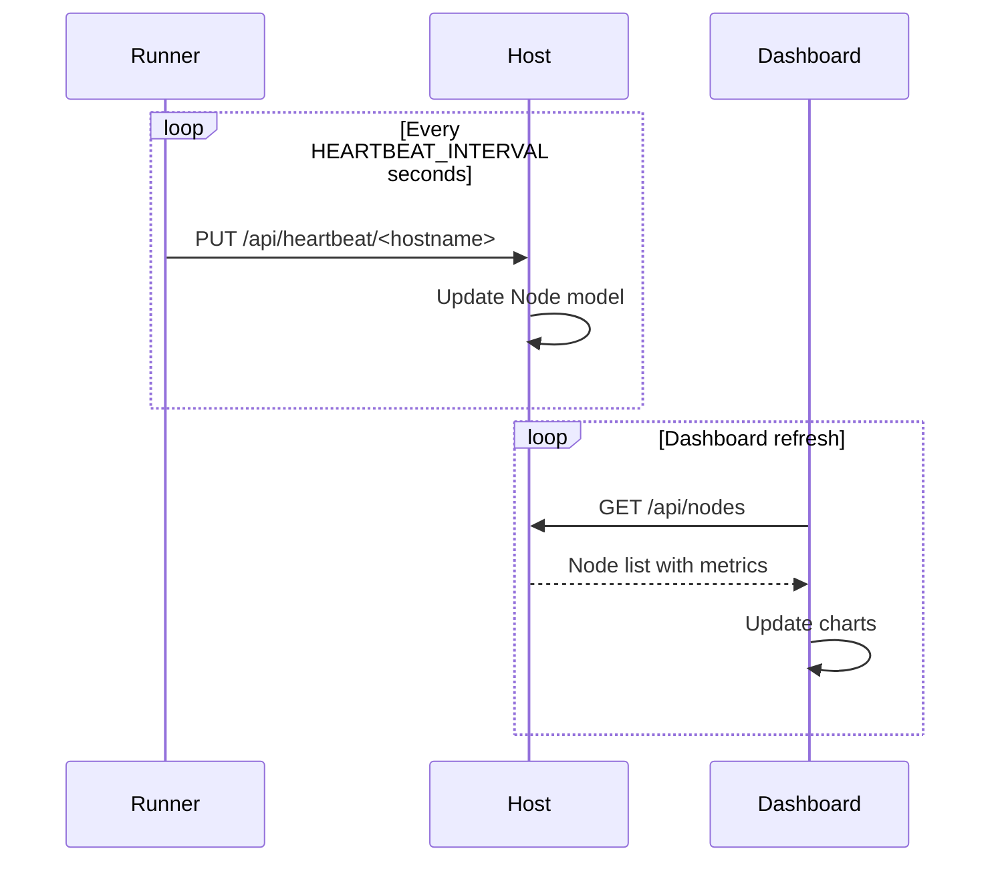

# Node Monitoring

The web dashboard provides real-time node monitoring with interactive charts powered by Plotly.js.

## Data Flow

```
  Monitoring Data Pipeline
  ────────────────────────

  ┌──────────────────────┐     ┌───────────────────────┐     ┌──────────────────┐
  │    Runner Nodes      │     │     Host Server       │     │   Web Dashboard  │
  │                      │     │                       │     │                  │
  │  ┌────────────────┐  │     │  ┌─────────────────┐  │     │  ┌────────────┐ │
  │  │Resource Monitor│  │     │  │  Node Model     │  │     │  │ Node List  │ │
  │  │                │  │     │  │  (SQLite DB)    │  │     │  │ View       │ │
  │  │ CPU, Memory,   │──┼────>│  │                 │──┼────>│  │            │ │
  │  │ GPU, Temp      │  │PUT  │  │  cpu_percent    │  │GET  │  │ Per-node   │ │
  │  │                │  │/api/│  │  memory_percent │  │/api/│  │ detail     │ │
  │  │ nvidia-ml-py   │  │hb   │  │  gpu_info (JSON)│  │nodes│  │ view       │ │
  │  └────────────────┘  │     │  │  temperature    │  │     │  └──────┬─────┘ │
  │                      │     │  │  numa_topology  │  │     │         │       │
  │  Every 5s (default)  │     │  └─────────────────┘  │     │  ┌──────▼─────┐ │
  └──────────────────────┘     └───────────────────────┘     │  │ Plotly.js  │ │
                                                              │  │ Charts     │ │
                                                              │  └────────────┘ │
                                                              └──────────────────┘
```

## Node List View

The node list displays all registered nodes with:

- Hostname and URL
- Online/offline status
- Last heartbeat time
- CPU utilization percentage
- Memory usage (used/total)
- GPU count and utilization summary
- Runner version
- VM capability indicator

Offline nodes are highlighted in red. Nodes that have not sent a heartbeat within `HEARTBEAT_TIMEOUT` seconds are considered offline.

## Node Detail View

Click a node to see detailed metrics:

### CPU Metrics

- **Current utilization**: Percentage of CPU in use
- **Core count**: Total available CPU cores
- **Allocated cores**: Cores assigned to running tasks
- **Available cores**: Free cores for new tasks

### Memory Metrics

- **Total memory**: Physical RAM installed
- **Used memory**: Current memory usage
- **Memory percentage**: Usage as a percentage
- **Allocated memory**: Memory assigned to running tasks

### Temperature

- **Average temperature**: Mean across all CPU sensors
- **Maximum temperature**: Highest reading across all sensors
- **GPU temperatures**: Per-GPU temperature readings

### GPU Metrics

For each GPU on the node:

| Metric       | Description                           |
| ------------ | ------------------------------------- |
| GPU name     | Model name (e.g., "NVIDIA A100 80GB") |
| Utilization  | GPU compute utilization percentage    |
| Memory used  | VRAM currently in use                 |
| Memory total | Total VRAM capacity                   |
| Temperature  | GPU die temperature                   |
| Status       | Free or allocated to a task           |

GPU metrics are collected via `nvidia-ml-py` on the runner and reported through heartbeats.

### NUMA Topology

If the node has multiple NUMA nodes, the dashboard displays:

- NUMA node IDs
- CPU cores per NUMA node
- Memory per NUMA node
- GPUs associated with each NUMA node

## Resource Charts

The dashboard renders Plotly.js charts for historical data:

### CPU Utilization Chart

Line chart showing CPU usage over time with the current value highlighted.

### Memory Usage Chart

Area chart showing memory consumption trends.

### GPU Utilization Chart

Per-GPU line charts showing compute utilization over time.

### GPU Memory Chart

Per-GPU area charts showing VRAM usage trends.

### Temperature Chart

Line charts for CPU and GPU temperatures with warning thresholds.

## Cluster Summary

The cluster summary aggregates metrics across all online nodes:

| Metric              | Description                       |
| ------------------- | --------------------------------- |
| Total nodes         | Count of all registered nodes     |
| Online nodes        | Count of nodes currently online   |
| Total CPU cores     | Sum of all CPU cores across nodes |
| Available CPU cores | Sum of unallocated cores          |
| Total memory        | Sum of all node memory            |
| Available memory    | Sum of unallocated memory         |
| Total GPUs          | Count of all GPUs                 |
| Available GPUs      | Count of unallocated GPUs         |
| Running tasks       | Count of currently running tasks  |
| Running VPS         | Count of running VPS instances    |

## Heartbeat Data

Node metrics are updated through the runner heartbeat system:



The heartbeat includes:

- CPU percentage, load average
- Memory usage (used, total, percent)
- Temperature (average, max)
- GPU info (per-GPU utilization, memory, temperature)
- Running task list
- NUMA topology

## Refresh Settings

The dashboard auto-refreshes node data. Configure the refresh interval in the dashboard settings or via URL parameter.

The CLI TUI dashboard also supports custom refresh intervals:

```bash
kohakuriver terminal --refresh 2.0
```

## Related Topics

- [Task Management](task-management.md) -- Monitoring task resources
- [VPS Management](vps-management.md) -- VPS resource monitoring
- [Admin Panel](admin-panel.md) -- Node administration
- [Monitoring](../tasks/monitoring.md) -- CLI monitoring commands
