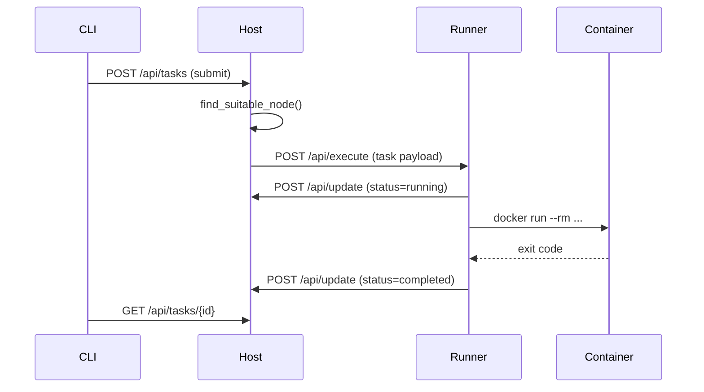
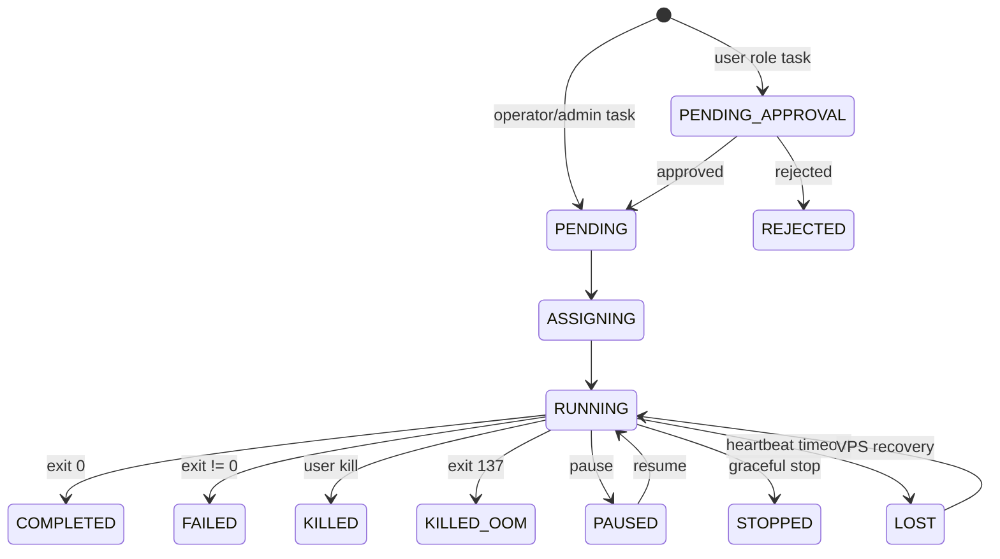

# System Architecture

KohakuRiver is a three-tier cluster manager: a single **Host** orchestrates multiple **Runners**, each of which manages Docker containers and QEMU/KVM virtual machines as compute workloads.

## Design Goals

- **Shared-nothing runners**: each Runner is self-contained -- it only needs network access to the Host. Shared storage (NFS/CIFS) is recommended for the simplest image distribution workflow, but is not required; runners can also pull images directly from a Docker registry via the `registry_image` field.
- **Dual workload backends**: Docker containers for lightweight tasks and QEMU VMs for hardware-passthrough workloads, dispatched through the same API.
- **Overlay networking**: containers and VMs on different nodes communicate over a flat Layer 3 address space without manual VLAN configuration.
- **Minimal external dependencies**: SQLite for persistence, no message broker or etcd required.

## Tier Overview

```
                     ┌──────────────────────┐
                     │  CLI / Web Dashboard │
                     │   (Typer / Vue.js)   │
                     └──────────┬───────────┘
                                │ HTTP / WebSocket
                                ▼
                     ┌──────────────────────┐
                     │    Host Server       │
                     │    FastAPI :8000     │
                     │                      │
                     │  ┌────────────────┐  │
                     │  │ Task Scheduler │  │
                     │  │ Node Manager   │  │
                     │  │ Overlay Mgr    │  │
                     │  │ IP Reservation │  │
                     │  │ Tunnel Proxy   │  │
                     │  │ SSH Proxy:8002 │  │
                     │  │ SQLite (Peewee)│  │
                     │  └────────────────┘  │
                     └───┬──────────────┬───┘
                         │              │
            HTTP + VXLAN │              │ HTTP + VXLAN
                         │              │
              ┌──────────▼──┐     ┌─────▼──────────────┐
              │  Runner A   │     │    Runner B         │
              │  :8001      │     │    :8001            │
              │             │     │                     │
              │ TaskExecutor│     │ TaskExecutor        │
              │ VPSManager  │     │ VPSManager          │
              │ TunnelSrv   │     │ VMVPSManager        │
              │ OverlayAgent│     │ TunnelSrv           │
              └──┬──────────┘     │ OverlayAgent        │
                 │                └──┬───────────┬─────┘
                 │                   │           │
           ┌─────▼──────┐      ┌─────▼───┐  ┌───▼──────┐
           │  Docker    │      │  Docker │  │ QEMU VMs │
           │ Containers │      │  Cont.  │  │ (KVM)    │
           └────────────┘      └─────────┘  └──────────┘
```

### Host (port 8000)

The Host is a FastAPI application that owns the SQLite database (Peewee ORM) and acts as the single source of truth for task state, node registration, and overlay network topology. Key responsibilities:

| Service         | Module                             | Purpose                                           |
| --------------- | ---------------------------------- | ------------------------------------------------- |
| Task Scheduler  | `host/services/task_scheduler.py`  | Dispatches tasks/VPS to runners via HTTP          |
| Node Manager    | `host/services/node_manager.py`    | Selects nodes by resource fit (cores, GPUs, NUMA) |
| Overlay Manager | `host/services/overlay/manager.py` | L3 VXLAN hub -- one interface per runner          |
| IP Reservation  | `host/services/ip_reservation.py`  | HMAC-signed token-based IP pre-allocation         |
| Tunnel Proxy    | `host/services/tunnel_proxy.py`    | Bidirectional WebSocket proxy for port forwarding |

### Runner (port 8001)

Each Runner registers with the Host via heartbeat and exposes a local FastAPI server. Runners execute workloads and report status back to the Host.

```
┌──────────────────────── Runner Process ────────────────────────┐
│                                                                │
│  ┌──────────────┐  ┌──────────────┐  ┌───────────────────┐     │
│  │ Task Executor│  │ VPS Manager  │  │ VM VPS Manager    │     │
│  │  (COMMAND)   │  │  (Docker)    │  │  (QEMU/KVM)       │     │
│  └──────┬───────┘  └──────┬───────┘  └───────┬───────────┘     │
│         │                 │                   │                │
│         ▼                 ▼                   ▼                │
│  ┌──────────────┐  ┌──────────────┐  ┌───────────────────┐     │
│  │   Docker     │  │   Docker     │  │  qemu-system-     │     │
│  │ subprocess   │  │ subprocess   │  │  x86_64 -daemonize│     │
│  └──────────────┘  └──────────────┘  └───────────────────┘     │
│                                                                │
│  ┌──────────────┐  ┌──────────────┐                            │
│  │ Tunnel Server│  │ Overlay Agent│                            │
│  │  (WebSocket) │  │  (VXLAN)     │                            │
│  └──────────────┘  └──────────────┘                            │
└────────────────────────────────────────────────────────────────┘
```

Runners use **subprocess-based Docker execution** (not the Docker SDK) for task containers, giving precise control over `docker run` flags such as `--cpus`, `--gpus`, `--network`, and `--ip`.

### Container / VM

Workloads run inside Docker containers or QEMU VMs. A Rust-based **tunnel client** binary is mounted into containers to enable port forwarding through the WebSocket tunnel chain: Container -> Runner -> Host -> CLI.

## Communication Patterns



All Host-to-Runner communication is pull-free: the Host **pushes** task payloads, and the Runner **pushes** status updates. Heartbeats flow from Runner to Host on a 10-second interval. If the heartbeat is missed beyond a configurable timeout the Host marks the node offline and its tasks as `lost`.

## Data Model

The database layer uses Peewee ORM with SQLite. JSON-heavy fields (GPU lists, environment variables, mount directories) are stored as `TextField` columns with `get_X()` / `set_X()` accessor pairs that serialize through `json.loads` / `json.dumps`.

```python
# Example from db/task.py
task_id = peewee.BigIntegerField(primary_key=True)  # Snowflake ID
required_gpus = peewee.TextField(default="[]")       # JSON array

def get_required_gpus(self) -> list[int]:
    return json.loads(self.required_gpus) if self.required_gpus else []
```

Primary keys use **Snowflake IDs** (64-bit, time-ordered) to avoid conflicts across distributed task submissions.

## State Machine

Task lifecycle is governed by a 12-state machine (see [Task System Design](../task-system/design.md)):



## Port and Service Map

```
┌─────────────────────────────────────────────────────────────────┐
│ Host Machine                                                    │
│                                                                 │
│   :8000  ─── FastAPI REST + WebSocket API                       │
│   :8002  ─── SSH Proxy (TCP forwarding to runner VPS)           │
│   :4789  ─── VXLAN UDP (overlay data plane)                     │
│                                                                 │
│ Runner Machine                                                  │
│                                                                 │
│   :8001  ─── FastAPI REST + WebSocket API                       │
│   :4789  ─── VXLAN UDP (overlay data plane)                     │
│                                                                 │
│ Container / VM                                                  │
│                                                                 │
│   :22    ─── SSH (VPS sessions only)                            │
│   :*     ─── User workload ports (tunnel-forwarded)             │
└─────────────────────────────────────────────────────────────────┘
```

## Trade-offs and Limitations

**Single-host bottleneck**: The Host is not replicated. SQLite and in-memory overlay state live on a single machine. For clusters under ~60 nodes this is sufficient; beyond that, the overlay subnet scheme (`NODE_BITS=6` by default) and single-writer SQLite become limiting.

**Subprocess Docker execution**: Using `docker run` via subprocess rather than the Docker SDK means each task incurs process-spawn overhead. The benefit is exact flag control and avoidance of Docker SDK version skew.

**No persistent queue**: Task dispatch is synchronous HTTP. If the Host crashes between accepting a task and dispatching it, the task remains in `PENDING` state and must be manually retried.

**Optional shared filesystem**: Tarball-based image distribution relies on a shared NFS/CIFS mount (`SHARED_DIR`), which is the recommended approach for keeping all runners on identical images with minimal configuration. However, shared storage is not a hard requirement -- runners can instead pull images from any Docker registry by specifying `registry_image` on a task. VMs always use local disk images and do not depend on shared storage at all.
