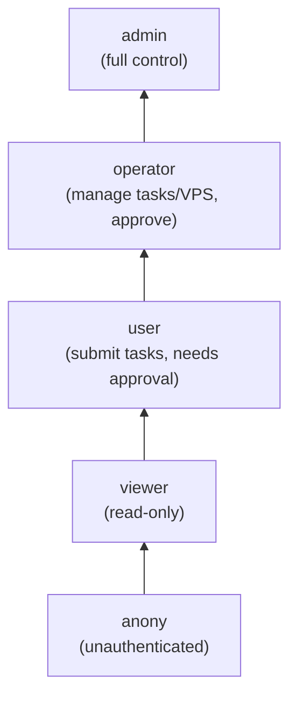
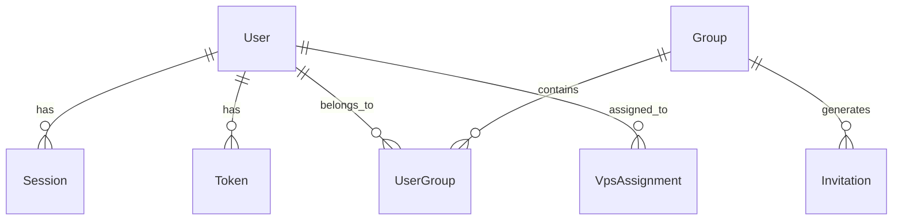
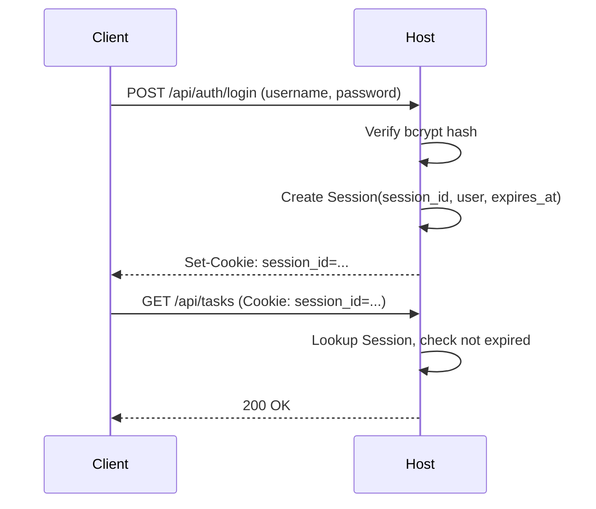
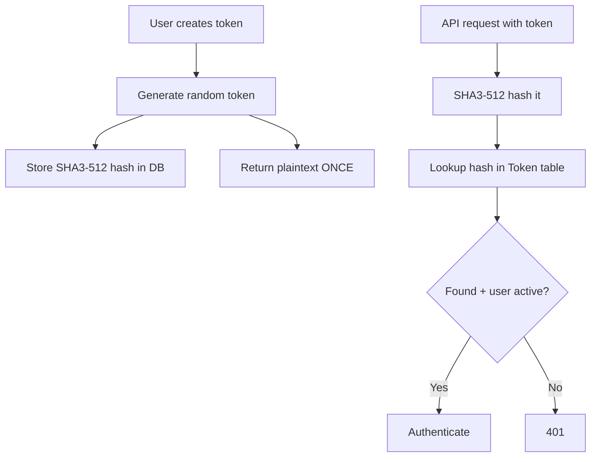
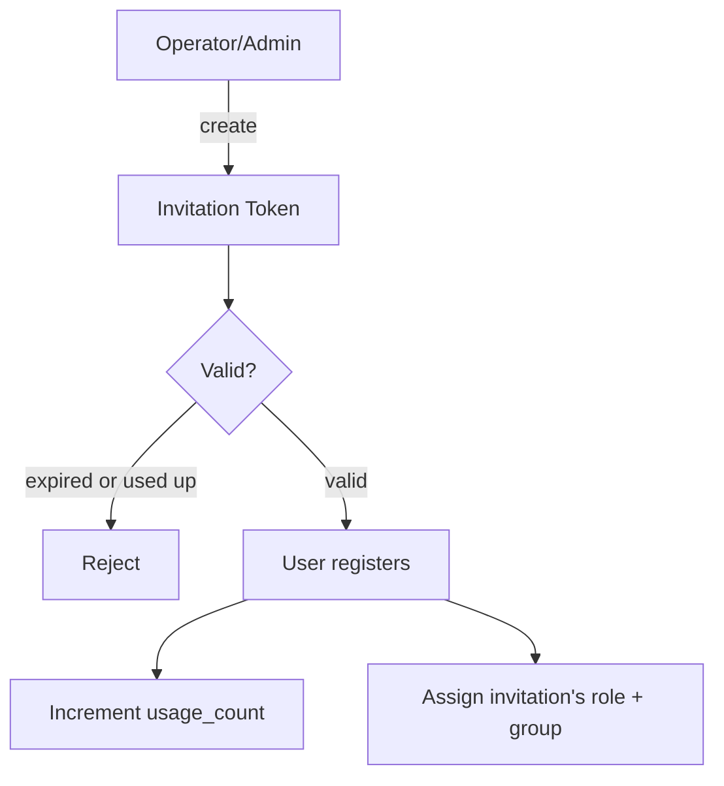
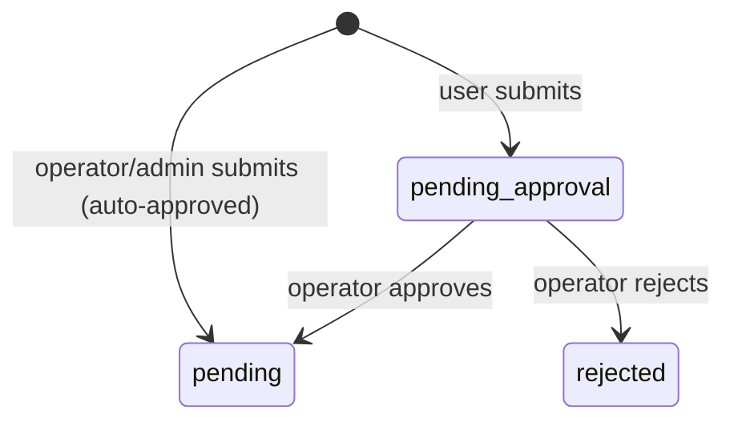

# Authentication System Design

KohakuRiver's authentication system provides role-based access control, session management, API token authentication, and an invitation-only registration model. The system is implemented across `db/auth.py` (models), `host/auth/` (routes and utilities), and enforced via FastAPI dependency injection.

## Design Goals

- **Role hierarchy**: five privilege levels from anonymous to admin, with consistent permission checks.
- **Dual authentication**: cookie-based sessions for web/CLI, API tokens for programmatic access.
- **Invitation-only signup**: new users require a valid invitation token to register.
- **Resource quotas**: groups with configurable limits on tasks, VPS, and GPU access.
- **VPS access control**: fine-grained per-VPS user assignments.

## Role Hierarchy



The hierarchy is an ordered list with index-based comparison:

```python
class UserRole:
    _HIERARCHY = ["anony", "viewer", "user", "operator", "admin"]

    @classmethod
    def is_at_least(cls, user_role, required_role):
        return cls._HIERARCHY.index(user_role) >= cls._HIERARCHY.index(required_role)
```

| Action                       | Minimum Role | Notes                          |
| ---------------------------- | ------------ | ------------------------------ |
| View cluster status          | viewer       |                                |
| Submit tasks                 | user         | Tasks enter `pending_approval` |
| Submit tasks (auto-approved) | operator     | Go directly to `pending`       |
| Approve/reject tasks         | operator     |                                |
| Manage users, groups         | admin        |                                |

## Data Model

Seven tables implement the auth system (all Peewee ORM models):

- **User**: username, bcrypt password_hash, role, is_active
- **Session**: session_id (cookie), user FK, expires_at
- **Token**: SHA3-512 token_hash, user FK, name, last_used
- **Group**: name, tier, limits_json (JSON resource quotas)
- **Invitation**: token, role, group FK, max_usage, usage_count, expires_at
- **UserGroup**: user FK, group FK, role_override (M2M)
- **VpsAssignment**: vps_task_id, user FK (M2M)



## Password Authentication

Passwords are hashed with **bcrypt** (cost factor 12):

```python
password_hash = bcrypt.hashpw(password.encode(), bcrypt.gensalt())
bcrypt.checkpw(password.encode(), user.password_hash.encode())
```

## Session Management



Sessions are stored server-side. Expiry is checked on every request; expired sessions are rejected but not automatically purged from the database.

## API Token Authentication

For programmatic access, API tokens use SHA3-512 hashing:



```python
token_hash = hashlib.sha3_512(plaintext_token.encode()).hexdigest()
```

The plaintext is shown once at creation and never stored. Compromised database contents do not expose valid tokens. The `last_used` timestamp provides audit visibility.

## Invitation System



Invitation properties control registration scope:

| Field        | Purpose                            |
| ------------ | ---------------------------------- |
| `role`       | Role assigned to registrants       |
| `group`      | Auto-assigned group                |
| `max_usage`  | Max registrations (1 = single-use) |
| `expires_at` | Expiry datetime                    |

```python
def is_valid(self) -> bool:
    if datetime.datetime.now() > self.expires_at:
        return False
    return self.usage_count < self.max_usage
```

## Group Resource Quotas

Groups store JSON-encoded resource limits:

```python
limits_json = peewee.TextField(default="{}")
# Example: {"max_tasks": 10, "max_vps": 3, "max_gpus": 4}
```

Users belong to multiple groups via `UserGroup` (M2M), with optional `role_override` per membership.

## VPS Access Control

`VpsAssignment` provides per-VPS user access (M2M between users and VPS task IDs):

```python
class VpsAssignment(BaseModel):
    vps_task_id = peewee.BigIntegerField(index=True)
    user = peewee.ForeignKeyField(User, on_delete="CASCADE")
```

Only assigned users (plus operators/admins) can SSH, access the terminal, or view VPS details.

## Task Approval Workflow

Tasks from `user`-role accounts require approval:



The Task model tracks `approval_status`, `approved_by_id`, `approved_at`, and `rejection_reason`. Tasks with `approval_status = None` (from operators/admins) skip the workflow.

## FastAPI Dependency Injection

Authentication is enforced via FastAPI `Depends()`:

```python
async def require_user(request: Request) -> User:
    user = await get_current_user(request)  # Check session or token
    if not user or not user.has_role(UserRole.USER):
        raise HTTPException(status_code=403)
    return user

@router.post("/api/tasks")
async def submit_task(user: User = Depends(require_user)):
    ...
```

## Trade-offs

**No OAuth/OIDC**: Custom session/token auth simplifies deployment but prevents SSO integration with external identity providers.

**SQLite concurrency**: Auth operations compete with task operations for SQLite writes. WAL mode mitigates but does not eliminate write contention under heavy load.

**No token expiry**: API tokens persist until manually revoked. This simplifies automation but means leaked tokens remain valid indefinitely.

**Group limits enforcement**: The group model stores limits, but enforcement depends on per-endpoint checks. There is no centralized middleware for automatic quota rejection.
