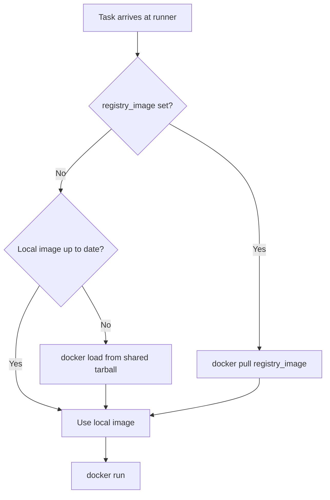

# Container System Design

KohakuRiver uses Docker containers as the primary execution environment for both COMMAND tasks and Docker-backend VPS sessions. Containers are managed entirely through `subprocess` calls to the `docker` CLI rather than the Docker SDK.

## Design Goals

- **Reproducible environments**: containers are provisioned from shared-storage tarballs (recommended) or pulled from a Docker registry via `registry_image`, ensuring all runners use identical images.
- **Resource isolation**: CPU, memory, and GPU limits enforced via Docker's cgroup integration.
- **Overlay-native networking**: containers join the VXLAN overlay network with pre-reserved IP addresses.
- **Transparent port forwarding**: a Rust tunnel client binary is mounted into every container.

## Container Naming

The `docker/naming.py` module defines deterministic naming conventions:

```python
def task_container_name(task_id: int) -> str:
    return f"kohakuriver-task-{task_id}"

def vps_container_name(task_id: int) -> str:
    return f"kohakuriver-vps-{task_id}"

def image_tag(container_name: str) -> str:
    return f"kohakuriver/{container_name}:base"
```

These names are used for `docker run --name`, `docker kill`, `docker pause`, and snapshot tagging.

## Image Provisioning



The shared-storage sync path uses `docker/utils.py`:

1. `needs_sync(container_name, tar_dir)` compares the local image's creation timestamp against the tarball's file modification time.
2. If sync is needed, `sync_from_shared(container_name, tar_path)` runs `docker load -i tarball.tar` in a subprocess.
3. A global `asyncio.Lock` prevents concurrent syncs from racing on the same image.

## Mount Architecture

Every task container receives a standard set of bind mounts. The `SHARED_DIR`-based mounts are only present when shared storage is configured; without shared storage, containers still function but cross-node shared data and tarball-based log paths are unavailable.

```
┌─────────────────────────── Host Filesystem ───────────────────────────┐
│                                                                       │
│  {SHARED_DIR}/shared_data ──────────► /shared             (cross-node)│  ← requires shared storage
│  {SHARED_DIR}/logs ─────────────────► /kohakuriver-logs   (task I/O)  │  ← requires shared storage
│  {LOCAL_TEMP_DIR} ──────────────────► /local_temp         (scratch)   │
│  config.ADDITIONAL_MOUNTS[*] ───────► (user-defined)      (custom)    │
│  tunnel binary path ────────────────► /usr/local/bin/      (tunnel)   │
│                                        tunnel-client                  │
└───────────────────────────────────────────────────────────────────────┘
```

| Host Path                     | Container Path                 | Purpose                              | Requires Shared Storage |
| ----------------------------- | ------------------------------ | ------------------------------------ | :---------------------: |
| `{SHARED_DIR}/shared_data`    | `/shared`                      | Cross-node shared filesystem         |           Yes           |
| `{SHARED_DIR}/logs`           | `/kohakuriver-logs`            | Task stdout/stderr log files         |           Yes           |
| `{LOCAL_TEMP_DIR}`            | `/local_temp`                  | Node-local scratch space             |           No            |
| `config.ADDITIONAL_MOUNTS[*]` | (user-defined)                 | Extra bind mounts from runner config |           No            |
| tunnel binary path            | `/usr/local/bin/tunnel-client` | Port forwarding binary               |           No            |

Mounts are constructed as `--mount type=bind,source=...,target=...` flags. The stdout and stderr paths are translated from host paths to container-relative paths under `/kohakuriver-logs/`.

## Resource Limits

```
┌───────────────────────────────────────────────────┐
│                  docker run flags                 │
│                                                   │
│  --cpus N ──────────────── CFS quota (core count) │
│  --memory Xm ──────────── cgroup memory limit     │
│  --gpus "device=0,1" ──── NVIDIA Container Toolkit│
│  --cap-add SYS_NICE ───── scheduling control      │
│                                                   │
│  (inner command prefix)                           │
│  numactl --cpunodebind=N ── NUMA CPU affinity     │
│  numactl --membind=N ────── NUMA memory affinity  │
└───────────────────────────────────────────────────┘
```

- **CPU**: `--cpus` sets the CFS quota. If `required_cores=0`, the `--cpus` flag is **not passed** (no CPU limit; container can use all available cores). If `required_cores>0`, `--cpus N` is set with the integer core count.
- **Memory**: `--memory` in megabytes, converted from `required_memory_bytes`.
- **GPU**: `--gpus "device=0,1"` using NVIDIA Container Toolkit. GPU indices come from the task's `required_gpus` list.
- **NUMA**: If `target_numa_node_id` is set, the inner command is prefixed with `numactl --cpunodebind=N --membind=N`.

Non-privileged containers receive `--cap-add SYS_NICE` for scheduling control. If `TASKS_PRIVILEGED` is enabled in the runner config, containers run with `--privileged`.

## Network Integration

Containers join the runner's Docker network, which is either:

- **Overlay mode**: `kohakuriver-overlay` (a Docker bridge network attached to the VXLAN `kohaku-overlay` Linux bridge). Containers receive pre-reserved IPs via `--ip`.
- **Default mode**: `kohakuriver-net` (a standard Docker bridge network for single-node setups).

```
┌────────────────────── Runner Node ──────────────────────┐
│                                                         │
│  ┌───────────┐     ┌────────────────────┐               │
│  │ Container │     │ kohakuriver-overlay│               │
│  │ 10.128.   │◄───►│ (Docker network)   │               │
│  │  64.5     │veth │                    │               │
│  └───────────┘     └────────┬───────────┘               │
│                             │ bridge port               │
│                    ┌────────▼───────────┐               │
│                    │  kohaku-overlay    │               │
│                    │  (Linux bridge)    │               │
│                    └────────┬───────────┘               │
│                             │                           │
│                    ┌────────▼───────────┐               │
│                    │   VXLAN tunnel     │               │
│                    │   VNI=101          │               │
│                    └────────┬───────────┘               │
│                             │ UDP :4789                 │
└─────────────────────────────┼───────────────────────────┘
                                                          │
                              ▼
                     Host VXLAN Hub (L3 router)
```

## Inner Command Wrapping

The task command is wrapped in a shell pipeline:

```bash
# Without tunnel
exec {numa_prefix} {command} {args} > /kohakuriver-logs/.../stdout 2> .../stderr

# With tunnel
(/usr/local/bin/tunnel-client --runner-url ... --container-id ... &); \
exec {numa_prefix} {command} {args} > ... 2> ...
```

The `exec` replaces the shell process with the task command, ensuring signals (SIGTERM, SIGKILL) are delivered directly to the workload.

## Task Lifecycle Control

| Operation | Docker Command          | Effect                        |
| --------- | ----------------------- | ----------------------------- |
| Kill      | `docker kill {name}`    | Sends SIGKILL to PID 1        |
| Pause     | `docker pause {name}`   | Freezes cgroup (SIGSTOP-like) |
| Resume    | `docker unpause {name}` | Unfreezes cgroup              |

Kill removes the task from `TaskStateStore` first, so the `execute_task()` coroutine knows to skip status reporting when the subprocess exits.

## Trade-offs

**Subprocess vs SDK**: Using `subprocess.run(["docker", ...])` means error handling relies on exit codes and stderr parsing rather than structured exceptions. The benefit is precise control over every `docker run` flag without SDK abstraction leaks.

**Image sync lock**: The global `docker_sync_lock` serializes all image syncs on a runner. This prevents corruption but means two tasks needing different images must wait in sequence.

**No container reuse**: COMMAND tasks use `--rm`, so every task creates and destroys a container. The overhead is acceptable because container startup is fast (~1s) relative to typical task runtimes, and it avoids stale-state issues.
