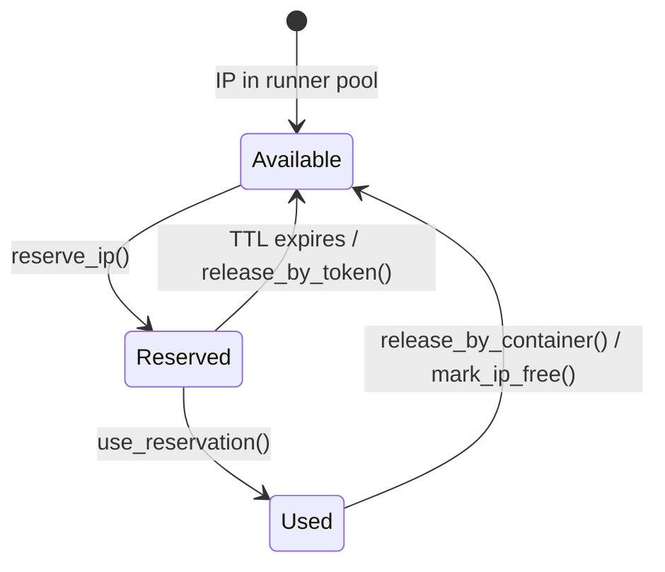
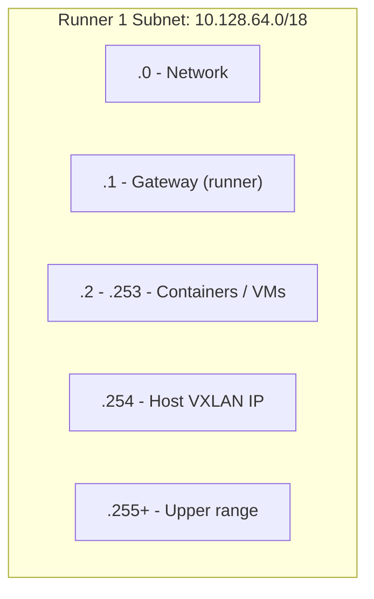
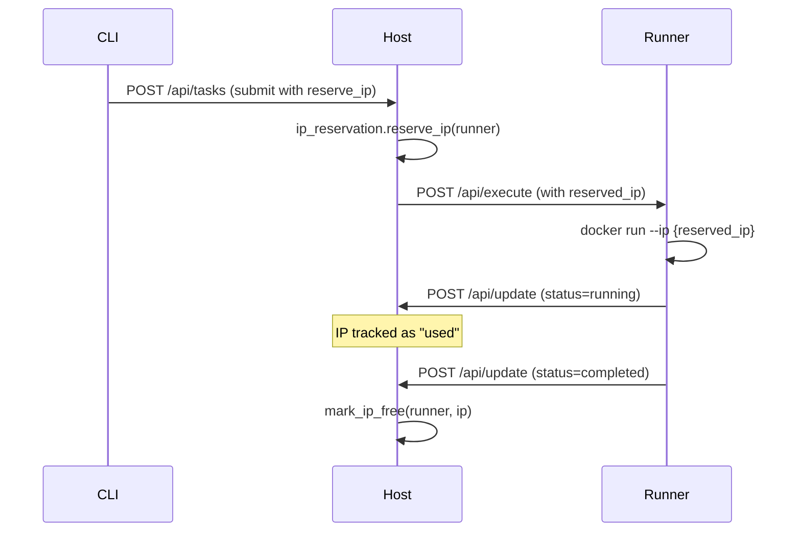
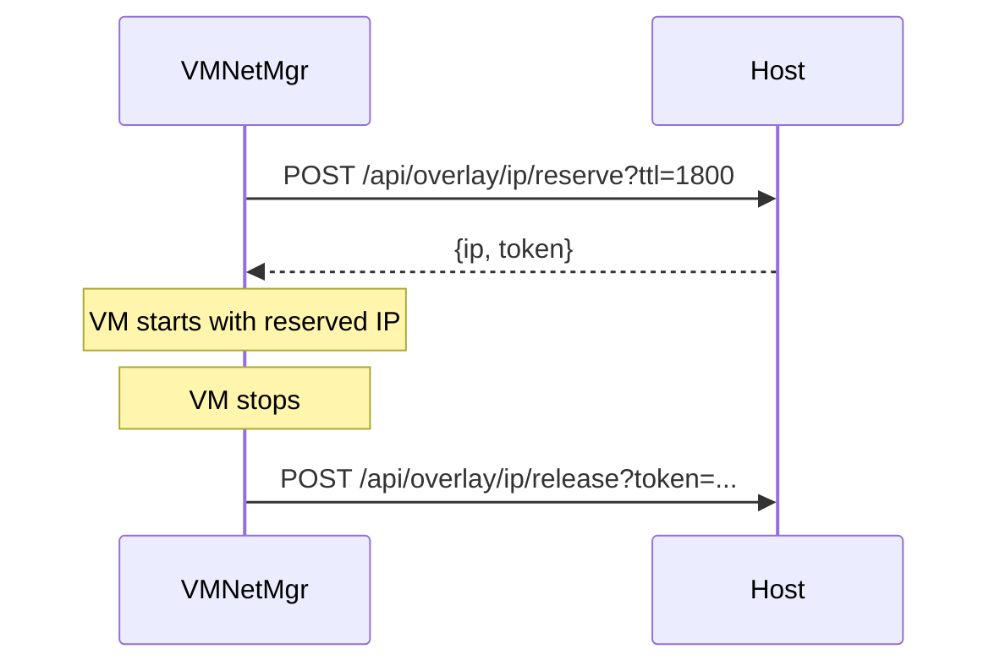

# IP Address Management

The overlay network requires coordinated IP allocation across runners. KohakuRiver's `IPReservationManager` in `host/services/ip_reservation.py` provides a reservation-based system with HMAC-signed tokens, enabling distributed training scenarios where IP addresses must be known before task submission.

## Design Goals

- **Pre-allocation**: reserve IPs before launching tasks, so distributed training workers can be configured with the master's address at submission time.
- **Signed tokens**: self-contained, tamper-proof tokens that encode the IP, runner, and expiry without requiring database lookups.
- **In-memory with expiry**: reservations are transient -- they expire after a configurable TTL (default 300 seconds for task reservations, 1800 seconds for VMs).
- **Dual tracking**: separate tracking for reserved IPs (pending) and used IPs (assigned to running containers/VMs).

## Reservation Lifecycle



## Token Architecture

Tokens are HMAC-signed, base64-encoded payloads:

```python
def _generate_token(self, ip, runner_name, expires_at):
    payload = {
        "ip": ip,
        "runner": runner_name,
        "exp": int(expires_at.timestamp()),
    }
    payload_json = json.dumps(payload, separators=(",", ":"))
    signature = hashlib.sha256(
        (payload_json + self.secret_key).encode()
    ).hexdigest()[:16]
    token_data = f"{payload_json}.{signature}"
    return base64.urlsafe_b64encode(token_data.encode()).decode()
```

```mermaid
flowchart LR
    subgraph "Token Structure"
        B64["base64url(payload.signature)"]
    end
    subgraph "Decoded"
        Payload['"ip":"10.128.64.5","runner":"node1","exp":1707500300']
        Sig["sha256(payload+secret)[:16]"]
    end
    B64 --> Payload
    B64 --> Sig
```

Verification checks both the HMAC signature and the expiry timestamp:

```python
def _verify_token(self, token):
    token_data = base64.urlsafe_b64decode(token.encode()).decode()
    payload_json, signature = token_data.rsplit(".", 1)
    expected_sig = hashlib.sha256(
        (payload_json + self.secret_key).encode()
    ).hexdigest()[:16]
    if signature != expected_sig:
        return None  # Tampered
    payload = json.loads(payload_json)
    if payload["exp"] < time.time():
        return None  # Expired
    return payload
```

The secret key is auto-generated at startup (`secrets.token_hex(32)`) or can be provided via configuration.

## Per-Runner IP Pool

Each runner's available IP range is derived from the `OverlaySubnetConfig`:



The `_get_available_ips_for_runner()` method computes available IPs by:

1. Getting the full IP range from `OverlaySubnetConfig.get_container_ip_range()`.
2. Subtracting reserved IPs (non-expired reservations on this runner).
3. Subtracting used IPs (assigned to running containers/VMs).
4. Excluding the host IP on the runner subnet (`.254`).

```python
def _get_available_ips_for_runner(self, runner_name):
    first_ip_str, last_ip_str = subnet_config.get_container_ip_range(runner_id)
    reserved_ips = {r.ip for r in self._reservations.values()
                    if r.runner_name == runner_name and not r.is_expired()}
    used_ips = self._used_ips.get(runner_name, set())
    unavailable = reserved_ips | used_ips
    # Iterate range, exclude unavailable + host IP
```

## Reservation API

### Reserve

```
POST /api/overlay/ip/reserve?runner=node1&ttl=300
```

Returns:

```json
{ "ip": "10.128.64.5", "token": "eyJpcCI6IjEwLjEyOC42NC41Ii..." }
```

If no specific IP is requested, a random available IP is selected via `secrets.choice()` for better distribution across the pool.

### Validate and Use

```python
# Validate token (check signature + expiry + not already used)
reservation = await ip_mgr.validate_token(token, expected_runner="node1")

# Mark as used by a container
ip = await ip_mgr.use_reservation(token, container_id="kohakuriver-task-123")
```

### Release

Reservations can be released by token (for unused reservations) or by container ID (for used reservations when a container exits):

```python
# Release unused reservation
await ip_mgr.release_by_token(token)

# Release all IPs used by a container
released_ips = await ip_mgr.release_by_container("kohakuriver-task-123")

# Mark IP as free (direct, no reservation involved)
await ip_mgr.mark_ip_free(runner_name, ip)
```

## Container IP Assignment Flow



## VM IP Assignment Flow

For QEMU VMs, the runner reserves the IP directly:



## Expiry and Cleanup

Expired reservations are cleaned up lazily: `_cleanup_expired_sync()` is called at the start of `reserve_ip()` and `get_reservations()`. This avoids the need for a background cleanup task.

```python
def _cleanup_expired_sync(self):
    expired = [
        (ip, r) for ip, r in self._reservations.items()
        if r.is_expired() and not r.is_used()
    ]
    for ip, reservation in expired:
        del self._reservations[ip]
        del self._token_to_ip[reservation.token]
    return len(expired)
```

Used reservations (where `container_id` is set) are never expired automatically -- they persist until the container exits and `release_by_container()` is called.

## Concurrency

All mutable operations are protected by an `asyncio.Lock`:

```python
self._lock = asyncio.Lock()

async def reserve_ip(self, runner_name, ip=None, ttl=None):
    async with self._lock:
        self._cleanup_expired_sync()
        # ... allocation logic
```

This serializes reservation operations but does not block the event loop (asyncio locks are cooperative).

## Trade-offs

**In-memory only**: Reservations are lost on host restart. This is acceptable because reservations are short-lived (5-minute TTL) and used IPs are re-discovered through container/VM status reporting.

**Linear IP search**: `_get_available_ips_for_runner()` iterates the entire IP range. For the default /18 subnet (~16K IPs), this is fast enough. Larger subnets would benefit from a bitmap or free-list data structure.

**HMAC truncation**: The signature is truncated to 16 hex characters (64 bits). This provides adequate collision resistance for the reservation use case but is not suitable for high-security contexts.

**No cross-runner reservation**: IPs can only be reserved on a specific runner. There is no mechanism to reserve an IP on "any runner" and have the scheduler pick the runner based on the reservation.
