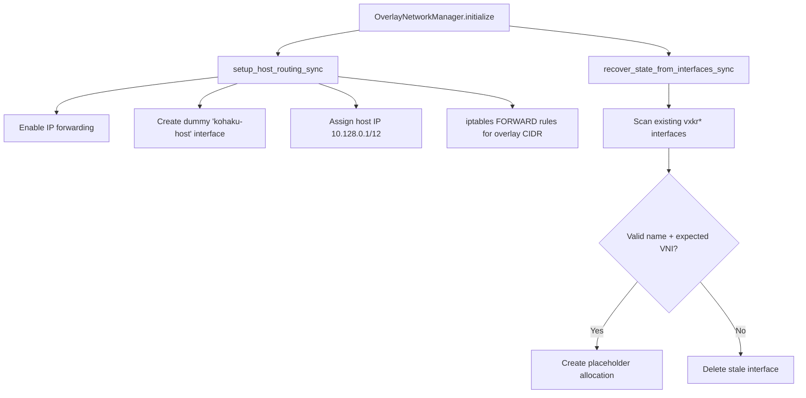
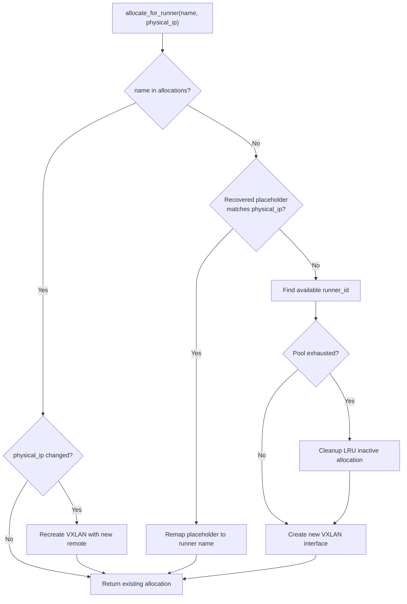
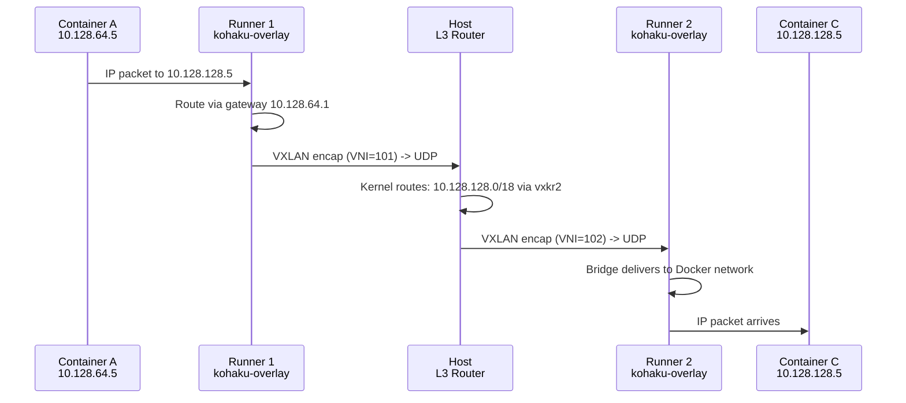

# Overlay Network Design

KohakuRiver's overlay network connects containers across multiple runner nodes into a single flat IP address space. The architecture uses VXLAN tunnels in a **hub-and-spoke L3 routing** topology with the Host as the central router.

## Design Goals

- **Pure L3 routing**: no L2 bridge on the host side -- each runner gets its own VXLAN interface and IP subnet, with the host kernel routing between them.
- **Flexible subnet allocation**: a configurable `BASE_IP/NETWORK_PREFIX/NODE_BITS/SUBNET_BITS` format supports diverse cluster sizes.
- **Crash-resilient**: host restarts do not break existing VXLAN tunnels. State is recovered from existing network interfaces.
- **Zero-config runner side**: runners receive their subnet configuration from the host during registration.

## Network Topology

```
                      ┌──────────────────────────────────────┐
                      │         Host (Central L3 Router)      │
                      │                                       │
                      │   kohaku-host (dummy)                 │
                      │   10.128.0.1/12                       │
                      │                                       │
                      │   ┌──────────┐    ┌──────────┐        │
                      │   │  vxkr1   │    │  vxkr2   │        │
                      │   │10.128.   │    │10.128.   │        │
                      │   │ 64.254/18│    │128.254/18│        │
                      │   └────┬─────┘    └────┬─────┘        │
                      │        │               │              │
                      └────────┼───────────────┼──────────────┘
                               │               │
                    VXLAN      │               │      VXLAN
                    VNI=101    │               │      VNI=102
                    UDP:4789   │               │      UDP:4789
                               │               │
              ┌────────────────▼──┐    ┌───────▼───────────────┐
              │     Runner 1      │    │      Runner 2         │
              │                   │    │                       │
              │ ┌───────────────┐ │    │ ┌───────────────────┐ │
              │ │ vxlan0        │ │    │ │ vxlan0            │ │
              │ └───────┬───────┘ │    │ └───────┬───────────┘ │
              │         │         │    │         │             │
              │ ┌───────▼───────┐ │    │ ┌───────▼───────────┐ │
              │ │kohaku-overlay │ │    │ │ kohaku-overlay    │ │
              │ │ (bridge)      │ │    │ │ (bridge)          │ │
              │ │ 10.128.64.1/18│ │    │ │ 10.128.128.1/18   │ │
              │ └───┬───────┬───┘ │    │ └────┬──────────────┘ │
              │     │       │     │    │      │                │
              │ ┌───▼─┐ ┌──▼──┐  │    │  ┌───▼───┐            │
              │ │ C:A │ │ C:B │  │    │  │  C:C  │            │
              │ │.64.5│ │.64.6│  │    │  │.128.5 │            │
              │ └─────┘ └─────┘  │    │  └───────┘            │
              └───────────────────┘    └───────────────────────┘
```

## Subnet Configuration

The `OverlaySubnetConfig` class in `models/overlay_subnet.py` parses the format string:

```
BASE_IP / NETWORK_PREFIX / NODE_BITS / SUBNET_BITS
```

Constraint: `NETWORK_PREFIX + NODE_BITS + SUBNET_BITS = 32`.

### Default Configuration: `10.128.0.0/12/6/14`

```
 Bit layout (32 bits total):
 ├── 12 bits ──┤── 6 bits ──┤────── 14 bits ───────┤
 │  NETWORK    │   NODE     │      SUBNET          │
 │  (fixed)    │ (runner ID)│  (container IPs)     │
 │  10.128.    │  0-63      │  0-16383             │
 └─────────────┴────────────┴──────────────────────┘
```

| Parameter     | Value           | Effect                            |
| ------------- | --------------- | --------------------------------- |
| Network       | `10.128.0.0/12` | Range 10.128.0.0 - 10.143.255.255 |
| Node bits     | 6               | Up to 63 runners                  |
| Subnet bits   | 14              | ~16,380 container IPs per runner  |
| Runner prefix | /18             | Each runner gets a /18 subnet     |

### IP Assignment for Runner 1 (runner_id=1)

```
  10.128.64.0/18 (Runner 1 subnet)
  ┌──────────────────────────────────────────────────┐
  │  .0        Network address                       │
  │  .1        Gateway (runner bridge IP)            │
  │  .2-.253   Container / VM IP range               │
  │  .254      Host VXLAN interface IP               │
  │  .255+     Upper range (broadcast region)        │
  └──────────────────────────────────────────────────┘
```

```python
def get_runner_subnet(self, runner_id: int) -> str:
    base_int = int(self.base_network.network_address)
    runner_offset = runner_id << self.subnet_bits
    subnet_addr = base_int + runner_offset
    return f"{ipaddress.IPv4Address(subnet_addr)}/{self.runner_prefix}"
```

## Host-Side Architecture

### Initialization (`overlay/manager.py`)



### Device Naming

VXLAN device names follow the format `vxkr{base36_runner_id}`:

```
  Runner ID   Device Name     VNI
  ─────────   ───────────     ────
  1           vxkr1           101
  10          vxkra           110
  35          vxkrz           135
  36          vxkr10          136
```

Base36 encoding keeps names compact within Linux's 15-character IFNAMSIZ limit. The VNI (VXLAN Network Identifier) is `base_vxlan_id + runner_id`.

### Runner Registration Flow



### VXLAN Interface Creation (`overlay/vxlan.py`)

The `create_vxlan_sync()` function handles three cases:

1. **Interface does not exist**: create new VXLAN with pyroute2 `link("add", kind="vxlan", ...)`, assign IP, bring up.
2. **Interface exists with correct config** (same VNI, same remote IP): reuse -- just ensure IP is assigned and interface is up.
3. **Interface exists with wrong config**: delete and recreate.

```python
# pyroute2 VXLAN creation
ipr.link("add",
    ifname=device_name,
    kind="vxlan",
    vxlan_id=vni,
    vxlan_group=physical_ip,   # Remote runner IP
    vxlan_local=local_ip,       # Host's reachable address
    vxlan_port=vxlan_port,
    vxlan_learning=False,
)
```

## Runner-Side Architecture

The `RunnerOverlayManager` in `runner/services/overlay_manager.py` sets up the runner's end of the tunnel:

```
┌─────────────────── Runner Overlay Setup ────────────────────┐
│                                                             │
│  Step 1: Create VXLAN tunnel                                │
│  ┌────────────────┐                                         │
│  │    vxlan0       │  VNI = base_vxlan_id + runner_id       │
│  │  local=runner   │  point-to-point to Host                │
│  │  remote=host    │  vxlan_learning=False                  │
│  └───────┬────────┘                                         │
│          │                                                  │
│  Step 2: Create Linux bridge + attach VXLAN                 │
│  ┌───────▼────────┐                                         │
│  │ kohaku-overlay  │  gateway IP (e.g., 10.128.64.1/18)     │
│  │   (bridge)      │  VXLAN attached as bridge port         │
│  └───────┬────────┘                                         │
│          │                                                  │
│  Step 3: Create Docker bridge network                       │
│  ┌───────▼────────────────────────┐                         │
│  │  kohakuriver-overlay           │                         │
│  │  (Docker network, driver=bridge│                         │
│  │   bridge.name=kohaku-overlay)  │                         │
│  └────────────────────────────────┘                         │
│                                                             │
│  Step 4: Add routes + firewall rules                        │
│  - Route overlay CIDR via host gateway                      │
│  - iptables FORWARD ACCEPT for overlay CIDR                 │
│  - iptables NAT MASQUERADE for internet access              │
│  - firewalld trusted zone for bridge + VXLAN                │
└─────────────────────────────────────────────────────────────┘
```

## Cross-Node Traffic Flow

Container A (`10.128.64.5` on Runner 1) communicates with Container C (`10.128.128.5` on Runner 2):



## State Recovery

On host startup, `recover_state_from_interfaces_sync()` scans all network interfaces:

1. Find interfaces starting with `vxkr`.
2. Parse runner_id from the device name.
3. Verify the VNI matches `base_vxlan_id + runner_id`.
4. If valid: create a placeholder allocation (`runner_{id}`) that will be claimed when the runner re-registers.
5. If invalid: delete the stale interface.

This recovery mechanism means **host restarts do not break running containers**. The VXLAN tunnels remain operational because the kernel-level interfaces persist across the Python process lifecycle.

## Trade-offs

**Hub bottleneck**: all cross-node traffic passes through the Host. For bandwidth-intensive workloads between runners, this adds a hop and concentrates load on the Host's network stack. A full-mesh topology would eliminate this but would require O(n^2) VXLAN interfaces.

**No encryption**: VXLAN traffic is unencrypted UDP. On trusted networks this is acceptable; on untrusted networks, WireGuard or IPsec would be needed as an underlay.

**In-memory state**: Overlay allocations are stored in Python dicts, not in the database. This is intentional (the network interfaces are the source of truth), but it means allocation metadata like `last_used` timestamps are lost on host restart.
