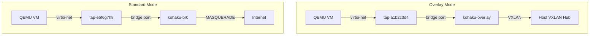
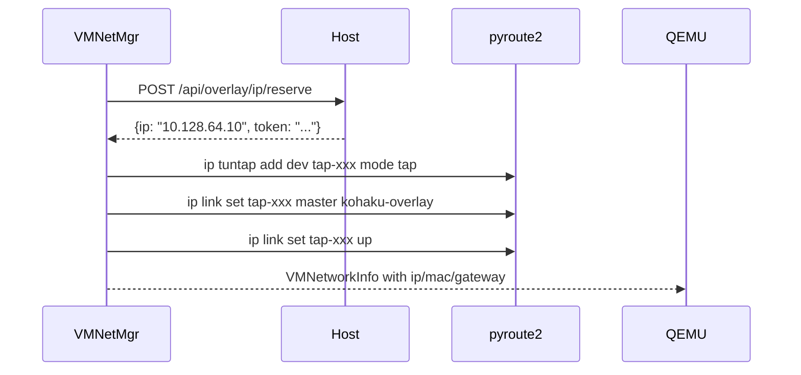
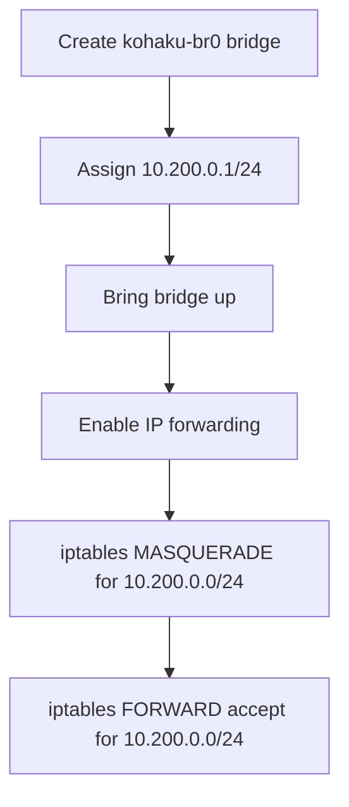

# VM Networking

QEMU VMs require a different networking approach than Docker containers. Instead of veth pairs managed by the Docker daemon, VMs use **TAP devices** attached to a Linux bridge. The `VMNetworkManager` in `runner/services/vm_network_manager.py` supports two modes: overlay and standard (NAT).

## Design Goals

- **Seamless overlay integration**: VMs and Docker containers share the same overlay IP space and can communicate directly.
- **Fallback NAT mode**: for environments without overlay networking, a local NAT bridge provides internet access.
- **Deterministic addressing**: MAC and TAP names are derived from task IDs for reproducibility and debugging.
- **Clean teardown**: TAP devices and IP reservations are released on VM stop.

## Architecture Overview



## Mode Selection

The mode is determined at runner startup based on the overlay configuration:

```python
self._is_overlay = (
    config.OVERLAY_ENABLED
    and hasattr(config, "_overlay_configured")
    and config._overlay_configured
)
```

- **Overlay mode**: the `kohaku-overlay` bridge already exists (created by `RunnerOverlayManager`). VMs attach to it and receive IPs from the Host's `IPReservationManager`.
- **Standard mode**: a dedicated `kohaku-br0` NAT bridge is created with a local `10.200.0.0/24` subnet.

## TAP Device Naming

Linux limits interface names to 15 characters (IFNAMSIZ). TAP names are generated using a SHA3-224 hash of the task ID:

```python
def _tap_name(task_id: int) -> str:
    h = hashlib.sha3_224(str(task_id).encode()).hexdigest()[:8]
    return f"tap-{h}"  # e.g., "tap-a1b2c3d4" (12 chars)
```

This avoids collisions while keeping names within the kernel limit.

## MAC Address Generation

MAC addresses are deterministic and use QEMU's locally-administered range:

```python
def _generate_mac(task_id: int) -> str:
    h = hashlib.sha3_224(str(task_id).encode()).digest()
    return f"52:54:00:{h[0]:02x}:{h[1]:02x}:{h[2]:02x}"
```

The `52:54:00` prefix is the conventional QEMU/KVM locally-administered OUI. Deterministic generation from task_id means the same task always gets the same MAC, which is important for cloud-init network config matching.

## Overlay Mode Details



### IP Reservation

In overlay mode, VMs use the same `IPReservationManager` as Docker containers. The runner calls the Host's HTTP API:

```python
async with httpx.AsyncClient() as client:
    response = await client.post(
        f"{host_url}/api/overlay/ip/reserve",
        params={"runner": hostname, "ttl": 1800},
    )
    data = response.json()
    return data["ip"], data["token"]
```

The reservation token is stored in `VMNetworkInfo` for later release. The longer TTL (1800 seconds vs the default 300) accounts for VM boot time.

### Network Parameters

The overlay mode derives network parameters from the runner's overlay configuration:

| Parameter     | Source                              | Example                   |
| ------------- | ----------------------------------- | ------------------------- |
| Gateway       | `config._overlay_gateway`           | `10.128.64.1`             |
| Prefix length | `OverlaySubnetConfig.runner_prefix` | `18`                      |
| Bridge        | `RunnerOverlayManager.BRIDGE_NAME`  | `kohaku-overlay`          |
| Runner URL    | `http://{gateway}:{runner_port}`    | `http://10.128.64.1:8001` |

## Standard Mode Details

### NAT Bridge Setup

When overlay is not available, `_setup_nat_bridge_sync()` creates `kohaku-br0`:



### Local IP Pool

Standard mode manages a simple in-memory IP pool:

```python
NAT_POOL_START = 10   # 10.200.0.10
NAT_POOL_END = 254    # 10.200.0.254

def _allocate_local_ip(self) -> str:
    for i in range(self.NAT_POOL_START, self.NAT_POOL_END + 1):
        ip = f"{base}.{i}"
        if ip not in self._used_local_ips:
            self._used_local_ips.add(ip)
            return ip
    raise RuntimeError("No available IPs in VM NAT pool")
```

This pool supports up to 245 concurrent VMs per runner. Released IPs are returned to the pool via `_release_local_ip()`.

### Firewall Rules

Standard mode configures iptables for outbound NAT:

```bash
# MASQUERADE for internet access
iptables -t nat -A POSTROUTING -s 10.200.0.0/24 ! -d 10.200.0.0/24 -j MASQUERADE

# FORWARD rules (both directions)
iptables -I FORWARD 1 -s 10.200.0.0/24 -j ACCEPT
iptables -I FORWARD 1 -d 10.200.0.0/24 -j ACCEPT
```

Rules are checked before insertion (`-C`) to avoid duplicates on runner restart.

## TAP Device Operations

TAP creation uses `ip tuntap` via subprocess (pyroute2's TUN/TAP API is unreliable), then pyroute2 for bridge attachment:

```python
# Create TAP
subprocess.run(["ip", "tuntap", "add", "dev", tap_name, "mode", "tap"])

# Attach to bridge via pyroute2
ipr.link("set", index=tap_idx, master=bridge_idx)
ipr.link("set", index=tap_idx, state="up")
```

Cleanup deletes the TAP device via `ipr.link("del", index=...)`.

## Cloud-Init Network Config

The `VMNetworkManager` generates a netplan v2 config using MAC matching:

```yaml
version: 2
ethernets:
  vmnic0:
    match:
      macaddress: '52:54:00:ab:cd:ef'
    addresses:
      - '10.128.64.10/18'
    routes:
      - to: default
        via: '10.128.64.1'
    nameservers:
      addresses: ['8.8.8.8', '8.8.4.4']
```

See [Cloud-Init Integration](../qemu-virtualization/cloud-init-integration.md) for how this is injected into the VM.

## Trade-offs

**Overlay dependency**: In overlay mode, VM IP allocation requires HTTP calls to the Host. If the Host is unreachable during VM creation, the operation fails. Standard mode avoids this dependency with a local pool.

**No SR-IOV**: The current implementation uses software TAP devices. SR-IOV virtual functions would provide better network performance but require specific NIC hardware and driver support.

**Single bridge per mode**: All VMs on a runner share the same bridge. There is no per-VM network isolation at the L2 level -- isolation relies on the VM's IP-level firewall and the overlay subnet boundaries.
