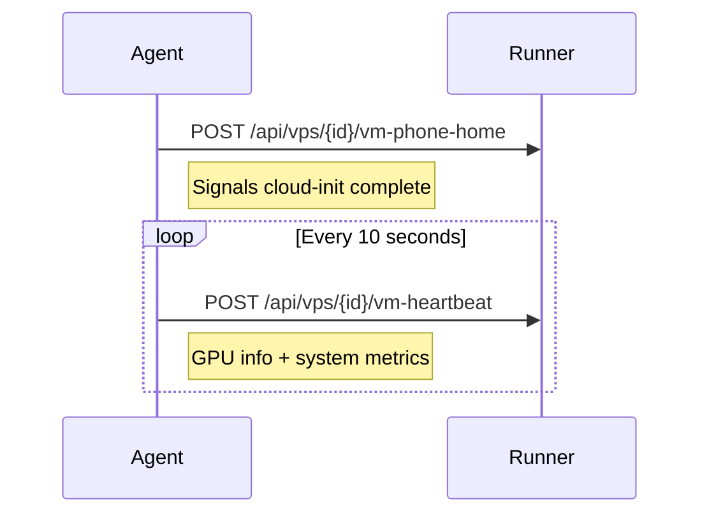

# Cloud-Init Integration

Cloud-init is the industry-standard tool for initializing cloud VMs on first boot. KohakuRiver generates a `seed.iso` for each VM containing meta-data, user-data, and network-config that fully provisions the VM without manual intervention.

## Design Goals

- **Zero-touch provisioning**: VMs boot, configure networking, install SSH keys, and phone home to the runner without any user interaction.
- **MAC-based network config**: avoid hardcoded device names (enp0s2, ens3, eth0) by matching on MAC address.
- **Embedded VM agent**: a Python script installed via cloud-init that provides heartbeat and GPU telemetry back to the runner.
- **Automatic NVIDIA driver installation**: detect host driver version and install the matching version inside the VM during cloud-init.

## Seed ISO Structure

```
┌──────────────── seed.iso (volume: "cidata") ─────────────────┐
│                                                               │
│  ┌─────────────┐  ┌─────────────────┐  ┌──────────────────┐  │
│  │  meta-data  │  │    user-data    │  │  network-config  │  │
│  │  (YAML)     │  │  (#cloud-config)│  │  (netplan v2)    │  │
│  │             │  │                 │  │                  │  │
│  │ instance-id │  │ users, packages │  │ MAC match, IP,   │  │
│  │ hostname    │  │ runcmd, files   │  │ gateway, DNS     │  │
│  └─────────────┘  └─────────────────┘  └──────────────────┘  │
└──────────────────────────────────────────────────────────────┘

Generated by: genisoimage -output seed.iso -volid cidata -joliet -rock ...
```

The ISO is created by `create_cloud_init_iso()`:

```python
cmd = [
    iso_tool,
    "-output", output_path,
    "-volid", "cidata",
    "-joliet", "-rock",
    meta_data_path, user_data_path, network_config_path,
]
subprocess.run(cmd, capture_output=True, timeout=30)
```

The volume ID `cidata` is the magic label that cloud-init recognizes as a NoCloud data source.

## Meta-Data

Minimal identification:

```yaml
instance-id: kohaku-vm-{task_id}
local-hostname: kohaku-vm-{task_id}
```

The `instance-id` ensures cloud-init treats each VM creation as a fresh instance, even if the same base image is reused.

## User-Data

The user-data is the most complex component, structured as a `#cloud-config` YAML document.

### User Setup

```yaml
users:
  - name: kohaku
    sudo: 'ALL=(ALL) NOPASSWD:ALL'
    shell: /bin/bash
    lock_passwd: true
    ssh_authorized_keys:
      - { user_public_key }
      - { runner_public_key } # For TTY/filesystem access
  - name: root
    ssh_authorized_keys:
      - { user_public_key }
      - { runner_public_key }
```

The runner's own SSH public key is included so the runner can perform internal operations (terminal access, filesystem operations) on the VM.

### File Injection

Four files are written into the VM:

| Path                                               | Purpose                                          |
| -------------------------------------------------- | ------------------------------------------------ |
| `/usr/local/bin/kohakuriver-vm-agent`              | Heartbeat + GPU telemetry script                 |
| `/etc/fstab` (append)                              | 9p mount entries for `/shared` and `/local_temp` |
| `/etc/ssh/sshd_config.d/99-kohakuriver.conf`       | Enable root login and password auth              |
| `/etc/systemd/system/kohakuriver-vm-agent.service` | Systemd unit for the VM agent                    |

### Run Commands (runcmd)

The `runcmd` section executes after all packages are installed:

```yaml
runcmd:
  - modprobe 9p 9pnet 9pnet_virtio || true
  - mkdir -p /shared /local_temp
  - mount -t 9p -o trans=virtio,version=9p2000.L,msize=524288 kohaku_shared /shared || true
  - mount -t 9p -o trans=virtio,version=9p2000.L,msize=524288 kohaku_local /local_temp || true
  # (NVIDIA driver install steps inserted here if GPU is present)
  - systemctl daemon-reload
  - systemctl restart sshd || systemctl restart ssh || true
  - systemctl enable --now kohakuriver-vm-agent
  - systemctl enable --now qemu-guest-agent
```

### NVIDIA Driver Auto-Install

When GPU passthrough is configured, the driver version is detected on the host **before** VFIO binding:

```python
nvidia_driver_version = detect_nvidia_driver_version()
```

Cloud-init then injects installation commands before the VM agent starts:

```yaml
packages:
  - build-essential
  - dkms
  - linux-headers-generic
  - python3-pip

runcmd:
  # ... (9p mounts)
  - wget -q -O /tmp/nvidia.run https://us.download.nvidia.com/.../NVIDIA-Linux-x86_64-{ver}.run
  - chmod +x /tmp/nvidia.run
  - /tmp/nvidia.run --silent --dkms --no-cc-version-check
  - rm -f /tmp/nvidia.run
  - pip3 install nvidia-ml-py --break-system-packages
  # ... (VM agent starts after this)
```

The `--dkms` flag ensures the driver survives kernel updates. `nvidia-ml-py` (pynvml) is installed for the VM agent's GPU telemetry.

## Network Configuration

```yaml
version: 2
ethernets:
  vmnic0:
    match:
      macaddress: '52:54:00:ab:cd:ef'
    addresses:
      - '10.128.64.5/18'
    routes:
      - to: default
        via: '10.128.64.1'
    nameservers:
      addresses: ['8.8.8.8', '8.8.4.4']
```

Key design choice: **MAC address matching** instead of a device name. Different Linux distributions and kernel versions assign different names to virtio-net devices (enp0s2, ens3, eth0). By matching on MAC, the config works regardless of naming scheme.

The MAC address is deterministically generated from the task ID:

```python
def _generate_mac(task_id: int) -> str:
    h = hashlib.sha3_224(str(task_id).encode()).digest()
    return f"52:54:00:{h[0]:02x}:{h[1]:02x}:{h[2]:02x}"
```

The `52:54:00` prefix is QEMU's conventional locally-administered range.

## VM Agent

The VM agent is an embedded Python script (`VM_AGENT_SCRIPT`) that runs as a systemd service inside the VM:



### Phone-Home

The first action after starting is `phone_home()`, which hits the runner's `/api/vps/{id}/vm-phone-home` endpoint. This signals that cloud-init has completed and the VM is ready for SSH connections. The runner waits for this callback in its cloud-init watchdog coroutine.

### Heartbeat Payload

```json
{
  "task_id": 12345,
  "timestamp": 1707500000.0,
  "status": "healthy",
  "gpus": [
    {
      "gpu_id": 0,
      "name": "NVIDIA RTX 4090",
      "driver_version": "550.54.14",
      "gpu_utilization": 45,
      "memory_total_mib": 24564.0,
      "memory_used_mib": 8192.0,
      "temperature": 72,
      "power_usage_mw": 280000
    }
  ],
  "system": {
    "memory_total_bytes": 34359738368,
    "memory_used_bytes": 12884901888,
    "disk_total_bytes": 53687091200,
    "disk_used_bytes": 15032385536,
    "load_1m": 2.5
  }
}
```

GPU telemetry uses `pynvml` (nvidia-ml-py), which is installed as part of the NVIDIA driver cloud-init setup. Non-GPU VMs report an empty `gpus` list.

## Shared Filesystem Integration

VMs access the host filesystem through virtio-9p, configured in both QEMU command-line flags and cloud-init fstab entries:

```
┌───────── QEMU Host ──────────┐      ┌──────── Guest VM ───────────┐
│                               │      │                            │
│  {SHARED_DIR}/shared_data     │ 9p   │  /shared                   │
│  ─────────────────────────────┼─────►│  mount tag: kohaku_shared  │
│                               │      │  msize=524288 (512KB)      │
│  {LOCAL_TEMP_DIR}             │ 9p   │  /local_temp               │
│  ─────────────────────────────┼─────►│  mount tag: kohaku_local   │
│                               │      │  msize=524288 (512KB)      │
└───────────────────────────────┘      └────────────────────────────┘
```

| QEMU Flag                                | Mount Tag       | VM Mount Point |
| ---------------------------------------- | --------------- | -------------- |
| `-fsdev local,...,path={shared_dir}`     | `kohaku_shared` | `/shared`      |
| `-fsdev local,...,path={local_temp_dir}` | `kohaku_local`  | `/local_temp`  |

The `msize=524288` parameter sets the maximum 9p message size to 512KB for improved throughput on large file operations.

## Trade-offs

**Cloud-init boot time**: Full cloud-init execution with package updates and NVIDIA driver compilation can take 10-15 minutes for GPU VMs. The watchdog timeout accounts for this, but users experience a delay before the VPS is usable.

**Embedded script maintenance**: The VM agent is a raw Python string embedded in `cloud_init.py`. Changes require editing the string literal directly, without IDE support for the embedded code.

**No cloud-init re-run**: Cloud-init runs once on first boot. If the VM is rebooted (via QMP reset), cloud-init does not re-execute. The systemd service ensures the VM agent restarts, but any one-time setup that failed on first boot will not be retried.
