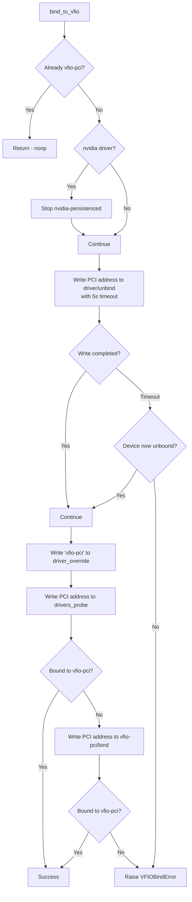
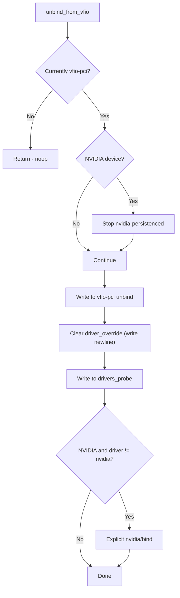

# VFIO GPU Passthrough

VFIO (Virtual Function I/O) allows passing physical PCI devices directly to a VM for near-native performance. KohakuRiver's `qemu/vfio.py` module handles the complex sysfs dance required to bind NVIDIA GPUs to the `vfio-pci` driver while respecting IOMMU group constraints.

## Design Goals

- **IOMMU group awareness**: all non-bridge endpoints in an IOMMU group must be bound to vfio-pci together, as required by the Linux VFIO subsystem.
- **Consumer GPU support**: handle NVIDIA consumer cards that hang on sysfs unbind writes by using timeout-based writes with daemon threads.
- **nvidia-persistenced management**: stop and restart the persistence daemon around bind/unbind operations to prevent file descriptor leaks.
- **Idempotent operations**: binding an already-bound device or unbinding an already-unbound device is a no-op.

## IOMMU Group Architecture

An IOMMU group is the smallest set of devices that the IOMMU can isolate. For VFIO to work, **every** non-bridge device in the group must be bound to `vfio-pci`.

```
┌─────────────────── IOMMU Group 17 ────────────────────┐
│                                                       │
│  ┌──────────────────┐                                 │
│  │  PCI Bridge      │  class 0x06xx                   │
│  │  (kernel-managed)│  ── excluded from VFIO binding  │
│  └──────────────────┘                                 │
│                                                       │
│  ┌──────────────────┐                                 │
│  │  GPU             │  0000:01:00.0  class 0x03xx     │
│  │  (NVIDIA)        │  ── MUST bind to vfio-pci ──┐   │
│  └──────────────────┘                             │   │
│                                                   │   │
│  ┌──────────────────┐                             │   │
│  │  HD Audio        │  0000:01:00.1               │   │
│  │                  │  ── MUST bind to vfio-pci ──┤   │
│  └──────────────────┘                             │   │
│                                                   ▼   │
│  ┌──────────────────┐                      ┌─────────┐│
│  │  PLX DMA         │  0000:01:00.2        │ vfio-pci││
│  │  (endpoint)      │  ── MUST bind to ───►│ driver  ││
│  └──────────────────┘                      └─────────┘│
└───────────────────────────────────────────────────────┘
```

The `get_iommu_group_non_bridge_devices()` function filters the group:

```python
def get_iommu_group_non_bridge_devices(pci_address: str) -> list[str]:
    group = get_iommu_group(pci_address)
    devices = get_iommu_group_devices(group)
    return [d for d in devices if not _is_pci_bridge(d)]
```

Bridge detection reads the PCI class from sysfs: devices with class `0x06xx` are bridges. Everything else -- GPUs (0x03xx), audio controllers, DMA endpoints -- must be bound.

## Bind Procedure



### Sysfs Bind Sequence

The sysfs files involved in the bind operation are:

```
/sys/bus/pci/devices/{pci_addr}/
├── driver/           -> symlink to current driver
│   └── unbind        <- write PCI addr here to detach
├── driver_override   <- write "vfio-pci" here
├── vendor            -> "0x10de" (NVIDIA)
├── device            -> device ID
└── class             -> PCI class code

/sys/bus/pci/
├── drivers_probe     <- write PCI addr to trigger re-probe
└── drivers/
    └── vfio-pci/
        └── bind      <- explicit bind fallback
```

### Timeout-Based Sysfs Writes

Consumer NVIDIA GPUs (GeForce series) can hang on the sysfs `unbind` write even after the driver has released the device. The `_write_sysfs_timeout()` function handles this:

```python
def _write_sysfs_timeout(path: str, value: str, timeout: float = 5.0) -> bool:
    error: OSError | None = None

    def _do_write():
        nonlocal error
        try:
            with open(path, "w") as f:
                f.write(value)
        except OSError as e:
            error = e

    t = threading.Thread(target=_do_write, daemon=True)
    t.start()
    t.join(timeout=timeout)
    if error:
        raise VFIOBindError(...)
    return not t.is_alive()  # True if completed, False if timed out
```

When the write times out, the code checks whether the device is actually unbound. If it is, the operation is considered successful despite the hung thread (the daemon thread will eventually complete or be cleaned up at process exit).

### Driver Override Strategy

The bind uses a two-phase approach:

1. Write `"vfio-pci"` to `driver_override` to tell the kernel which driver to use.
2. Trigger `drivers_probe` to make the kernel re-probe the device.
3. If `drivers_probe` does not result in vfio-pci binding (newer kernels may ignore it after `driver_override`), fall back to explicit `/sys/bus/pci/drivers/vfio-pci/bind`.

## Unbind Procedure



For non-NVIDIA devices (PLX DMA endpoints, etc.), `drivers_probe` alone is sufficient to restore the original driver. For NVIDIA devices, an explicit `/sys/bus/pci/drivers/nvidia/bind` fallback is attempted if `drivers_probe` does not restore the nvidia driver.

## nvidia-persistenced Management

The `nvidia-persistenced` daemon keeps `/dev/nvidia*` file descriptors open, which blocks the sysfs unbind write indefinitely. The bind/unbind operations bracket with:

1. **Stop before bind/unbind**: `systemctl stop nvidia-persistenced`
2. **Restart after all operations**: `systemctl start nvidia-persistenced`

The restart happens in the `bind_iommu_group()` / `unbind_iommu_group()` `finally` blocks, so remaining GPUs on the host (not passed through) regain persistence mode.

## Group-Level Operations

```python
async def bind_iommu_group(pci_address: str) -> list[str]:
    devices = get_iommu_group_non_bridge_devices(pci_address)
    bound = []
    try:
        for dev in devices:
            await bind_to_vfio(dev)
            bound.append(dev)
    finally:
        if bound:
            await asyncio.to_thread(_start_nvidia_persistenced)
    return bound
```

The `create_vm()` method deduplicates across GPUs that share an IOMMU group:

```python
bound_devices = set()
for pci_addr in options.gpu_pci_addresses:
    if pci_addr not in bound_devices:
        group_bound = await vfio.bind_iommu_group(pci_addr)
        bound_devices.update(group_bound)
```

## Capability Detection

`qemu/capability.py` provides pre-flight checks before attempting GPU passthrough:

| Check               | Method                                                    | What it verifies                |
| ------------------- | --------------------------------------------------------- | ------------------------------- |
| KVM available       | `/dev/kvm` exists                                         | Hardware virtualization enabled |
| CPU virt extensions | `/proc/cpuinfo` flags                                     | vmx (Intel) or svm (AMD)        |
| IOMMU enabled       | `/sys/kernel/iommu_groups/` non-empty                     | IOMMU active in kernel          |
| VFIO modules        | `vfio`, `vfio_pci`, `vfio_iommu_type1` loaded             | VFIO kernel support             |
| QEMU tools          | `qemu-system-x86_64`, `qemu-img` in PATH                  | QEMU installed                  |
| GPU discovery       | `/sys/bus/pci/devices/*/class` == 0x03xxxx, vendor 0x10de | NVIDIA GPUs present             |

## Trade-offs

**Daemon thread leak on timeout**: When a sysfs write hangs, the daemon thread is left behind. This is acceptable because the write will eventually complete (it is the kernel cleaning up the device), but it means the thread count grows temporarily during bind operations on consumer cards.

**Single-driver assumption**: The unbind path assumes NVIDIA GPUs should return to the `nvidia` driver. This would not work for GPUs intended for other drivers (e.g., `nouveau`), though in practice KohakuRiver targets NVIDIA proprietary driver environments.

**ACS override**: The capability module detects ACS (Access Control Services) override support, which is needed for PLX-switched multi-GPU systems where IOMMU groups may be too large without the `pcie_acs_override=downstream,multifunction` kernel parameter.
