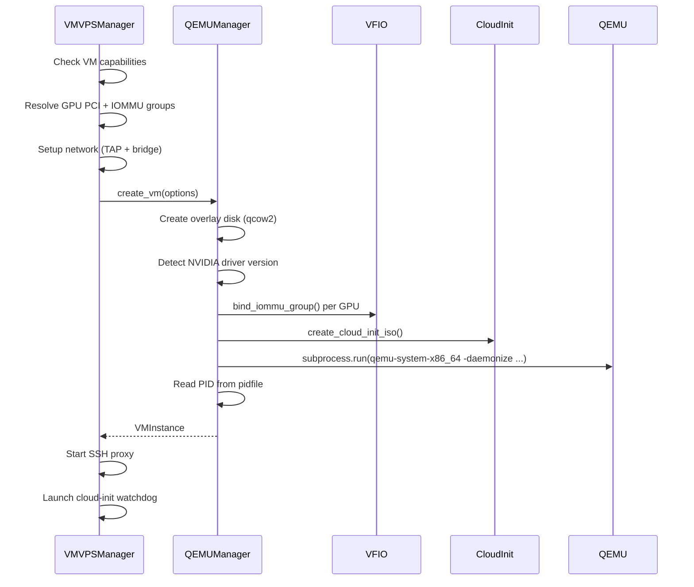
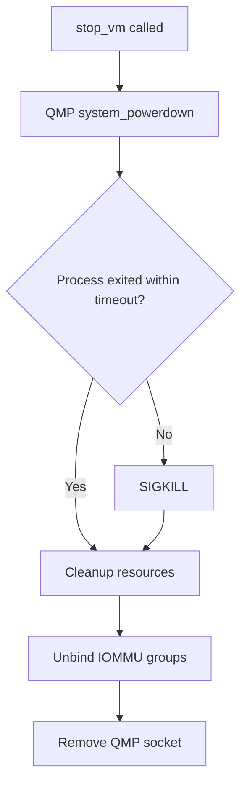
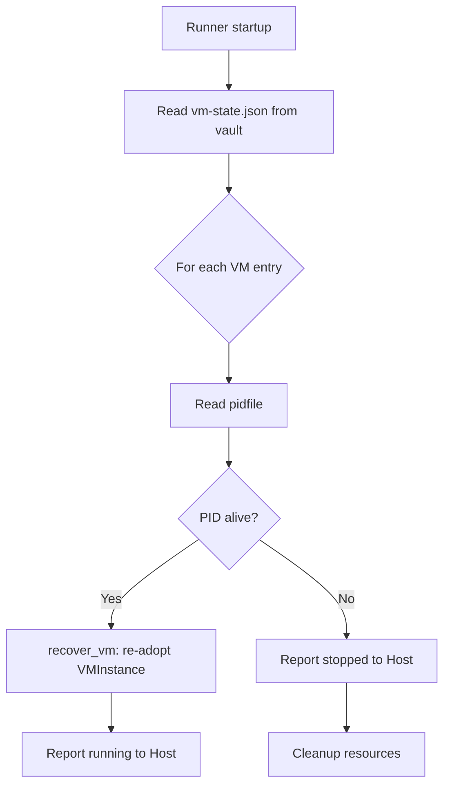

# VM Lifecycle Management

KohakuRiver's QEMU integration provides full VM lifecycle management for GPU-passthrough VPS sessions. The `QEMUManager` class in `qemu/client.py` handles creation, shutdown, restart, and recovery, while `VMVPSManager` in `runner/services/vm_vps_manager.py` orchestrates the higher-level VPS workflow.

## Design Goals

- **VFIO GPU passthrough**: bind NVIDIA GPUs to vfio-pci for bare-metal GPU performance inside VMs.
- **Cloud-init provisioning**: no manual VM setup -- SSH keys, network config, and the VM agent are injected automatically.
- **Graceful lifecycle**: QMP-based shutdown with force-kill fallback; reboot via QMP reset with heartbeat watchdog.
- **Crash recovery**: re-adopt running VMs after runner restart using persistent state and PID file detection.

## VM Creation Pipeline



### Step 1: Overlay Disk Creation

Each VM gets a qcow2 overlay disk backed by a shared base image:

```python
await asyncio.create_subprocess_exec(
    "qemu-img", "create", "-f", "qcow2",
    "-b", base_image_path, "-F", "qcow2", output_path,
)
# Optional resize
await asyncio.create_subprocess_exec(
    "qemu-img", "resize", output_path, disk_size,
)
```

This copy-on-write approach means VM creation is instant regardless of base image size. The base images live in `VM_IMAGES_DIR` as `.qcow2` files created by `scripts/create-vm-base-image.sh`.

### Step 2: GPU Binding

Before starting QEMU, all GPU PCI addresses (and their IOMMU group companions) are bound to vfio-pci. See [VFIO GPU Passthrough](./vfio-gpu-passthrough.md) for details.

The NVIDIA host driver version is detected **before** VFIO binding (since the GPU is unbound from nvidia during bind), and passed to cloud-init for matching driver installation inside the VM.

### Step 3: QEMU Command

The QEMU command is built by `_build_qemu_command()`:

```
qemu-system-x86_64 -enable-kvm -machine q35,accel=kvm -cpu host
  -smp {cores} -m {memory_mb}M
  -daemonize -pidfile {pidfile}
  -drive if=pflash,format=raw,readonly=on,file={OVMF_CODE}     # UEFI
  -drive file={root_disk},format=qcow2,if=virtio,cache=writeback
  -drive file={cloud_init_iso},format=raw,if=virtio,media=cdrom
  -netdev tap,id=net0,ifname={tap},script=no,downscript=no
  -device virtio-net-pci,netdev=net0,mac={mac}
  -qmp unix:{qmp_socket},server,nowait
  -device vfio-pci,host={gpu_pci_addr}                         # per GPU
  -fsdev local,id=fs_shared,path={shared_dir},...               # 9p mounts
  -device virtio-9p-pci,fsdev=fs_shared,mount_tag=kohaku_shared
```

Key design choices:

- **`-daemonize`**: QEMU forks and the parent exits. The real daemon PID is written to `pidfile`. This avoids holding an `asyncio` subprocess handle for the VM's entire lifetime.
- **Q35 machine type**: provides PCIe topology needed for VFIO GPU passthrough.
- **OVMF UEFI firmware**: required for GPU passthrough (VFIO needs UEFI, not legacy BIOS).
- **virtio-9p**: shared filesystems (`/shared`, `/local_temp`) mounted inside the VM via Plan 9 protocol.

### Step 4: Cloud-Init Watchdog

After QEMU starts, `vm_vps_manager.py` launches a watchdog coroutine that waits for the VM agent's phone-home callback. Timeouts differ by GPU presence:

- GPU VMs: 15 minutes (NVIDIA driver compilation in cloud-init takes ~10 minutes)
- Non-GPU VMs: 5 minutes

If phone-home never arrives, the VM is killed and the task is marked failed.

## VM Shutdown



The `stop_vm()` method follows a two-phase approach:

1. **Graceful**: send `system_powerdown` via QMP. The guest OS receives an ACPI power button event and shuts down cleanly.
2. **Force**: if the process is still alive after `timeout` seconds (default 30), send `SIGKILL`.

## VM Restart (Reboot)

Restart uses QMP `system_reset`, which is equivalent to pressing the reset button:

```python
async def restart_vm(self, task_id: int) -> bool:
    await self.qmp_reset(task_id)
    return True
```

After reset, `vm_vps_manager.py` starts a reboot watchdog that monitors the VM agent heartbeat. If the heartbeat does not resume within 5 minutes, the VM is considered failed and stopped.

## QMP Communication

QMP (QEMU Machine Protocol) uses a Unix domain socket. The protocol is JSON-based:

```
┌──────────────────────────────────────────────────────────┐
│  QMP Socket: /run/kohakuriver/vm/{task_id}.qmp           │
│                                                          │
│  1. Connect (AF_UNIX, SOCK_STREAM)                       │
│  2. Receive QMP greeting JSON                            │
│  3. Send: {"execute":"qmp_capabilities"}  (handshake)    │
│  4. Receive: {"return":{}}                               │
│  5. Send: {"execute":"system_powerdown"}  (command)      │
│  6. Receive: {"return":{}}                               │
│  7. Close socket                                         │
└──────────────────────────────────────────────────────────┘
```

```python
def _send_qmp():
    sock = socket.socket(socket.AF_UNIX, socket.SOCK_STREAM)
    sock.connect(qmp_socket)
    sock.recv(4096)                               # QMP greeting
    sock.sendall(b'{"execute":"qmp_capabilities"}\n')  # Handshake
    sock.recv(4096)
    sock.sendall(b'{"execute":"system_powerdown"}\n')  # Command
    return json.loads(sock.recv(4096))
```

The socket path follows the convention: `/run/kohakuriver/vm/{task_id}.qmp`.

## Recovery After Runner Restart

When the runner starts, `vm_vps_manager.py` iterates over persisted VM state from `TaskStateStore`:



The `recover_vm()` method verifies the PID is alive via `os.kill(pid, 0)`, then re-creates the `VMInstance` tracking object. The `ssh_ready` flag is set to `True` on the assumption that if the VM survived the runner restart, SSH was already working.

## Trade-offs

**Daemonize vs managed process**: Using `-daemonize` means QEMU runs independently of the runner process. If the runner crashes, the VM keeps running (enabling recovery). However, stdout/stderr from QEMU are lost -- errors are only visible in the serial log file.

**No live snapshot**: QEMU supports live snapshots via QMP, but KohakuRiver does not implement them for VMs. Only Docker VPS has snapshot/restore. VM state is preserved only through the qcow2 overlay disk.

**Single QMP command at a time**: The QMP socket is opened, used, and closed for each command. This is simpler than maintaining a persistent connection but adds latency for rapid command sequences.
