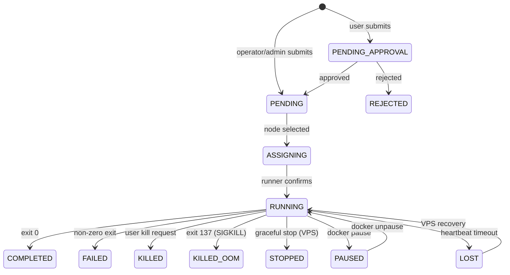
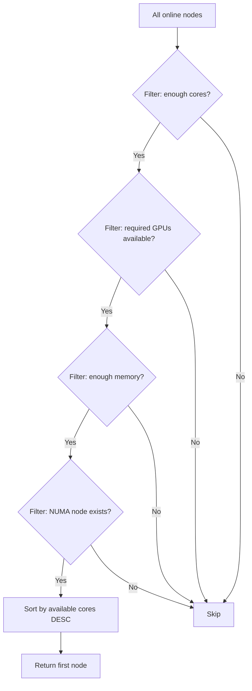
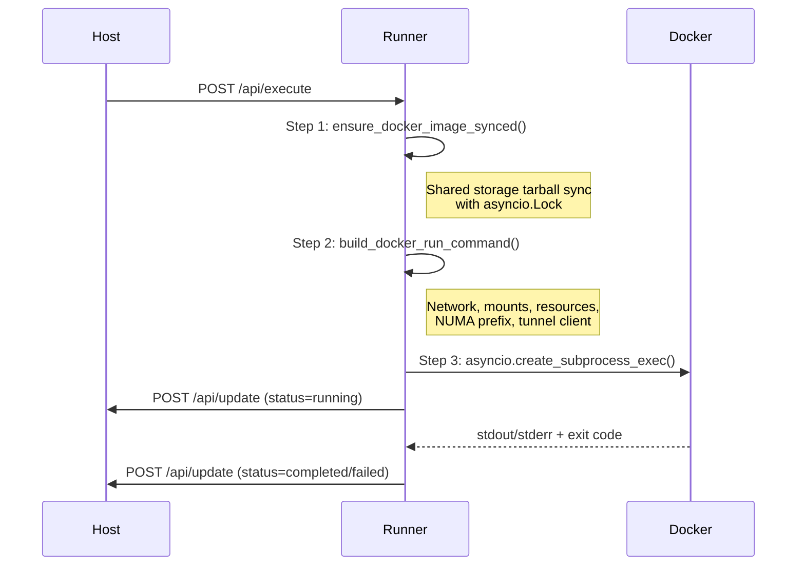

# Task System Design

The task system is the core workload engine of KohakuRiver. It handles submission, scheduling, execution, and lifecycle management of two task types: one-shot **COMMAND** tasks and long-running **VPS** sessions.

## Design Goals

- **Resource-aware scheduling**: match tasks to nodes by CPU cores, GPU indices, memory, and NUMA topology.
- **Approval workflow**: tasks from `user`-role accounts require operator/admin approval before scheduling.
- **Dual backend dispatch**: VPS tasks route to Docker or QEMU based on the `vps_backend` field.
- **Lost-task recovery**: VPS containers that survive a runner restart are automatically reclaimed.

## State Machine

The task lifecycle is a 12-state machine defined in `models/enums.py`:



State transition validation is enforced in `task_scheduler.py`:

```python
def _validate_status_transition(task, new_status, message):
    final_states = {"completed", "failed", "killed", "killed_oom", "lost", "stopped"}
    if task.status not in final_states:
        return True
    # Allow VPS recovery: lost -> running
    if task.task_type == "vps" and task.status == "lost" and new_status == "running":
        return True
    return new_status in final_states
```

## Node Selection Algorithm

`node_manager.py` implements `find_suitable_node()` which filters candidate nodes by resource constraints, then sorts by most-available-cores-first:



For VM tasks, `find_suitable_node_for_vm()` adds two additional filters:

1. Node must have `vm_capable = True`.
2. Requested GPU PCI addresses must be present in the node's `vfio_gpus` list.

Available resources are computed by subtracting allocations of currently running tasks from the node's total capacity. GPU availability is tracked per-index.

## Execution Pipeline (COMMAND Tasks)

The runner-side `execute_task()` in `task_executor.py` follows a three-step pipeline:



### Image Sync

Before running a task, the runner checks whether the local Docker image matches the shared-storage tarball:

1. Compare local image timestamp with tarball modification time.
2. If the tarball is newer (or local image does not exist), load it via `docker load`.
3. An `asyncio.Lock` (`docker_sync_lock`) prevents concurrent syncs of the same image.

Alternatively, if `registry_image` is set, the runner performs `docker pull` instead.

### Docker Command Construction

`build_docker_run_command()` assembles a `docker run --rm` command with:

| Flag        | Source                                                          |
| ----------- | --------------------------------------------------------------- |
| `--network` | `config.get_container_network()` (overlay or bridge)            |
| `--ip`      | `reserved_ip` from IP reservation system                        |
| `--cpus`    | `required_cores`                                                |
| `--memory`  | `required_memory_bytes` converted to MB                         |
| `--gpus`    | `"device=0,1"` format from GPU list                             |
| `--mount`   | shared_data, logs, local_temp, additional mounts, tunnel binary |
| `-e`        | User env vars + `KOHAKURIVER_TASK_ID`, tunnel vars              |

NUMA binding is applied by prepending `numactl --cpunodebind=N --membind=N` to the inner command.

### Exit Code Interpretation

```python
match exit_code:
    case 0:   status = "completed"
    case 137:  status = "killed_oom"    # SIGKILL -- likely OOM
    case 143:  status = "failed"        # SIGTERM
    case _:    status = "failed"
```

### Kill Coordination

The `kill_task()` function removes the task from the `TaskStateStore` **before** issuing `docker kill`. This signals to the `execute_task()` coroutine (which is blocked on `process.communicate()`) that the task was externally killed, so it should not report a redundant status update.

## VPS Task Dispatch

VPS creation is dispatched via `send_vps_task_to_runner()`, which calls the runner's `/api/vps/create` endpoint. The runner's VPS endpoint inspects the `vps_backend` field:

- `"docker"`: routes to `VPSManager.create_vps()` (see [VPS System](../vps-system/design.md))
- `"qemu"`: routes to `VMVPSManager.create_vm_vps()` (see [VM Lifecycle](../qemu-virtualization/vm-lifecycle.md))

## Trade-offs

**No priority queue**: Tasks are dispatched in submission order with first-fit node selection. There is no preemption or priority-based scheduling.

**Snowflake ID ordering**: Task IDs are time-ordered, which makes database range queries efficient but ties ID generation to wall-clock time.

**Suspicion counter**: The `assignment_suspicion_count` field tracks repeated failures to verify a task on its assigned node. After a threshold, the task may be marked lost. This heuristic can false-positive under network partitions.
