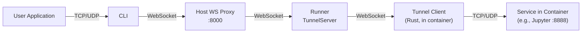
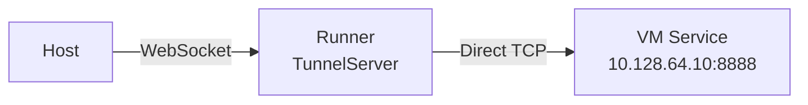
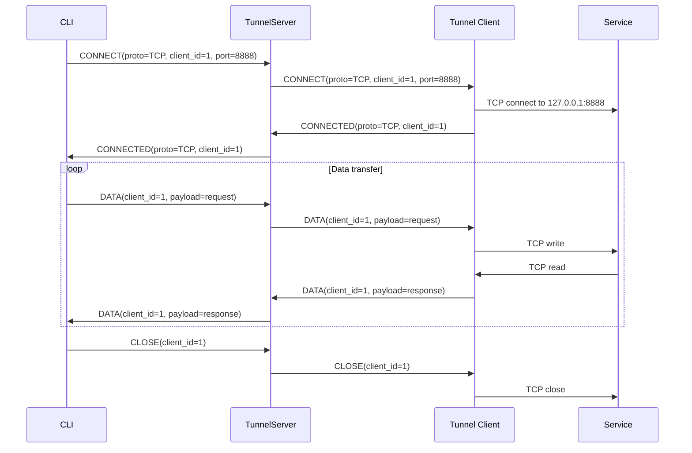

# Tunnel Protocol Analysis

KohakuRiver's tunnel system enables port forwarding from containers and VMs to the user's machine. The protocol uses a compact 8-byte binary header over WebSocket to multiplex multiple TCP/UDP connections through a single tunnel.

## Design Goals

- **Low overhead**: 8-byte header per message, binary encoding, no JSON parsing in the data path.
- **Connection multiplexing**: multiple independent TCP and UDP connections share a single WebSocket, identified by a 32-bit client ID.
- **Protocol support**: both TCP and UDP forwarding through the same tunnel.
- **Resilient reconnection**: the Rust tunnel client auto-reconnects with configurable backoff.

## System Architecture



For VM-based VPS, the runner skips the tunnel client and connects directly to the VM's IP:



## Wire Format

The binary header is 8 bytes, big-endian:

```
 0                   1                   2                   3
 0 1 2 3 4 5 6 7 8 9 0 1 2 3 4 5 6 7 8 9 0 1 2 3 4 5 6 7 8 9 0 1
+-+-+-+-+-+-+-+-+-+-+-+-+-+-+-+-+-+-+-+-+-+-+-+-+-+-+-+-+-+-+-+-+
|    Type (8)   |   Proto (8)   |         Client ID (32)        |
+-+-+-+-+-+-+-+-+-+-+-+-+-+-+-+-+-+-+-+-+-+-+-+-+-+-+-+-+-+-+-+-+
|   Client ID (cont.)          |          Port (16)             |
+-+-+-+-+-+-+-+-+-+-+-+-+-+-+-+-+-+-+-+-+-+-+-+-+-+-+-+-+-+-+-+-+
|                         Payload (variable)                     |
+-+-+-+-+-+-+-+-+-+-+-+-+-+-+-+-+-+-+-+-+-+-+-+-+-+-+-+-+-+-+-+-+
```

### Field Definitions

| Field     | Size    | Encoding | Description                   |
| --------- | ------- | -------- | ----------------------------- |
| Type      | 1 byte  | u8       | Message type (see below)      |
| Proto     | 1 byte  | u8       | Protocol: TCP=0x00, UDP=0x01  |
| Client ID | 4 bytes | u32 BE   | Unique connection identifier  |
| Port      | 2 bytes | u16 BE   | Target port (used in CONNECT) |

### Message Types

| Type      | Value | Direction        | Purpose                                     |
| --------- | ----- | ---------------- | ------------------------------------------- |
| CONNECT   | 0x01  | Server -> Client | Open connection to target port              |
| CONNECTED | 0x02  | Client -> Server | Connection established                      |
| DATA      | 0x03  | Bidirectional    | Relay application data                      |
| CLOSE     | 0x04  | Bidirectional    | Close connection                            |
| ERROR     | 0x05  | Client -> Server | Connection failed (payload = error message) |
| PING      | 0x06  | Server -> Client | Keepalive ping                              |
| PONG      | 0x07  | Client -> Server | Keepalive pong                              |

## Connection Lifecycle



## Rust Tunnel Client

The tunnel client (`src/kohakuriver-tunnel/`) is a Rust binary using Tokio and Tungstenite. It runs inside each container and manages connections on behalf of external clients.

### Connection Manager

```rust
pub struct ConnectionManager {
    connections: HashMap<u32, ActiveConnection>,
}

struct ActiveConnection {
    sender: mpsc::Sender<Bytes>,  // Channel to write data
    task_handle: JoinHandle<()>,   // Tokio task handle
}
```

Each connection gets:

- A Tokio task for reading from the TCP/UDP socket and forwarding to the WebSocket.
- An `mpsc` channel for receiving data from the WebSocket and writing to the socket.

### TCP Connection Handler

```rust
// On CONNECT message
async fn handle_connect(&self, header: &Header) {
    let addr = format!("127.0.0.1:{}", header.port);
    match TcpStream::connect(&addr).await {
        Ok(stream) => {
            let (read, write) = stream.into_split();
            // Send CONNECTED
            ws_tx.send(build_connected(Proto::Tcp, header.client_id));
            // Spawn reader task (socket -> websocket)
            // Store writer channel (websocket -> socket)
        }
        Err(e) => {
            ws_tx.send(build_error(Proto::Tcp, header.client_id, &e.to_string()));
        }
    }
}
```

The read buffer size is 65,536 bytes. Data read from the socket is wrapped in DATA messages and sent through the WebSocket.

### UDP Handler

UDP connections use `UdpSocket::bind("0.0.0.0:0")` (random port) and `connect()` to the target address. The same mpsc channel pattern is used for bidirectional data flow.

### Auto-Reconnect

The tunnel client implements automatic WebSocket reconnection:

```rust
loop {
    match connect_and_run(&runner_url, &container_id).await {
        Ok(()) => break,
        Err(e) => {
            eprintln!("Connection error: {e}");
            if attempts >= max_reconnect {
                break;
            }
            sleep(Duration::from_secs(reconnect_delay)).await;
            attempts += 1;
        }
    }
}
```

All active connections are cleaned up on disconnect and re-established when the WebSocket reconnects.

## Runner TunnelServer

The Python-side `TunnelServer` in `runner/services/tunnel_server.py` manages per-container `ContainerTunnel` instances. Each container gets a WebSocket connection to its tunnel client.

### VM Port Forwarding

For VM-based VPS (container IDs starting with `vm-`), the TunnelServer opens a direct TCP connection to the VM's IP instead of forwarding through a tunnel client:

```python
async def _handle_vm_port_forward(self, header, ws):
    vm_ip = self._get_vm_ip(container_id)
    reader, writer = await asyncio.open_connection(vm_ip, header.port)
    # Bidirectional relay between WebSocket and TCP
```

This is necessary because VMs do not run the Rust tunnel client.

## Host WebSocket Proxy

The Host's `tunnel_proxy.py` provides a transparent WebSocket proxy between the CLI and the Runner:

```python
async def _proxy_loop(ws_cli, ws_runner):
    # Bidirectional relay
    done, pending = await asyncio.wait(
        [
            asyncio.create_task(_forward(ws_cli, ws_runner)),
            asyncio.create_task(_forward(ws_runner, ws_cli)),
        ],
        return_when=asyncio.FIRST_COMPLETED,
    )
    for task in pending:
        task.cancel()
```

The proxy is protocol-transparent: it forwards binary WebSocket frames without parsing the tunnel protocol. This keeps the Host lightweight and avoids header parsing overhead for every data message.

## Protocol Constants (Python Side)

```python
# host/services/tunnel_proxy.py
HEADER_FORMAT = ">BBIH"  # Type(u8), Proto(u8), ClientID(u32 BE), Port(u16 BE)
HEADER_SIZE = 8

MSG_CONNECT = 0x01
MSG_CONNECTED = 0x02
MSG_DATA = 0x03
MSG_CLOSE = 0x04
MSG_ERROR = 0x05
```

## Trade-offs

**Single WebSocket per container**: All connections to a container share one WebSocket. This simplifies management but means a slow connection can head-of-line block other connections on the same WebSocket frame stream.

**No encryption beyond WebSocket**: The tunnel protocol itself is unencrypted. Security relies on the WebSocket transport (which can be upgraded to WSS) and the overlay network's isolation.

**Fixed 65KB buffer**: The Rust client reads 65,536 bytes at a time. Larger reads would improve throughput for bulk transfers but increase memory usage per connection.

**No flow control**: The protocol has no backpressure mechanism. If the CLI sends data faster than the container service can consume it, messages queue in the mpsc channel unboundedly. In practice, TCP backpressure at the socket level provides implicit flow control.
