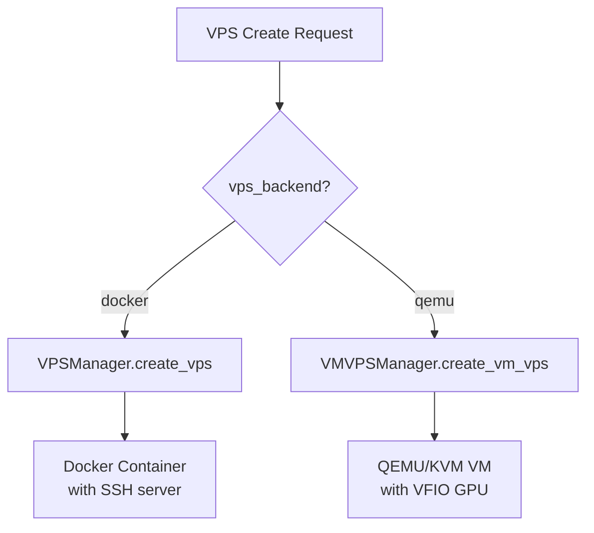
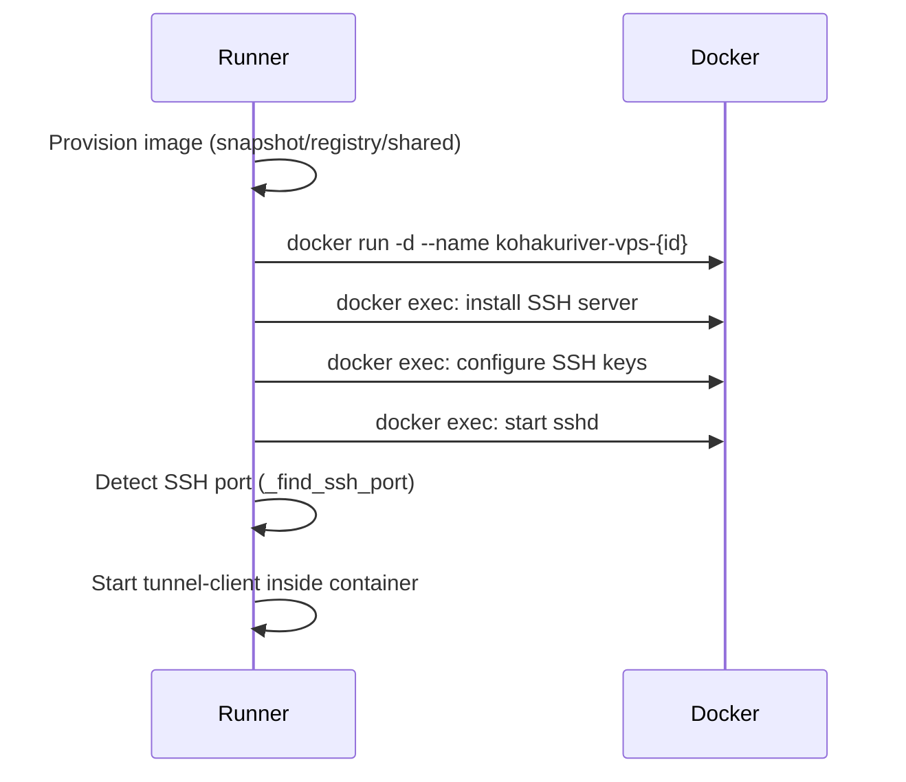
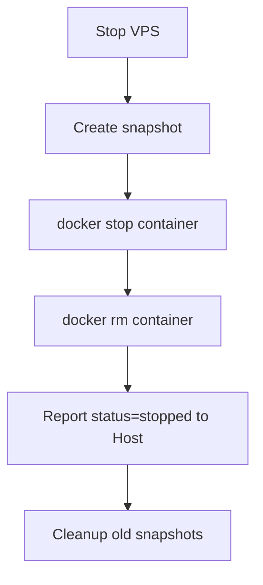

# VPS System Design

VPS (Virtual Private Server) sessions provide long-running interactive environments with SSH access. Unlike COMMAND tasks which are fire-and-forget, VPS sessions persist until explicitly stopped and support pause/resume, snapshots, and live SSH connections.

## Design Goals

- **Dual backend**: Docker containers for lightweight sessions, QEMU VMs for GPU passthrough workloads.
- **Transparent SSH**: users connect via the Host's SSH proxy without knowing which runner hosts the session.
- **Snapshot and restore**: Docker VPS sessions are auto-snapshotted on stop and restored from the latest snapshot on recreation.
- **Lost-state recovery**: VPS containers that survive a runner restart are automatically reclaimed.

## Backend Dispatch

The `vps_backend` field on the Task model determines which backend handles the VPS:



The Host dispatches VPS creation to runners via `send_vps_task_to_runner()`, which calls `/api/vps/create`. The runner's endpoint inspects the container name prefix: if it starts with `kohaku-vm-`, it routes to the VM manager; otherwise, Docker.

## Docker VPS Lifecycle

### Creation (`vps_creation.py`)



The Docker VPS container runs in detached mode (`-d`) without `--rm`, so it persists across tunnel disconnects. SSH setup depends on the key mode:

| SSH Mode   | Behavior                                                     |
| ---------- | ------------------------------------------------------------ |
| `none`     | Passwordless root login                                      |
| `upload`   | User's public key installed in `~root/.ssh/authorized_keys`  |
| `generate` | Runner generates an SSH keypair, returns private key to user |
| `disabled` | No SSH server started                                        |

The SSH port is discovered by running `docker port {name} 22` with retries, since Docker takes a moment to bind the port after container start.

### Snapshot Management (`vps_manager.py`)

Snapshots are Docker image commits tagged with timestamps:

```python
# Snapshot naming
tag = f"kohakuriver/{container_name}:snapshot-{timestamp}"

# Commit with pause (filesystem-consistent snapshot)
docker_cmd = ["docker", "commit", "--pause=true", container_name, tag]
```

Snapshot lifecycle:

1. **Auto-snapshot on stop**: before `docker stop`, the VPS is committed.
2. **Restore on create**: if a matching snapshot exists, it is used as the base image instead of the original container image.
3. **Cleanup**: `cleanup_old_snapshots()` keeps only the N most recent snapshots per container, removing older ones via `docker rmi`.

### Stop Sequence



## QEMU VPS Lifecycle

For QEMU-backed VPS, see [VM Lifecycle](../qemu-virtualization/vm-lifecycle.md) for detailed coverage. The key differences from Docker VPS:

- GPU passthrough via VFIO (requires IOMMU group binding)
- Cloud-init provisioning instead of `docker exec` for SSH setup
- QMP socket for graceful shutdown/restart instead of `docker stop/restart`
- VM agent for heartbeat and GPU monitoring instead of Docker health checks
- Network via TAP device attached to overlay bridge or NAT bridge

## SSH Access Architecture

```
┌──────┐    SSH    ┌──────────────────┐   TCP fwd   ┌────────────┐
│ User │──────────►│  Host SSH Proxy  │────────────►│   Runner   │
│      │           │     :8002        │             │            │
└──────┘           └──────────────────┘             └─────┬──────┘
                                                                 │
                        ┌────────────────────────────────────────┘
                                                                 │
            ┌───────────▼──────────┐     ┌───────────────────────┐
            │  Docker VPS          │     │  QEMU VPS             │
            │  docker port :22     │     │  SSH proxy -> VM IP   │
            │  -> random host port │     │  -> overlay :22       │
            └──────────────────────┘     └───────────────────────┘
```

For Docker VPS, the runner maps port 22 to a random host port (`-p 0:22`). The Host stores this port in the Task model's `ssh_port` field. The Host's SSH proxy on port 8002 routes incoming connections to the correct runner and port.

For QEMU VPS, the runner starts an SSH proxy that forwards to the VM's overlay IP on port 22. The same Host-side proxy routes to this runner-side SSH proxy port.

## Recovery from Runner Restart

When a runner starts, it scans for existing containers and VMs:

1. **Docker**: checks for running containers matching `kohakuriver-vps-*` pattern. For each found container, it re-registers the VPS in `TaskStateStore` and reports `status=running` to the Host.
2. **QEMU**: reads `vm-state.json` from the task store, checks if the PID is still alive, and re-adopts the VM via `QEMUManager.recover_vm()`.

The Host's `_validate_status_transition()` allows `lost -> running` transitions specifically for VPS tasks, enabling this recovery path:

```python
# Special case: VPS recovery from "lost" state
if task.task_type == "vps" and task.status == "lost" and new_status == "running":
    return True  # Allow transition
```

## VPS Assignment (Auth)

Operators can assign VPS access to specific users via the `VpsAssignment` model (many-to-many between users and VPS task IDs). Only assigned users (and operators/admins) can connect to a VPS session.

## Trade-offs

**No live migration**: VPS sessions are pinned to their runner node. If the runner goes down, the VPS is lost (Docker) or must wait for the node to recover (QEMU, since the VM process may still be running).

**Snapshot size**: Docker commit creates a new image layer capturing all filesystem changes. For VPS sessions with large working sets, snapshots can consume significant disk space.

**SSH port discovery race**: The `_find_ssh_port()` function retries `docker port` with a 1-second delay. Under heavy load, SSH may take longer to bind, causing transient failures in the port discovery loop.
